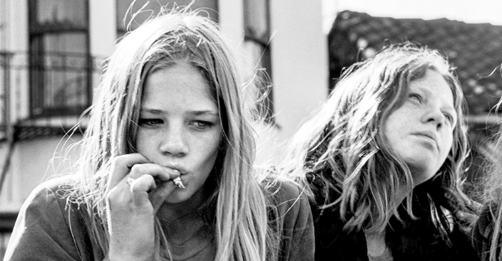
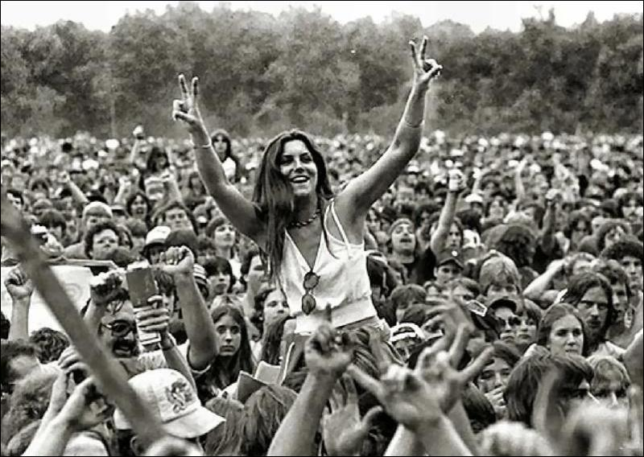

# ✊🏿6️⃣0️⃣ THE 60s

The 1960s was an era of growth: women found their voices, the fashion industry
became more colorful than ever, and music changed in ways nobody could have
imagined. It was a time of innovation - and these are the things 1960s Americans
just couldn't live without.

Prior to 1960, the most effective and popular form of birth control was the
condom. Not only did they prevent pregnancy, but they also minimized the risk of
contracting sexually transmitted diseases. Still, condoms could be inconvenient,
and would sometimes break or come off. Luckily, a new form of contraception was
right around the corner.

When the FDA approved a drug to ease menstrual problems in 1957, it was never
intended to be a contraceptive. But it actually did prevent pregnancy, causing
an awful lot of women to suddenly report severe menstrual disorders. Known as
Enovid, by 1960, the FDA had finally recognized the drug as an effective way to
stave off pregnancy. It quickly became commonly called "the Pill." Within two
years, 1.2 million women were taking the Pill as it exploded in popularity.



But the drug remained controversial, largely due to the Pope's views on family -
and the reactionary groups who charged Planned Parenthood with, in their words,
"committing genocide."

For those reasons, the Pill remained illegal in several states even as it rose
to become the most popular method of birth control. And then, in 1969, Barbara
Seaman's book, The Doctor's Case Against the Pill, revealed such risky side
effects as blood clots, heart attacks, strokes, weight gain, depression, and
even "loss of libido" - which kind of defeated the purpose of the Pill in the
first place.

Enovid was discontinued in the U.S. in 1988, and today has been replaced by a
number of more effective contraceptive pills.

Many, many different musical genres can trace their roots to the 1960s. For one,
there's the British Invasion, which revolutionized rock thanks to the Beatles,
the Rolling Stones, and the Who. But the decade also saw a huge rise in the
popularity of a number of other genres, including Motown, psychedelic rock, and
folk. Put them all together and they made for one groovy scene.

Valium, which made its first appearance in 1963, was prescribed to manage
anxiety – and quickly became one of the most commonly prescribed drugs of all
time. Drug manufacturers had actually been researching anti-anxiety pills since
the late 1800s, but many of them contained highly addictive opiates. It was
hoped that Valium would change that.



Spoiler alert: it didn't.

Even so, big pharma continued marketing it as safe, and falsely insisted it was
nearly impossible to overdose on valium. Over a 10-year period, the drug was
prescribed to 59.3 million patients. The primary target market was women, many
who were harried housewives assigned to domestic duties at home.

Wearing tie-dye became hip among the younger generations, who became a kind of
spiritual extension of writer Jack Kerouac's beat generation of the 50's. The
only real difference was that, rather than beatniks, these people were known as
hippies. "We're doing the hardest work in the world, because we're growing.
We're trying to change."

Composed mostly of young people, hippies fought the suppression of society by
developing their own culture and way of living. It was an attempt to become a
kinder generation, with many going vegetarian, using natural methods for
medicine, practicing free love - and, of course, doing a whole lot of drugs.

Hippies came from white middle-class families and grew up in suburbs, which were
very white. So were crowds at Woodstock and other rock festivals. They had
little experience with people of other races. Hippies made African-Americans
uncomfortable. While hippies sneered at success, poor young blacks had to fight
to join the mainstream that freaks rejected.

Young whites found their parents to be gluttons of consumer culture. Hippies saw
that consumption failed to make their parents happy, but they did not understand
that their parents were reacting to deprivation between 1929 and 1945. Young
blacks craved consumer goods as signs of success and acceptance.

Hippies had a moral vision of the world, and so do the Star Wars films. Luke
Skywalker is a technologically empowered individual living an authentic life
defending his community. J. K. Rowling builds on these themes in the Harry
Potter books, but she adds fantasy, mysticism and the supernatural. These are
counterculture values. Freaks felt that mainstream society had gone awry because
it was too scientific and too rational. At times, hippies argued, feelings were
more important. Rowling entreats the reader to trust in feelings.

```
"If everyone demanded peace instead of another television set, then there would be peace."
```

~ John Lennon

Peace.

## About the Author

Mujahid Al-Majali, a 29-year-old former air force soldier and an economic
development and business specialist, also does translation and copywriting.
Loves long drives, chill music and old school movies. A nicotine addict and a
huge fan of Jack Daniel’s whiskey. Owned multiple businesses in Amman and
southern of Jordan PRE-COVID and now focusing on translation and copywriting
part of my experience through Upwork.
