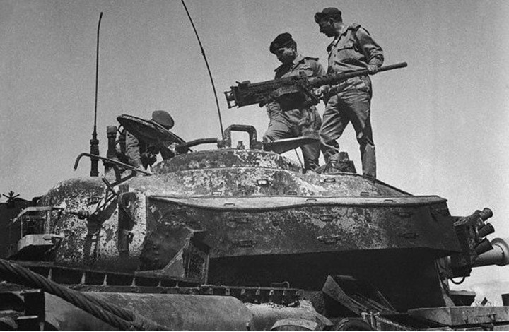
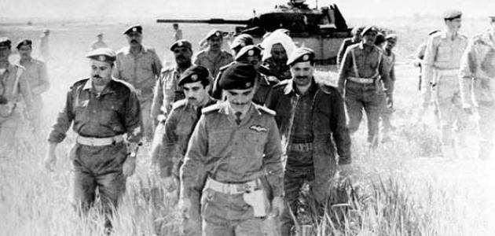
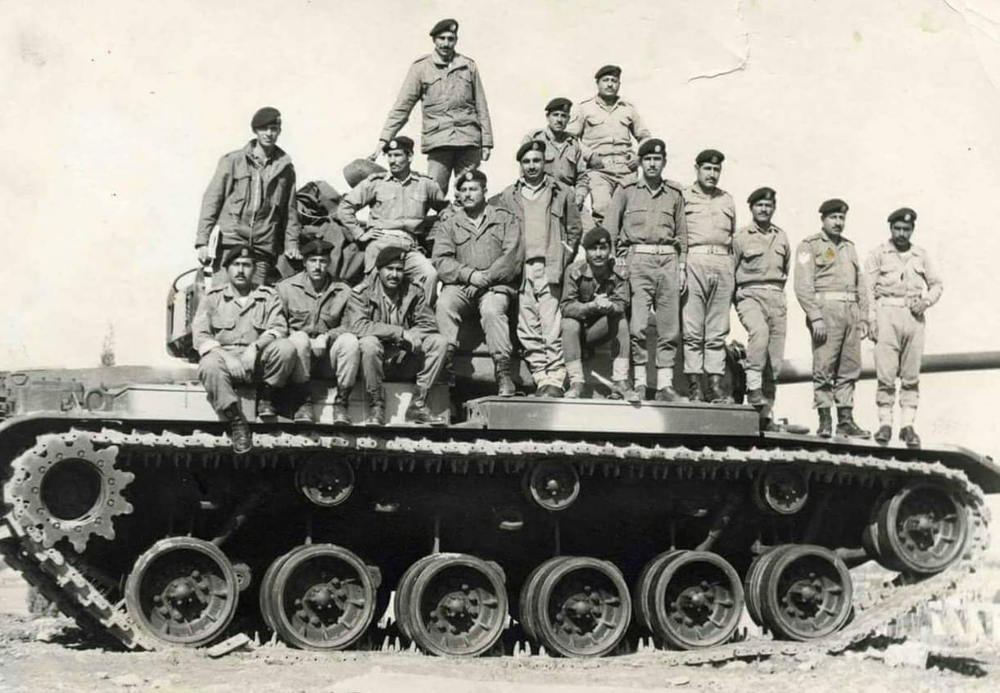

# 💥 Al Karama: The Home of Heroes

The Day of Dignity is immortal in the history of our Jordanian armed forces and
the national memory as one of the honorable pages of our glorious history, and a
station of determination and faith, and the example of the Arab army in patience
and pride. On the twenty-first of March, 48 years ago, the land of Rabat and the
Almoravids in the Jordan Valley witnessed - The Holy River Jordan - The fiercest
battles with an arrogant enemy who possessed the equipment, and whose arrogance
overwhelmed him, and the euphoria of June 67 took him to build bridges of
illusion and imagination, believing that crossing the Jordan River in the east
would be just a picnic. At the dawn of the twenty-first of March his legions
crawled silently After the attacks on our western front that have not stopped
since the 1967 war, he seeks to translate his ambitions and implement his plans
while he surrounds himself with an aura of arrogance to impose what he sees and
wants of coercion and expansion.

The goals of "Israel" from its invasion of Jordan can be summarized as follows:

The enemy wanted from the battle to destroy the Jordanian leadership and its
forces and its self-confidence after it was surprised by the situation that
arose as a result of the June War, which is Jordan’s rejection of the results of
this war, as it remained steadfast with its vitality, activity, and
determination to struggle to remove the effects of the aggression, and the
Israeli leadership believed that the Jordanian army He lives in disarray after
the June War, and miscalculated because the Jordanian leadership worked to
reorganize and quickly, and occupied new defensive positions on the eastern bank
of the Jordan River so that the fighting spirit and determination to fight the
battle remained at its highest levels, and it appeared in Jordan’s remarkable
steadfastness.

The site of the Battle of Karama is important from a religious point of view, as
it represents the land of Rabat for the sake of God within the Levant region.

As for the geographical and strategic importance of this region, it constitutes
the center point in the heart of the Arab world, as it is more like a gateway
through which the armies going to Palestine pass, whether these armies are
coming from the east or the west, the north or the south, and it was the scene
of decisive battles in Islamic history, and a gateway to For the victories that
achieved the nation’s prestige, dignity and status, and for spreading the
message of truth, justice and humanity, such as the battle of Hattin and Ain
Jalut.

The Jordan Valley is a low area located between two coordinated mountain ranges,
the Western Mountains and the Eastern Mountains, and it is said that they were
one block. In the third geological age, the crater that formed the Jordan Valley
occurred.

The Ghor region is rich in agricultural, water, and trees resources. It produces
vegetables and fruits, which are good pastoral areas. As for its water sources,
it is represented in the Jordan River - Lake Tiberias - the Dead Sea, and the
Eastern Ghor Canal, in addition to many water springs, ponds, and wells. The
Ghor is the nerve of agricultural and economic life for Jordan.

There is one transverse road in the Ghor that extends from the Jordanian Hamma
to Aqaba. As for the roads connecting the eastern and western highlands, they
are bridges (King Hussein Bridge, King Abdullah Bridge, Prince Muhammad Bridge).
The eastern and western parts of the area are characterized by the difficulty of
transportation, rugged roads, high altitudes, and the presence of trees and
sections. The sloping, rocky area is a strategic area where individuals lie
against the mechanisms and impede their movement in the event of any advance by
the enemy forces, as happened in the battle of Karama.

## Forces of Both Parties

1. Israeli forces. As a result of the information available from the
   intelligence sources and the observation of the battlefield, the Israeli
   forces were estimated to have an armored division with their supporting
   weapons in addition to the air force, as follows:

   - 7th Armored Brigade
   - 60th Armored Brigade.
   - 80th Mechanized Infantry Brigade.
   - Paratroopers battalion of the 35th Paratroopers Brigade.
   - 5 field artillery and heavy artillery battalions.
   - the Four squadrons of combat aircraft (Mirage, Mister).
   - Several helicopters capable of transporting two battalions at once.
   - Armored engineering battalion.

2. Jordanian forces. The 1st Infantry Division defends the central and southern
   region, starting from Sail al-Zarqa in the north to Aqaba in the south, and
   was distributed as follows:

   - Hittin Brigade occupies defensive positions on the approach Naour.
   - Princess Alia Brigade occupies defensive positions on the approach of Wadi
     Shuaib.
   - Al-Qadisiyah Brigade occupies defensive positions on the approaching
     crossbar.
   - The 60th Armored Brigade of Prince Hassan bin Talal supports the 1st
     Infantry Division, as one of its battalions was distributed among brigades
     and a battalion in the army's reserve role in the Tabarbour area.
   - The division is supported by three field artillery battalions and a heavy
     artillery company.
   - The division supports a field engineering battalion.

## Combat Approaches

The Battle of Karama began at 05:30 am on March 21, 1968, and continued for
sixteen hours of bitter fighting along the front. Through the course of
incidents and analysis of combat operations, it became clear that the attacking
Israeli forces built their plan on three main approaches and a fourth,
misleading approach. To disperse the efforts of the armed forces, and all these
approaches lead, according to the nature of the land and paved roads to the
heights of Salt, Amman, and Karak, and the approaches were as follows:

1. Approaching the crossbar. From Prince Muhammed Bridge (Damia) to the Masri
   Triangle to the main Arda road to Salt.
2. Approach Wadi Shuaib. From the King Hussein Bridge (formerly Allenby) to the
   Southern Shouneh, to the main road adjacent to Wadi Shuaib, and then to Salt.
3. Sowayma Approach. From Prince Abdullah Bridge to Ghor Al-Rama to Naour and
   then to Amman.
4. Gore net axis. From the south of the Dead Sea to Ghor Al Safi and Ghor Al
   Mazraa to the main road to Karak.

## White Weapon Battle

The landing operation carried out by the Israeli forces east of the town of
Al-Karama, was aimed at relieving the pressure on its forces that crossed east
of the river, in addition to destroying the town of Al-Karama, especially when
it was unable to put any new forces across the bridges, due to its destruction
by the Royal Artillery Corps, and this Conclusive evidence that the defensive
plans through which the Arab army forces fought their defensive battle were
tight, and the dense and accurate artillery support contributed to their
success, in addition to the steadfastness of the soldiers in defensive
positions, and in its depth, the landing process east of the town of Karama was
a limited operation, where a section of the fedayeen was They work there as a
launching pad for guerrilla action, sometimes based on the desire of the
Jordanian leadership. Indeed, the Israelis destroyed the town of Al-Karama after
they clashed with Jordanian forces and guerrilla fighters present there.

With the end of the events of the battle, the enemy had completely failed in its
military operations, without achieving any of the goals for which it had begun
these operations and on all approaches and axes, and returned to dragging the
tails of disappointment and failure, and the desired goals from behind the
battle were destroyed in front of the rock of Jordanian steadfastness, to prove
to the enemy Once again, he can continue one battle after another, and to
destroy the enemy's continuous attempts to undermine Jordan and its
steadfastness. The Jordanian soldier has proven that his fighting spirit stems
from the determination to fight battles of heroism, honor, bravery, and
sacrifice.

In his historic speech, the late King Hussein bin Talal said on the day after
the battle: “If I had to point out any of the lessons learned from this battle,
my brothers, arrogance, and vanity lead to defeat, and belief in God and
determination to persevere whatever the sacrifice is the way. The first is
victory, and it is self-reliance first and foremost, clarity of purpose and
nobility of the goal that gave us comfort when we decide that we are steadfast
and steadfast to death, determined to do so, we do not budge and do not retreat,
regardless of the challenges and difficulties.”

And the enemy's failure in its plans, which was known from the documents that
the Israeli leaders had and left on the battlefield, which is to occupy the
eastern heights and invite journalists to lunch in Amman.

This battle also embodied the importance of the will of the Arab soldier, which
was elaborate and highly efficient, and effectively contributed to the
resolution and success of the battle. It also highlighted the importance of
moral preparation, as this preparation was to the fullest. The morale of the
Arab army was high as they awaited the day of revenge and revenge against their
enemy. They waited anxiously for the zero hour to respond to injustice and
tyranny.

The battle highlighted the good planning, preparation, and good implementation
of the Arab army, as well as the importance of intelligence, as the enemy did
not succeed in achieving the element of surprise due to the strength of the
Jordanian military intelligence, which was closely monitoring the situation and
sending reports to the specialists, as it examined and analyzed the results and
predicted the news of the aggression by Israel, which Gave a chance to equip and
stand up to her.

## Losses of Both Parties

Our valiant forces: 86 martyrs and 108 wounded, 13 tanks and 39 different
vehicles were destroyed.

Israeli forces: (250 dead and 450 wounded, and 88 different vehicles were
destroyed, including 47 tanks, 18 tankers, 24 armed cars, 19 cargo cars, and 7
fighter planes).

### About the Author

Mujahid Al-Majali, a 29-year-old former air force soldier and an economic
development and business specialist, also does translation and copywriting.
Loves long drives, chill music and old school movies. A nicotine addict and a
huge fan of Jack Daniel’s whiskey. Owned multiple businesses in Amman and
southern of Jordan PRE-COVID and now focusing on translation and copywriting
part of my experience through Upwork.
