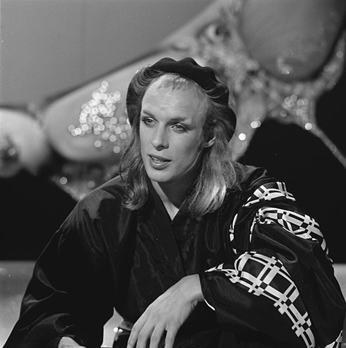

# 🎶 Ambient

"Aether sounds, rippling wave movements, mysterious, distant greenish-blue lights, breath-taking, almost indescribable moods. It's like walking the highways of a fairy-tale empire, away from the monotony of everyday life, while techno pounding in the adjoining hall. "

One of the UK’s best-known musical figures in the field is Mixmaster Morris (‘Irrestistible Force’). Around the 80s, it usually appeared in chill out rooms as well, because no matter what hectic genre we are talking about, there will always be a point where one can relax a bit from the fatigue so far so that later one can throw oneself into the party resume with renewed vigor.

The recurring sounds in these music are the sounds of nature as well as the acoustic instruments (like the piano, violin, or just the flute) whose sound are modulated with different effects.

"The genre originated in the 1960s and 1970s, when new musical instruments were being introduced to a wider market, such as the synthesizer. It was presaged by Erik Satie's furniture music and styles such as musique concrète, minimal music, Jamaican dub music and German electronic music, but was prominently named and popularized by British musician Brian Eno* in 1978 with his album Ambient 1: Music for Airports; Eno opined that ambient music "must be as ignorable as it is interesting."

The name Future Sound of London may be familiar from the fact that they made the ambient music really famous with the album "Lifeforms" (1994).

The genre has become known around the world, including Ibiza, where the name of Jose Padilla (‘Café del Mar’), can be associated with ambient music.

"Then the ambient died in its beauty. The experimental spirits enriched other trends, especially trip hop with hitherto unknown colors, perhaps they themselves created a new style, as New York's SD Spooky did with illbient. In England, there were only three ambient disc jockeys in the late 1990s:
Mixmaster Morris, Patterson and Andrea Parker. Among the publishers, EM stood in the mud for a long time."

You can find more details about its formation and development on Ishkur's Guide to Electronic Music, and you can listen to ambient music right away.
<https://music.ishkur.com/?query=Ambient>

The Every Noise at Once platform provides an opportunity for people to get to know better the names of the creators who have ever been in the genre and thus the peculiarities of it.
<https://everynoise.com/engenremap-ambient.html>

## Sources

- MENNYEK KAPUI - Az elektroniks zene évtizede (The decade of electronic music)
- Wikipedia
- Every Noise at Once
- Ishkur's Guide to Electronic Music

## About the Author

"Guido F. Matis (a.k.a. widosub), a seasoned producer-composer authority with an unquenchable compassion towards the musical expression, and many years of experience in the fields of event organizing, movie post-production, and recording with professional musicians. His devotion to movie sounds shows in his art - widosub's music is filled with landscapes of emotions, dramatic twists and melancholic moods. He's one of the hosts of Tilos Rádió's MustBeat show, in which he's is focusing on drum'n'bass and chillout music. He's also one half of the duo Empty Universe."
