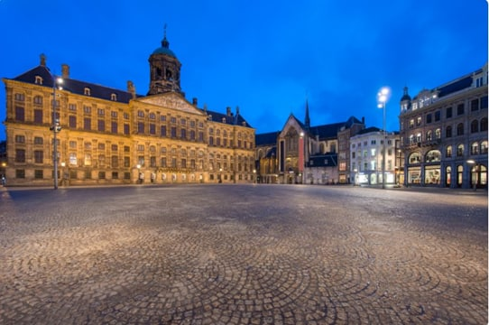
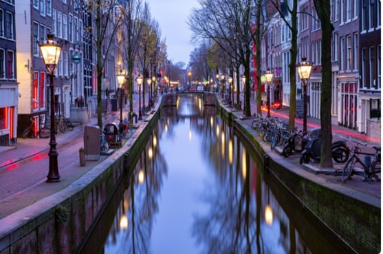
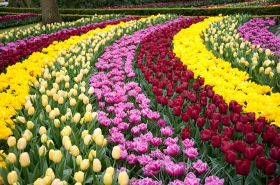

# 🌃 Amsterdam

Amsterdam in the capital of the Netherlands and thanks to its liberal culture attracts tourists from all corners of the planet, offers a wide range of bars, accommodation and special festivals for the LGBT community and due to its thriving cannabis culture, you can smoke in over 200 cafes and bars in the city center.

The ring of canals is another of the interesting attractions of this city, since not only does it have more than 150 canals but they are also crossed by 1,281 bridges. An impressive and beautiful city to tour by bicycle.

Dam Square is considered to be the heart of the city, where you can observe its architecture and enjoy its atmosphere. The Royal Palace dominates the attention of the square for its classical facade, it also has fine sculptures that were made to glorify the city.

The canal belt that characterizes Amsterdam allows you to take a boat ride on the canals to get to know the city during the day, but at night you will be able to see the houses and the illuminated bridges that will provide you with a romantic experience.

In Amsterdam, prostitution is legalized and it has the Red Light District, where you will find hundreds of prostitutes plying their trade behind a cluster of windows with red lights. For obvious reasons, it is one of the most famous places in Amsterdam where you can enjoy a party atmosphere, beer and sex shops. The Red Light District is a kind of amusement park dedicated specifically to sex.

If you have plans to go out, the best thing is to head towards Leidsepelin Square where you will find endless nightclubs, bars, restaurants, cafes, theaters and cinemas. During the day it is filled with jugglers, street musicians, fire-eaters and other types of artists. However, many of the shows last until the early hours.

If you want a rest day on your tour, you can visit the Vondelpark which is considered the most famous park in the Netherlands and has more than 10 million visitors a year.

Another of the tourist attractions of this city is the flower market, since the stalls where flowers are sold are floating houses and it is there where you can buy souvenir bulbs and tulips.

If your interest is art, you should go to the Van Gogh museum where you will find more than 200 paintings by the genius of impressionism, it also includes more than 400 drawings by Van Gogh to delight lovers of his works. But then you must go to the Stedelijk Museum where you will find the representatives of contemporary and modern art such as neo-impressionism, pop art and the Bauhaus. Works by great artists such as Piet Mondrian, Kandinsky, Chagall, Matisse, Pollock and Andy Warhol, among others.

On the other hand, the A'dam Tower can be an interesting experience where a wide variety of music groups, events, restaurants, bars and a hotel are housed. The Skybar is especially outstanding, which is an exclusive site that is located on the upper floors and also rotates, so you can enjoy its spectacular view.

One of the most significant and historic sites in Amsterdam is the Anne Frank House, where she and her family de ella lived in hiding during the Nazi invasion. Entering the house they give you a brochure where they explain in detail the events that occurred in each room of the house and certain paragraphs taken from the famous diary of Anne Frank.

The Oude Kerk is a church built in 1306, being the oldest building in Amsterdam. But during the 16th century the side chapels, the portal that takes you to the Iron Chapel and the tower were added. The interior of the church is impressive where you can see the choir stalls made of finely carved wood and three Dutch Renaissance windows.

As far as technology is concerned, the city has the NEMO science museum, an ultramodern structure that emerges from the water as if it were the hull of a ship, there you will find five floors of interactive exhibitions where they show you the functioning of the mind, the human body, physical phenomena and all kinds of science, with innumerable high-tech gadgets to teach the functioning of the universe in the funniest way, being a magical place to visit with children.

One of the most important museums in the country is the Risksmuseum (National Museum) which stands out for housing the baroque paintings of the great masters of Dutch painting.

If you are interested in plants, you should go to the Botanical Garden, which is one of the oldest in the world. Among its most relevant structures is the palm room whose dome is made of glass, the greenhouses and the seed house, where there are more than 4000 species of plants and numerous tropical species.

As we all know, Amsterdam is famous for its tulips and one of the best places to see them is the Keukenhof garden, which has more than 32 hectares full of flowers, whose main protagonist is the tulip. You can buy seeds, bulbs and flowers in their greenhouses and in their surroundings you will see beautiful fountains, lakes and windmills.

You cannot miss the cuisine of the city and a great way to taste the local flavors is in the Foodhallen, whose center houses several restaurants serving all kinds of food on the same roof, but you can also try Dutch bitterballen among other traditional dishes. . You can also eat dim sum, sushi and other international foods. It's a place frequented by locals, so it doesn't exactly look like a tourist spot, but there is sometimes live music and you can have craft beer in its four bars.

For cheese lovers it is essential to visit Alkmaar, which although it is true you cannot buy cheese, they give you a demonstration in front of a scale from the Middle Ages and with merchants who show you how commercial operations were carried out, with all the atmosphere in keeping with the times. But don't worry, right next to it you will find a small market where you can buy all kinds of cheeses.

The last place we can recommend is Maduroam, which is a miniature park where you can see Holland on a small scale. There you can also enjoy models of many towns in the Netherlands, with interactive activities such as flying a plane, loading containers on ships, mixing music on DJ tables where you can enjoy with your children or feel like one of them.

## About the Author

Idais, Graduated in Mechanical Engineering, and a master’s degree in teaching component, she gave classes in several institutes of mathematics and physics, but she also dedicated several years of my life as a television producer, she did the scripts for mikes, the camera direction, editing of video and even the location. Later she was dedicated to SEO writing for a couple of years. She likes poetry, chess and dominoes.
