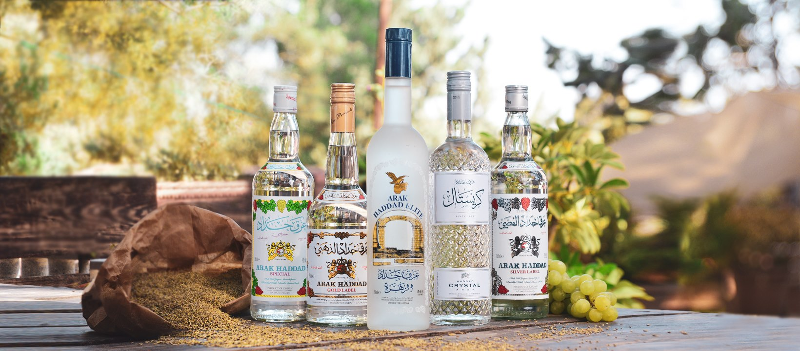
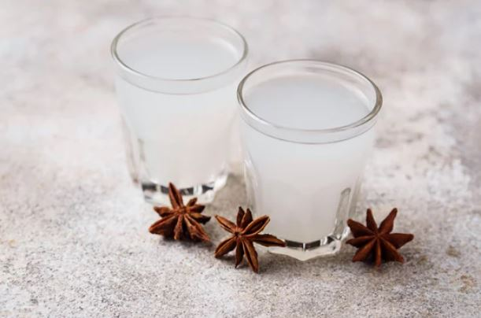
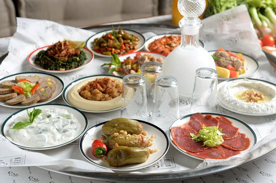
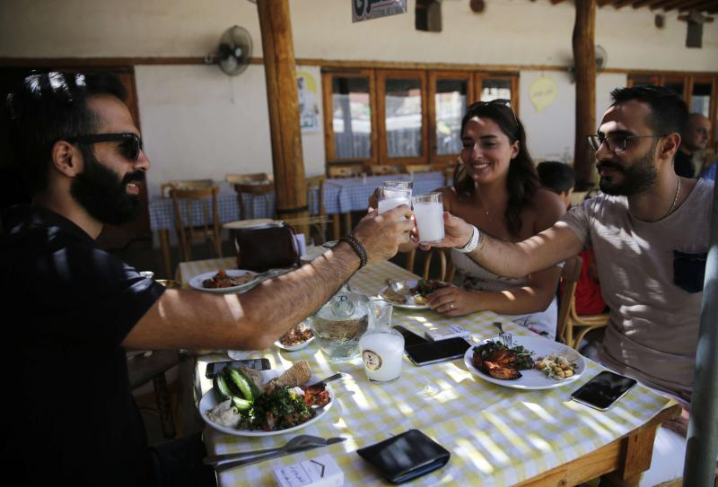
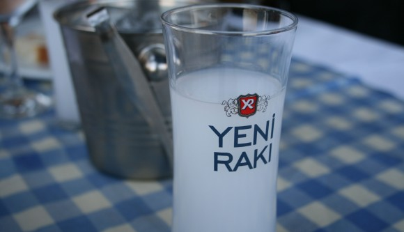

# Arak

A middle eastern drink.

Arak, also known as lion's milk, is the most popular alcoholic drink in the
middle east, which is an essential ingredient in various types of celebrations.

However, this drink has a certain ritual, to live the experience of drinking it
according to the origins. Arak is made from grapes and anise seeds, distilled
twice, and mixed with some cold water before drinking it.

Drinking arak is a traditional ritual of the celebration, and one of the
traditions of drinking it is to knock the bottoms of the cups together before
drinking.

It is advised not to drink Arak on an empty stomach. Among the most famous
dishes that go along with the arak drink, are oriental mezze dishes, such as
muhammara or raw meat.

The first mezze dish served with arak is the sliced cantaloupe with feta cheese,
and it is usually served with arak without the need to order.

There is usually a troupe of male musicians in Turkish bars, who play melodies
on oriental musical instruments, such as the qanun, lute, or flute. This group
is known in Turkish as "Fasil Ekipi".

Arak can’t be drunk directly, but it is diluted by adding about twice the amount
of water, and adding ice cubes to it. This dilution, especially in the Turkish,
Shami and Iraqi type of it, which is sometimes called Zahlawi, causes the color
of the Arak to change from colorless to white like milk.

The well-known tradition is to add water before the ice, because if the ice is
added first, an undesirable layer will form on the top of the drink, and for the
same reason the same cup cannot be used, and a new one must be used. So, in
restaurants, when arak is ordered, several glasses are brought along with the
bottle.

The most famous type of Arak in the world Rakia in Serbia, Turkey, Bulgaria,
Albania and Greece. Cognac in France. Water of life or Almahah in Morocco.

Arak has always been prepared from fermented grapes with the addition of anise,
as in Syria, but there are variations in some countries. The name varies in
countries such as Turkey, where it is called "raki", and it is called ouzo in
Greece, the Republic of Macedonia and Bulgaria. In these countries, it may also
be made from many seeds such as figs, peaches and potatoes. Among the varieties
of arak is also the Iraqi arak, which is made from fermented date juice, and
from raisins in Egypt.

In Iran, it is called 'erg seki', meaning 'dog Arak, and it is made without
anise and has a high alcohol content.

And the "Arak" drinking sessions turn into sessions to "open the heart" and
share worries and secrets between friends.

## About the Author

Mujahid Al-Majali, a 29-year-old former air force soldier and an economic
development and business specialist, also does translation and copywriting.
Loves long drives, chill music and old school movies. A nicotine addict and a
huge fan of Jack Daniel’s whiskey. Owned multiple businesses in Amman and
southern of Jordan PRE-COVID and now focusing on translation and copywriting
part of my experience through Upwork.
