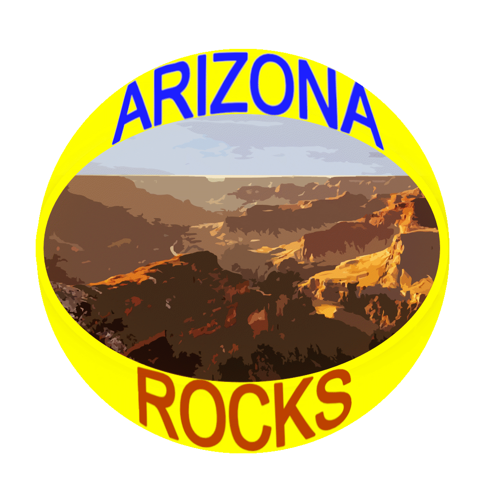

# 🇺🇸 Arizona

Arizona is VERY diverse. Politics is an example. In the north, around Flagstaff,
liberal politics are the norm. The same is true in the south, around Tucson,
while most, but definitely not all of the middle of the state embraces
conservative values. So much for that.

Most areas of the state enjoy a view of the mountains. It’s difficult to find a
location where one cannot see peaks in the distance, if not up close. For that
reason, there are areas in the south that are cooler than places farther north.
Even though Tucson has quite a few cacti, it is cooler than the Phoenix area
farther north, sometimes broadly referred to as “The Valley”. Speaking of
valleys, let’s not forget The Grand Canyon. Red rock formations can be found in
many areas of the state, including IN and around some cities. The varieties of
cacti are huge (60 species) and they exist to some extent over a large swath of
the state. I would mention the names, but most, other than Saguaro, would be
unfamiliar to many readers. Varieties of evergreens are everywhere, including
the world’s largest Ponderosa Pine forest.

As one might expect with such varied terrain, sports opportunities are numerous
as well. We have tall mountains (Humphreys Peak is 12,633 ft.) and the lowest
point is along the Colorado River in the southwest, at about 70 ft. Name an
outdoor sport and it is possible, from snow skiing to dune buggy racing. I have
driven my Jeep off-road in many places around the state (seems like a sport to
me). I included a couple of photos in an article in this series, on off-road
driving.

I could go on and on providing examples of Arizona’s diversity and not even
begin to touch many important points. The people are an example: Native
Americans, Hispanics, Blacks, Whites, Asians, young and old, folks relocated
from all over, to this land filled with wonderful sights, and of course tourists
from EVERYWHERE. I suppose this is beginning to sound like a tourist
advertisement of some sort, but the truth is that it’s difficult to not sound
like a promotional piece while describing Arizona.

The wildlife is incredible. In and around our small town, there are an
unbelievable number of different creatures. We have cattle and horse ranches. In
our neighborhood I have seen thousands of small lizards over the years, a good
thing because they eat insects and we have plenty, some Coyotes, Bald Eagles,
Great Horned Owls, Roadrunners, Vultures/Buzzards, Red Tailed Hawks and ALL the
more common birds that one might expect (my favorites being Quail and
Hummingbirds). We have also seen endangered Mexican Gray Wolves, Javelinas (like
a wild boar), and although I haven’t seen one, Mountain Lions in the nearby
mountains.

One day my wife, in a somewhat panicked state, pointed out a snake that looked a
lot like a poisonous Coral Snake on our kitchen counter. Yeah, REALLY! How the
hell a snake got in the house, let alone on the counter, I have no idea. I
looked it up and found it was just a harmless look-alike, but nevertheless a
shock for us. We let it go outside. Due to climate change and pollution, we
don’t see as many bats and toads as we used to.

We also have tarantulas, SOME varieties of which are not especially scary. Our
son picked one up one day and held it for a minute or two - no problem. I would
not suggest picking up a Scorpion or Centipede though. Bunnies, Jackrabbits,
squirrels, and moles are everywhere.

Arizona is surrounded by (starting in the south and going clockwise) Mexico,
California, Nevada, Utah, Colorado (the corners touch) and New Mexico. So
Arizona ranges from low to high altitude, from desert to evergreen forest; from
completely rural to densely packed cities; from liberal to conservative; and you
will find all kinds of wildlife in very surprising places.

The Navaho Reservation in the northeastern part of Arizona and also occupying
parts of Utah and New Mexico, is larger than West Virginia, Maryland, Hawaii,
Massachusetts, Vermont, New Hampshire, New Jersey, Connecticut, Delaware, Rhode
Island or the territory of Puerto Rico. It is almost as large as the last five
of these listed states added together (New Hampshire through Rhode Island). The
Navaho Nation deserves to be considered as a separate and important entity for
reasons other than just it’s expansive size. For more information on the Navaho
Nation, please see the link listed in the Resources below.

The climate where I live, a little northwest of the center of the state, is
generally mild: Winters not too cold, summers not as hot as some other areas,
spring is nice but windy, and so fall is my favorite.

RESOURCES - Check these websites for more information on Arizona:

- <https://www.britannica.com/place/Arizona-state>
- <https://www.tripadvisor.com/Tourism-g28924-Arizona-Vacations.html>
- <https://www.visitarizona.com/>
- <https://en.wikipedia.org/wiki/Navajo_Nation>
- <https://www.mapsofworld.com/usa/states/arizona/>

## About The Author

Harley Armentrout is a happy husband and father, former silversmith, aerospace
electronics prototype assembler, test, calibration & repair technician, also
writing test procedures at [BallAerospace](https://www.ball.com/aerospace). Then
21 years in the gaming industry, in a range of positions, culminated as a Gaming
Inspector, observing and reporting on rules violations, safety issues and
criminal activities for the
[Yavapai Prescott Indian Tribe](https://buckyscasino.com/). After “retiring”
Harley taught himself a few graphic design skills and he works as a freelance
designer.
