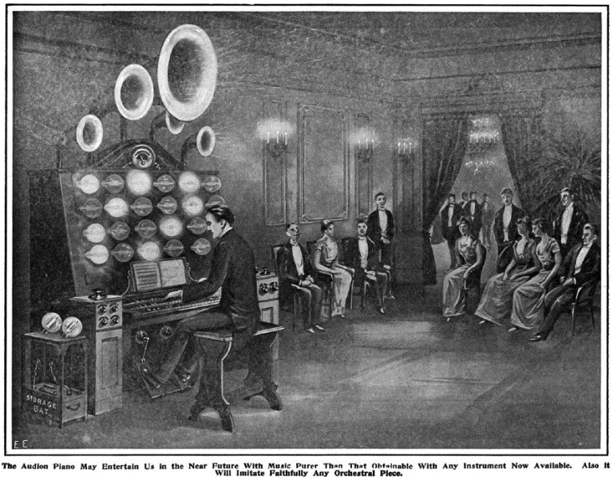
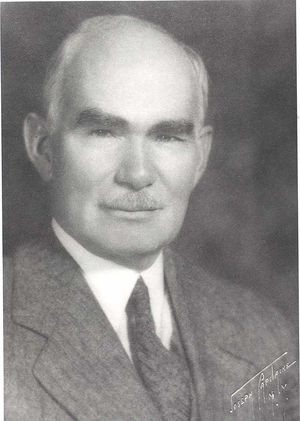

# ⌨️ Audion Piano

Lee De Forest, inventor of the triode electron tube, the Audion, also invented one of the first electronic musical instruments, the Audion piano. Invented in 1915, De Forest’s simple keyboard instrument used electron tubes in circuits called “oscillators,” which produced electromagnetic waves at a particular frequency. The waves were fed to a loudspeaker to make them audible.

In the Audion piano each “octave,” or set of eight notes on the keyboard, had a single electron tube dedicated to it, so that only one note per octave could be played at a time. So, while the Audion Piano could not play ordinary chords (complementary sets of keys) like a regular piano, it did produce some interesting musical sounds. In fact, because the wave-form of the oscillations could be modified to suit the player, the piano could produce many different kinds of sounds. De Forest described the sound
of the piano as “resembling a violin, cello, woodwind, muted brass,” or even as an entirely new sound never before possible with ordinary instruments. Sometimes, he admitted,
the sound was grating and unpleasant, leading the inventor to nickname his instrument the “squawk-a-phone.”

[“Audion Bulbs as Producers of Pure Musical Tones” from ‘The Electrical Experimenter’ December 1915]

The immediate application of De Forest’s triode valve was in the emerging radio technology of which De Forest was a tenacious promoter. De Forest also discovered that the valve was capable of creating audible sounds using the heterodyning or beat frequency technique: a way of creating audible sounds by combining two high frequency signals to create a composite lower frequency within audible range – a technique that was used by Leon Termen in his Theremin and Maurice Martenot in the Ondes Martenot some years later. In doing so, De Forest inadvertently invented the first true audio oscillator and paved the way for future electronic instruments and music.

In 1915 De Forest used the discovery of the heterodyning effect in an experimental instrument that he christened the ‘Audion Piano’ .
This instrument – based on previous experiments as early as 1907 – was the first vacuum tube instrument and established the blueprint for most future electronic instruments until the emergence of transistor technology some fifty year later.

[De Forest]

The Audion Piano, controlled by a single keyboard manual, used a single triode valve per octave, controlled by a set of keys allowing one monophonic note to be played per octave. This audio signal could be processed by a series of capacitors and resistors to produce variable and complex timbres and the output of the instrument could be sent to a set of speakers placed around a room giving the sound a novel spatial effect. De Forest planned a later version of the instrument that would have separate valves per key allowing full polyphony- it is not known if this instrument was ever constructed.

Next topic: Sound-Producing Device

## Sources

- Wikipedia / 120years.net / Ethw.org

## About the Author

"Guido F. Matis (a.k.a. widosub), a seasoned producer-composer authority with an unquenchable compassion towards the musical expression, and many years of experience in the fields of event organizing, movie post-production, and recording with professional musicians. His devotion to movie sounds shows in his art - widosub's music is filled with landscapes of emotions, dramatic twists and melancholic moods. He's one of the hosts of Tilos Rádió's MustBeat show, in which he's is focusing on drum'n'bass and chillout music. He's also one half of the duo Empty Universe."
