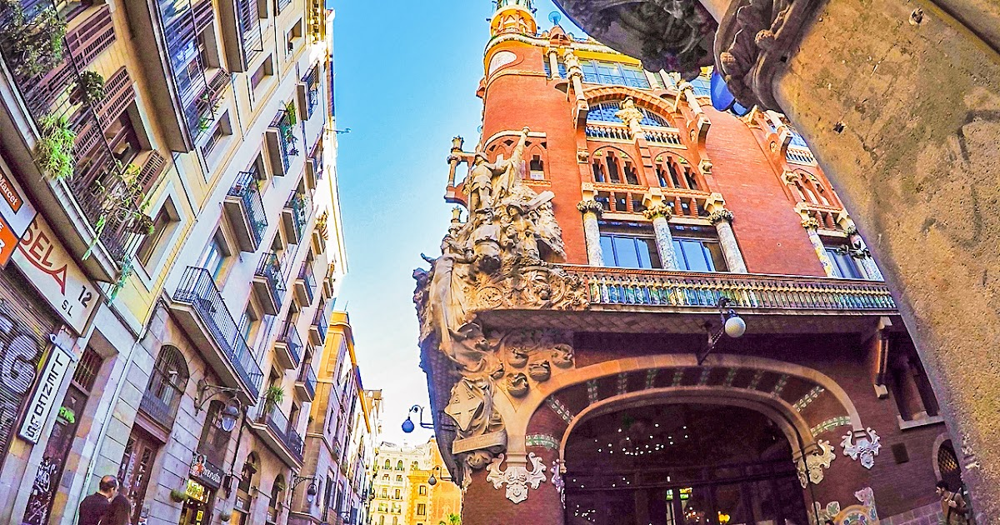
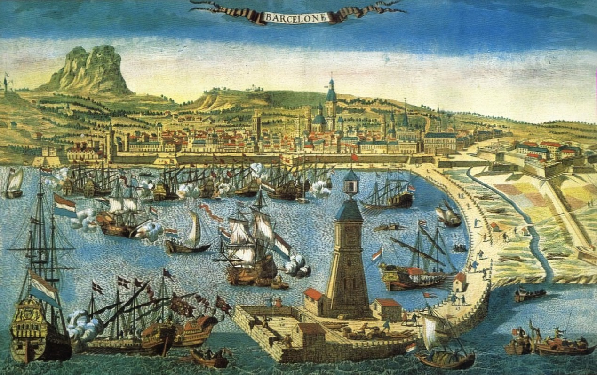
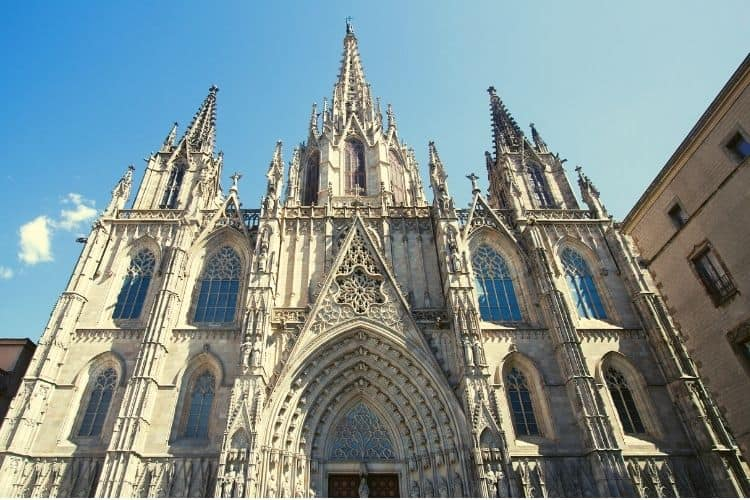
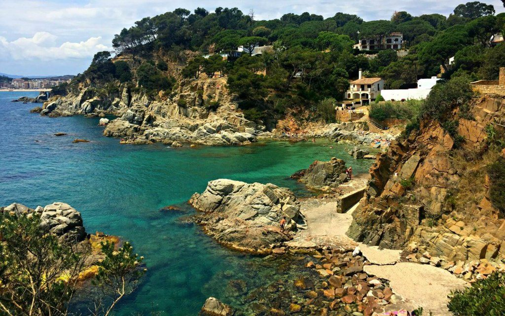
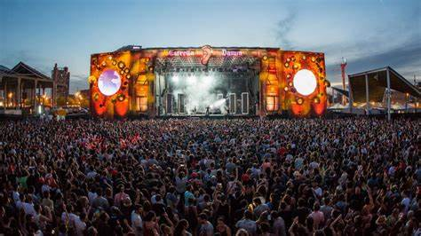
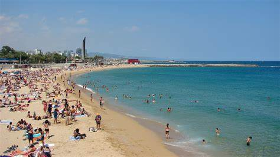

# 🏙️ Barcelona

Barcelona is a city on the coast of northeastern Spain. It is the capital and largest city of the autonomous community of Catalonia, as well as the second most populous municipality of Spain. With a population of 1.6 million within city limits,its urban area extends to numerous neighbouring municipalities within the Province of Barcelona and is home to around 4.8 million people,making it the fifth most populous urban area in the European Union after Paris, the Ruhr area, Madrid, and Milan. It is one of the largest metropolises on the Mediterranean Sea, located on the coast between the mouths of the rivers Llobregat and Besòs, and bounded to the west by the Serra de Collserola mountain range, the tallest peak of which is 512 metres (1,680 feet) high.

## History of name Barcelona

The name Barcelona comes from the ancient Iberian Baŕkeno, attested in an ancient coin inscription found on the right side of the coin in Iberian script as Barkeno in Levantine Iberian script, in ancient Greek sources as Βαρκινών, Barkinṓn; and in Latin as Barcino, Barcilonum and Barcenona.

Some older sources suggest that the city may have been named after the Carthaginian general Hamilcar Barca, who was supposed to have founded the city in the 3rd century BC,but there is no evidence that Barcelona was ever a Carthaginian settlement, or that its name in antiquity, Barcino, had any connection with the Barcid family of Hamilcar. During the Middle Ages, the city was variously known as Barchinona, Barçalona, Barchelonaa, and Barchenona.

# Architecture 

The city of Barcelona is one of the best-preserved medieval cities in Europe. As a result, visitors will see several aspects of the city’s historical nature that have helped it maintain its structures and essential aspects. The street plan is still recognizably medieval, despite several alterations over time and modernization during the 20th century.
The historic district contains many monuments, including Gothic churches and winding narrow streets with tiled roofs surrounded by walls at regular intervals.

The ancient walls were built in the 12th and 13th centuries to defend the populace from attacks by foreign armies. Other famous buildings include the most extensive library in Europe, Casey Mila, Barcelona’s Cathedral, and Park Güell – one of Gaudí’s masterpieces, called an architectonic masterpiece.

# FC Barcelona (Barça)

FC Barcelona is a Spanish football club. The club enjoys massive support throughout the world, having won many trophies. FC Barcelona has had many top players, including Pep Guardiola and Lionel Messi.

FC Barcelona certainly has its unique characteristics, as demonstrated by its successful team and the individuals who have played for it. In fact, FC Barcelona is one of the most valuable sports franchises in Europe. Additionally, the Camp Nou stadium and museum rank among Barcelona’s top 10 tourist attractions.

# Location and Climate

The city of Barcelona sits on the Mediterranean coast, surrounded by mountains that form the province of Catalonia. 

The Mediterranean’s climate, with warm sunny days and cool nights in winter, explains the abundant greenery throughout most of the year. The climate is cooler at night from December to March, but even then, it rarely snows.
Because of the city’s moderate temperature, residents spend a lot of time outside, from dining al fresco at outdoor restaurants and pubs to hiking or biking in the neighboring mountains. 

# Festivals and Street Parties

Apart from sports and architecture, the city of Barcelona is renowned for being one of the most energetic and active cities globally. The city has a range of festivals and carnival-style street festivities throughout the year, derived from traditions. 
The city hosts several significant music events throughout the summer, including Primavera Sound, Sonar Festival, Cruella, and Rock Fest Barcelona. Festival lineups feature the biggest stars in the music business and draw up to 200,000 people to the city.

 

Along with the music festivals, each city’s seventy-two wards has a Festa Major. These neighborhood fiestas feature street parties, parades, competitions for human towers, fire races, and fireworks displays.

# Mediterranean Beaches 

The city of Barcelona is renowned worldwide for its magnificent coastline. The city has a long, wild beach known as La Barceloneta. The Barceloneta is a highly famous beach in Barcelona, and it becomes quite crowded on weekends because of its easily accessible position. People come here to sunbathe and drink at one of the beachside bars and cafés or have a feast at one of the seafood restaurants in the neighboring tiny alleys. 

 

# About the author 

Idais, Graduated in Mechanical Engineering, and a master’s degree in teaching component, she gave classes in several institutes of mathematics and physics, but she also dedicated several years of my life as a television producer, she did the scripts for mikes, the camera direction, editing of video and even the location. Later she was dedicated to SEO writing for a couple of years. She likes poetry, chess and dominoes.
