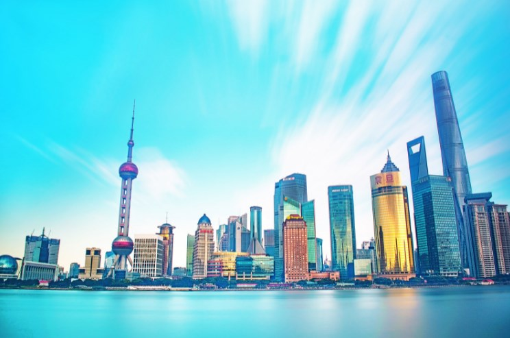
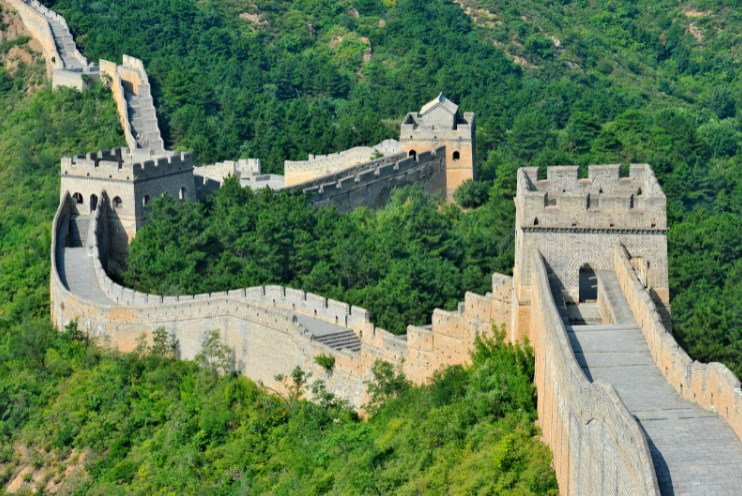
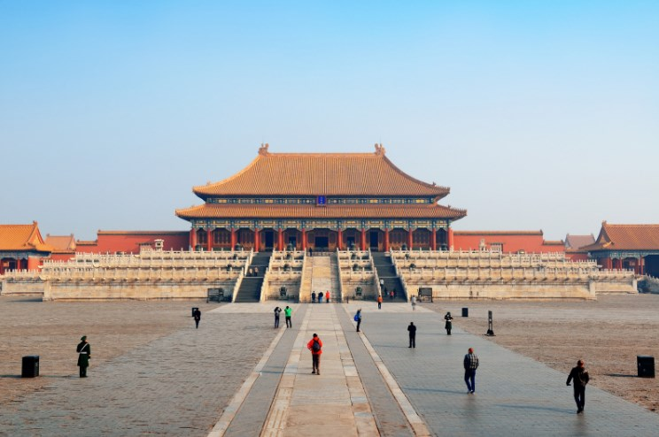

# 🏴󠁣󠁮󠀱󠀱󠁿 Beijing

Beijing is not only the capital of China, but also the political, social
and cultural heart of the country. It is a vibrant and chaotic city that
is constantly evolving, developing by leaps and bounds but at the same
time struggling to maintain its traditional structure. In Beijing you
will find contrasts where you will see modern skyscrapers that rise
majestically, next to small traditional houses that are located in the
old hutongs of Beijing.

The Far East is considered a magical and peculiar place where every
daily detail ends up being extremely curious for its visitors. This city
is surrounded by myths and legends, with a past characterized by
luxurious palaces and emperors of divine descent.

 

 Communism is still very present in Beijing, which is why many of its
citizens still remember with some nostalgia the time ruled by Chairman
Mao, so they pay homage to him in the mausoleum that is located in
Tiananmen, which is the largest square in the world. .

 Beijing is definitely one of the most populous cities on the planet, but
it is much more than traditional houses, tall skyscrapers, small temples
and red lanterns. So we are going to recommend the most emblematic
places in the city so that you do not miss an iota of its majesty.

 It is essential to visit the Great Wall, which although it is true is
not exactly inside Beijing, it is an attraction that is well worth
visiting since it is part of the seven Wonders of the World. It is the
quintessential symbol of the People\'s Republic of China in the world
and has been built for more than 2000 years. The legendary Great Wall of
China is a World Heritage Site and was built in order to protect China
along its northern border from foreign attacks. You can get there from
Beijing by bus and the trip takes about an hour and a half, but it is a
must-see as you are going to see the most significant engineering work
in the world.

 

 Another of the most important attractions in Beijing is visiting the
Forbidden City, where you can see endless rooms that have great
historical importance. The Chinese Imperial Palace was closed for
centuries and after a long time it opened its doors to the public, there
you can see the places where the imperial ceremonies were held, its
beautiful gardens and the immense courtyards that are part of the
Forbidden City.

 

 Touring the hutongs is an experience worth living, there you can see how
the most traditional community of the city lives on a daily basis. You
will be able to see children playing, women washing clothes in common
places and older adults playing majong, accompanied by an intense
movement of cyclists and pedestrians.

 One of the most beautiful places in the city is the Summer Palace, which
is made up of a series of gardens and buildings of singular beauty. It
was specially designed for the enjoyment of the imperial family in the
hot months and we are sure it will be a pleasant experience for you.

 Another of the most important buildings in the city is the Temple of
Heaven and in its rooms you can discover the divine rites that the
emperor carried out in order to strengthen his power on earth and the
silhouette of the triple blue roof is one of the best-known emblems
around of the world. On the other hand, the park that is in the Temple
of Heaven offers you the opportunity to see the inhabitants of the city
who gather there to dance, sing and play, being an experience of
complete cultural immersion.

 Although it is true that the places mentioned in advance are essential
visits, if you really want to get to know Beijing you should immerse
yourself in its local culture, discover its historical corners, discover
its flavors and feel the rhythm of this city of 22 million inhabitants
and 17,000 km².

 To live this excellent experience you must walk through Tiananmen
Square, where you can see the embalmed body of Mao in his mausoleum;
counting the dragons are carved in stone on the great staircase of the
Forbidden City (there are 9) in addition to visualizing each one of the
details of the impressive luxury.

 When you visit the Great Wall, one of the best activities you can do is
go to Mutianyu, which is one of the least crowded sectors and has a
cable car that at its highest station, you can have a spectacular view
of the forests that are in its vicinity surroundings.

 It is advisable that you discover the marble boat where Empress Cixi
held her great parties. Do not be disappointed when you realize that in
reality it is not exactly a ship, but rather a pavilion and that it is
not built in marble, but in wood. But its spectacular beauty more than
justifies the visit and we anticipate that in order to achieve that
appearance that is submerged in water, mirrors capable of reflecting the
waters of the lake were used.

 To get to know the local cuisine you must taste the dumplings they make
in the city of Xian Lao Man. You will realize that it is one of the
places where the local characters go to eat the best dumplings in the
city, so much so that years ago its Menu was only in Chinese, but today
you can find it in various places translated into English.

 Continuing with the gastronomic route, you should get lost among the
lights and red lamps of Gui Jie, being a colorful and vibrant street
full of restaurants, where you can have at your disposal dishes from all
parts of China.

 If you are interested in buying souvenirs, the recommendation is to go
to the famous Nanluoguxiang street which, in addition to being
completely remodeled, is full of restaurants and shops. You can even
visit the surrounding hutongs, as they are completely traditional and
thus you can bring together the best of both worlds.

 We invite you to discover the water lilies found in Beihai Park, which
are definitely part of the most beautiful and curious details of the
city. On the other hand, we recommend you get to know the bohemian area
of ​​Beijing and its street art found in the 798 artistic district, eat
inside a floating boat in Shichahai, live a night of music, exotic
drinks and fun in Sanlitun. Finally, try the caramelized sweet thangulu
fruit, which you will find in the street stalls that are scattered
throughout Beijing.

## About the Author

Idais, Graduated in Mechanical Engineering, and a master’s degree in teaching component, she gave classes in several institutes of mathematics and physics, but she also dedicated several years of my life as a television producer, she did the scripts for mikes, the camera direction, editing of video and even the location. Later she was dedicated to SEO writing for a couple of years. she like poetry, chess and dominoes.
