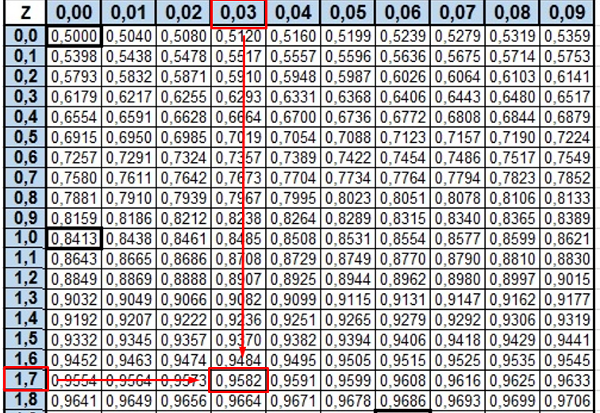
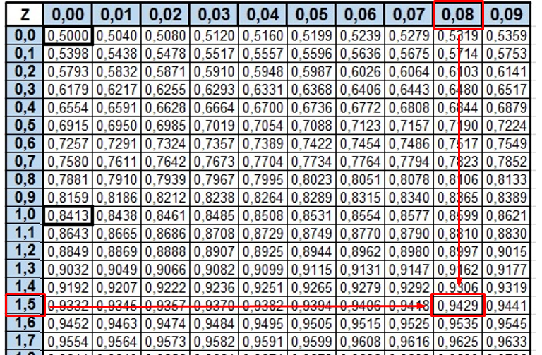
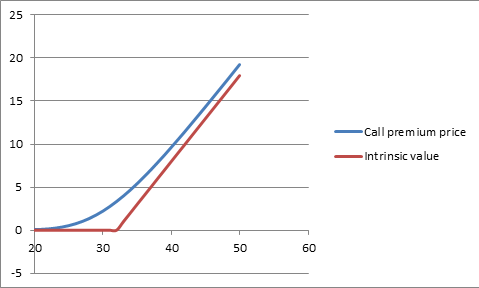

# 🔢 The Black Sholes Model

The Black Sholes model has had a great influence when it comes to evaluating financial options and was created by Fisher Black, Myron Sholes and Robert Merton in the year 1973. In fact, Myron Scholes and Robert Merton thanks to this model were awarded the Prize Nobel Prize in economics of the year 1997, unfortunately Fisher Black had died in 1995 and could not receive the award together with his colleagues.

We will give some basic notions before delving into the Black Scholes model, which will help us to better understand the model and its application.

An "asset" is any property that produces economic benefits, while a set of assets is what we call a "portfolio", these assets can be bonds, stocks, derivatives, etc.

On the other hand, there are certain costs to be able to carry out financial operations and these transaction costs will depend on whether it is an underlying or derivative asset, whether it is a purchase or a sale, etc.

What is an underlying asset? In finance there are products that are not actually assets in themselves, since they depend on the price, quotation and evolution of another specific asset, this type of product is called an underlying asset and it is precisely from where the value of instruments or instruments is derived. financial contracts.

Suppose a farmer wants to buy corn and his neighbor has exactly what he needs, which is a corn plantation, so the farmer makes an agreement with his neighbor. He is going to pay you $ 1,100 for the corn crop, which is currently worth $ 1,000, and this entitles the farmer to purchase the crop within six months.


Corn, in this case, would be the underlying asset and the agreement reached by the farmer with his neighbor would be the derivative contract. A financial derivative is a product, the value of which is based on the price of another underlying asset.

In this option to buy, the farmer can sell it to a third party at the price he wants, especially if he thinks that within six months the corn may become more expensive and thus obtain a profit.

Another concept that we must be clear about is volatility, so that if the price of an asset fluctuates a lot and also very fast, that price can be considered as very volatile. Typically, the standard or standard deviation is used to measure the volatility of an asset.

It is important to take into account that volatility only measures the past behavior or behavior of an asset, so it should never be confused with future risk. Of course, most of the prices that have been volatile in the past, it is very possible that they will continue to be so in the future.

The Black Sholes equation is based on stochastic processes and let's remember that a stochastic process is not predictable for sure, since it is influenced by a series of variables that move randomly. However, unlike non-stationary stochastic processes, stationary stochastic processes have certain characteristics that make them somewhat predictable.

In non-stationary stochastic processes the probability distribution varies constantly and the indicators behave in an absolutely chaotic way, while the stationary stochastic processes have values that are repeated and therefore can be predicted.

The Black Scholes model was devised to estimate the present value of a European “Call” option for the purchase, but also for the sale of future “Put” shares. In both cases, the model works to calculate the fair price of the premium to be paid by the buyer to the seller, to have the right to decide whether to buy the asset in the case of the Call option or to sell it, in the case of the option. Put.

A Call option is a financial derivative (its value is determined by changes in the underlying asset) that gives the buyer a right (but without forcing him) to acquire or purchase an asset in the future, at a price previously determined with the seller.

The buyer of a call option benefits when the underlying asset raises its price at the expiration date agreed with the seller. In that case, the owner of the call option may exercise his right by buying the asset and selling it at the market price, so that thanks to the rise in the share, he will keep a profit.

Otherwise, when the price of the share decreases in the future with respect to the price of the purchase option (known as the exercise price or strike price). The buyer may not exercise his right to buy the asset and will lose the premium that he had to pay in order to acquire the option. The buyer in that case must evaluate whether he prefers not to buy and only pay the premium.

That is why the buyer's profit can be very high, while his loss will always be limited to the premium he paid. The Black Scholes model defines a fair price for the premium to be paid, which gives the right to buy the share in the future, but as we specified previously, the buyer may not want to buy the option, if it does not suit him.

The Call option for the purchase is determined by the European style, where the buyer can only exercise the right to it, in case the date agreed with the seller has expired. While the US options can be exercised at any time from the date of the purchase option contract, until its expiration.

Now, in the Black Scholes model we will use what is called a "safe investment", that is, whose interest rate is risk-free. For example, when we analyze assets or derivatives but in short periods of time (quarters) and we are taking into account a state bond that is 20 years, it is of course a safe investment and we can assume constant (in the short term) the rate of that bond, for such a short time. This implies that the proportional changes in the share price for a short period of time have a normal distribution.

Let us remember that a normal distribution is based on a theoretical model, which satisfactorily approximates the value of random variables to an ideal situation, that is, the normal distribution is capable of adapting a random variable to a function that will depend so much on the standard deviation as the mean. In other words, the random variable and the function will have roughly the same representation, but with small differences.

On the other hand, when we buy a good at a lower price to sell it at a higher price in order to benefit thanks to the price difference, it is what we call "arbitrage", but as we know, there is no investment with the possibility to earn money without any risk. However, with a risk-free rate, we can minimize the levels of insecurity.

That is why there are agents specialized in minimizing the risks when investing and these agents avoid exposing the values of the assets to all the adverse changes that they may suffer.

In general, investment agents have portfolios whose assets are in a position that can be buy or sell, but they always try to place a derivative in the other position, so that if the price of the asset falls unfavorably , always have the option of cushioning that loss in this way.

The Black Scholes model in its beginnings tried to value options in order to calculate the price that the buyer had to pay for the premium of a European option (Call) for the purchase or sale (Put), but then the model began to be used in shares that produce dividends, not only in the European ones, but also in the North American ones and in the money market in general. Even today this model is used to value intangible assets, such as patents.

Considerations to take into account to apply the Black Scholes equation:

- Taxes or transaction costs are not taken into account in the model
- A risk-free and constant interest rate is assumed for the due date.
- Volatility is assumed to remain constant
- It should be based on the idea that there is no arbitration without risk
- The option does not bear interest
- Finally, it is also assumed that the probability distribution regarding the return is concerned, is a normal distribution.

Let's now go to the Black Sholes equation to find the price of a Call option:

`C=SxN(d_1 )-X e^(-rT) x N(d_2)`

Where the values of d_1 and d_2 are obtained from the following formulas:

`d_1= ln⁡〖S/X+ (r+ σ^2/2)x T〗/(σ √T)`

`d_2= d_1- σ √T`

We are going to explain the nomenclature of each of the elements that make up the formulas:

```
T = Time expressed in years, for example:
3 meses = ((1 año x 3 meses)/(12 meses)) = 0.25 año

C = Represents the fair price of the premium that entitles the buyer to acquire the asset in the future or purchase option, but which must be canceled at the time of signing the option, that is, for a time T = 0
σ = Standard deviation or volatility of the option or asset
r = Risk-free rate
X = Price of the option to buy or also called the exercise price
S = Current price of the option u asset, that is, for the initial time T = 0
```

N (d_1) and N (d_2) = Represent the values of the cumulative probability functions with a normal distribution, that is, it is assumed that the mean is zero (0) and the standard deviation is one (1) for both functions.

Let's go with the first example:

Suppose I want to calculate the fair value of a Call option with three months expiration, whose strike price is € 40. The share is priced at € 50 and its annual volatility is 30% (0.3), its risk-free interest rate being 10% (0.1) at three months and we know that in that period of time, the share does not pay dividends.

We break down the information in the terms we need to apply the Black Scholes equation:

```
T = 3 months, that is, 0.25 years
r = The risk-free interest rate that equals 10% (0.1)
σ = The volatility or standard deviation is 30% (0.3)
X = € 40
S = € 50
```

We are going to calculate both d_1and d_2

`d_1= ln⁡〖50/40+ (0.1+ 〖0.3〗^2/2) 0.25〗/(0.3 √0.25) = 1.72`

`d_2= d_1- σ √T = 1.72 – 0.3√0.25 = 1.57`

In order to evaluate the cumulative probability function of a normal distribution, where it is assumed that its mean is zero (0) and its standard deviation is one (1), we must go to the tables of that normal distribution, with the data obtained from `d_1= 1.729290342.`

As we can see, on the left side of the table we can only find the number that represents the units and tenths of d_1, that is: 1.7; while in the upper part we are going to approximate the hundredths (which in this case are 0.029290342) to 0.3 and the intersection of both values in the table, will give me as a result the specific normal distribution of our d_1



Then our value of N (d_1) = 0.9582

We are going to carry out the same method to obtain the evaluation of the cumulative probability function, but this time with d_2, in the same way we can observe that both the units and the tenths of d_2 are equal to 1.5; while the hundredths can be approximated from 0.079 to 0.08.Likewise, we intercept both values in the probability table:



From the table we can extract the value of N (d_2)

`N (d_2) = 0.9429`

Now we can calculate the fair price that the buyer must pay to obtain the Call purchase option, by means of the Black Sholes equation:

`C=S .N(d_1 )-(X .e^(-rT) )N(d_2)`

Substituting the values:

`C=50 .0,9582-(40 .e^(-0,1 x 0,25) ) x 0,9429`

`C=11,1226 €`

Of course, we can also do the calculations in Excel and instead of using the probability tables when evaluating the normal distribution, we can simply give the following instruction in the cell: NORM.S.DIST (place the cell where it is located calculated the value d_1; TRUE). When one places the word "true" after the (;) the NORM.S.DIST function returns the cumulative normal distribution which is the same as using the probability tables.

| S   | 50   |
| --- | ---- |
| X   | 40   |
| r   | 0,1  |
| σ   | 0,3  |
| T   | 0,25 |

| d1  | 1,7292903 |
| --- | --------- |
| d2  | 1,5792903 |

| N(d1) | 0,9581214 |
| ----- | --------- |
| N(d2) | 0,9428653 |

| C   | 11,122638 |
| --- | --------- |

As we can see, in both ways we obtain that the fair price of the Call option is € 11.12

Although this model offers us on a silver platter an absolutely brilliant solution to calculate the appropriate price to be paid to obtain an option in the future, we also know that it has some limitations, since it works with a series of assumptions that are not perfectly adapted to reality. For example: the risk-free rate and volatility are constant in this equation and it also assumes that the option does not pay dividends. It is no secret to anyone that not only are there stocks that pay dividends, but risk-free rates and volatility change over time, so these assumptions are ultimately not real.

On the other hand, the Black Scholes model focuses on assets or options, which can only be settled or exercised on a certain expiration date, and for example, North American options can be exercised or settled before their expiration date.

Just as this model offers us a suitable price for the European Call option (for the purchase), it also gives us an idea of the appropriate price for the sale of this European option (Put), so that our second example will be focused in this sense.

**Exercise 2:**

Suppose that the shares of a company are priced at $ 45 and we want to know the price of an option for the sale (Put) of 100 shares, if its exercise price (also called strike) is $ 48 per share, the date of maturity is 6 months, with a risk-free rate of 2.8% and has an annual volatility of 9%. Let's apply the Black Scholes equation!

For greater comfort when performing the calculations, it is advisable to use Excel and we realize that the value of all the actions at present is:

`S = $ 45 x 100 = $ 4500 and in the same way`
`X = $ 48 x 100 = $ 4800`

We must express time in years, therefore:

`T = 6/12 = 0.5`

The Black Scholes equation for the advisable price of the put option is:

`P=X. e^(-rT).N(-d_2 )-S.N(〖-d〗_1)`

It is important to take into account that for the put option when evaluating the normal distribution we must use the calculation of d_1but with the sign changed, that is: N (-〖 d〗\_1) and the same for the calculation of the normal distribution of d_2, in the formula is also used is N(-〖 d〗\_2).

Once we carry out all the calculations in Excel we are left with:

| S   | 4500  |
| --- | ----- |
| X   | 4800  |
| r   | 2,80% |
| σ   | 9%    |
| T   | 0,5   |

| d1  | -0,7623 |
| --- | ------- |
| d2  | -0,8260 |

| N(-d1) | 0,7771 |
| ------ | ------ |
| N(-d2) | 0,7956 |

| P   | 268,9296 |
| --- | -------- |

To clarify a bit the difference between the Call option and the Put option, in the former, the buyer must pay a premium to have the right, but not the obligation, to buy an underlying asset and the seller has the obligation to sell the asset, if the buyer wants to exercise his right to purchase.

For the Put option, the buyer is the one who sells the asset and in this option the buyer has the right to sell or not the underlying asset, because it is he who pays the premium, while the seller has the obligation to buy in case that the buyer decides to sell.

In both cases, the seller always keeps the premium regardless of whether or not the transaction is carried out and it is the buyer who decides whether to exercise his right or not, since he is the one who pays the premium.

So the price that the buyer must pay for the premium if he wants to sell the underlying asset is $ 268.9. The Black Sholes model

**Exercise 3:**

This exercise is intended to teach how to graph in Excel the relationship between the intrinsic value and the listing price of a Call option, since the relationship between the two is what can determine whether or not the underlying asset should be bought or not.

The intrinsic value of an underlying asset can be defined as the value in the present, of the cash flows of that action in an established future, that is, the current value of the money that we can earn with this asset, but in a future.

To calculate the intrinsic value of a Call option, we must subtract the price of the underlying asset minus the strike price:

`Intrinsic value Call = S - X`

Now, to calculate the intrinsic value of a Put option, we must subtract the price of the underlying asset from the exercise price.

`Intrinsic value Put = X - S`

In order not to go into details, we are simply going to place improvised values of each of the variables that are required to calculate the appropriate value of the premium of a certain option and according to the Black Scholes equation, we will obtain the result for both the call option to buy as for the Put option.

| S   | 30  |
| --- | --- |
| X   | 32  |
| r   | 8%  |
| σ   | 30% |
| T   | 0.5 |

We carry out the pertinent calculations in Excel and obtain the values:

| d1  | -0.00961  |
| --- | --------- |
| d2  | -0.221742 |

| N(d1) | 0.4961664 |
| ----- | --------- |
| N(d2) | 0.4122575 |

| N(-d1) | 0.5038336 |
| ------ | --------- |
| N(-d2) | 0.5877425 |

| C   | 2.2100264 |
| --- | --------- |
| P   | 2.9552884 |

Now we are going to make a data table with the possible prices quoted at the expiration date of a Call purchase option and we will place them in column “D” (in this case we will establish that they range between € 20 and € 50). It is important to leave the first row of this item completely blank.

| Variation of the share price at the expiration date | Call premium price | Intrinsic value |
| --------------------------------------------------- | ------------------ | --------------- |
| 0                                                   | 2,2100264          | 0               |
| 20                                                  |                    |                 |
| 21                                                  |                    |                 |
| 22                                                  |                    |                 |

Of course, it does not reach the value 22 until 50 ...

In the second column "E" we will assign the price of the Call premium and in the first row of this column, we will simply place the value obtained by means of the Black Scholes equation, which in this case is in cell B17, that is to say:

`= 2.2100264.`

The third column "F" is intended for the calculation of the intrinsic value, which in order to find it, it will be necessary to give the following instruction in the first row of this column: = MAX (the value of S - the value of X; 0). As we can see the value of S that we have in cell B2 we will subtract the value of X that is in cell B3 and after the (;) we must place zero (0), since this value tells us that if the value of S is less than the value of X, it gives us zero (0) as a result, so that we realize that in that case, it is not worth buying since the option would be giving losses.

Later we must choose all this table including its blank values and go to the upper part of Excel and choose "Data", and then display the "Analysis what if" menu that is in the upper right, then we choose the option "table of data ”and a box will appear, with two possibilities that are: input cell (row) and input cell (column), we position ourselves in the second option (column) and there we choose with the mouse the cell that corresponds to the value of "S", that is, cell B2 and we click "accept", in this way the rest of the data in our table will be automatically filled out as follows:

| Variation of the share price at the expiration date | Call premium price | Intrinsic value |
| --------------------------------------------------- | ------------------ | --------------- |
| 20                                                  | 0,041343887        | 0               |
| 21                                                  | 0,077187987        | 0               |
| 22                                                  | 0,134547121        | 0               |
| 23                                                  | 0,220885826        | 0               |
| 24                                                  | 0,344077707        | 0               |
| 25                                                  | 0,511811418        | 0               |
| 26                                                  | 0,73100205         | 0               |
| 27                                                  | 1,007292956        | 0               |
| 28                                                  | 1,344707004        | 0               |
| 29                                                  | 1,745473503        | 0               |
| 30                                                  | 2,210026361        | 0               |
| 31                                                  | 2,73714607         | 0               |
| 32                                                  | 3,324205122        | 0               |
| 33                                                  | 3,96747298         | 1               |
| 34                                                  | 4,662440339        | 2               |
| 35                                                  | 5,404130505        | 3               |
| 36                                                  | 6,187375462        | 4               |
| 37                                                  | 7,007043826        | 5               |
| 38                                                  | 7,858215942        | 6               |
| 39                                                  | 8,736307512        | 7               |
| 40                                                  | 9,637147112        | 8               |
| 41                                                  | 10,55701516        | 9               |
| 42                                                  | 11,49265261        | 10              |
| 43                                                  | 12,44124741        | 11              |
| 44                                                  | 13,4004058         | 12              |
| 45                                                  | 14,3681145         | 13              |
| 46                                                  | 15,34269833        | 14              |
| 47                                                  | 16,32277683        | 15              |
| 48                                                  | 17,3072223         | 16              |
| 49                                                  | 18,29512072        | 17              |
| 50                                                  | 19,28573653        | 18              |

It is then when we choose the whole table, we go to the upper part of our Excel in "Insert", we display the "Dispersion" menu and we choose the third option which is "Dispersion with smoothed lines" and in this way we will obtain the expected graph.



If we look at the table, we can realize that profits are obtained from € 33, because from that cell onwards, the intrinsic value is different from zero (0), but in the graph we can visualize this same behavior, because from of that same value (€ 33) is that the function that represents the intrinsic value begins to rise, giving us a positive response when buying the underlying asset, for the previous values, the intrinsic value found in the graph, we can observe that it is null.

## About The Author

Idais, Graduated in Mechanical Engineering, and a master’s degree in teaching component, she gave classes in several institutes of mathematics and physics, but she also dedicated several years of my life as a television producer, she did the scripts for mikes, the camera direction, editing of video and even the location. Later she was dedicated to SEO writing for a couple of years. she like poetry, chess and dominoes.
