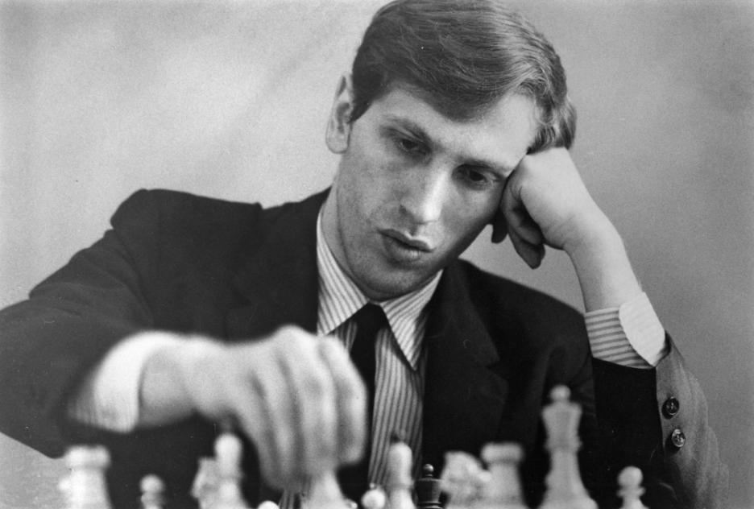

# ♖ Bobby Fischer, yeah?

Check. Mate.

Today we're going to talk about Bobby Fischer, King of the Chess People.

It's 1972. Bobby Fischer is, like, 29 years old, and at the time, he had won the U.S. Open Championship and was an International Grandmaster.

But he wasn't just a normal chess player. He was always going like boom boom boom, check!

Woot, woot, woot, checkmate!

That was when he felt most comfortable in life. And yet, Russia had won the World Championship for the last 24 years.

And Russia used that as sort of a PR campaign, like, we are the kings! We’re so good at this, we rule this game! We are not only Communists, but we are the intellectuals of the world because we do chess.

The World Championships are in Iceland, and Boris Spassky, backed by the Russian government,

was like, Bobby Fischer is too young and inexperienced for someone like me, the World Champion.

Here's the thing, Fischer hated Russians, and he called them filthy pigs. So, it was much more than just a chess match.

The Cold War is happening. Life Magazine called it the match of the century, and in the retrospect it was, because it was the match of the century.

And then Fischer didn't show up.

He was still in, uh, New York, and he said, I don't want to play in this match 'cause it's not enough prize money! Can you believe this!

It's not enough!

He was all talk. He wasn't, like, ready to perform for, like, commies and shit. But he gets a phone call from Henry Kissinger, the Secretary of State, and he said:

This is Henry Kissinger

saying that you need to get your ass over to Iceland now.

So, he finally shows up in Iceland, and Spassky's like, fine, great, let's get started.

But Fischer was like, there's too many cameras.

There's, uh-- the audience is too close.

The chess board is too shiny.

The lights are shiny.

But Fischer finally agreed to play, and in America it was shown on bars throughout the country. So, you would go into a bar, you'd see chess and not the New York Mets,

The first game was weird because there's cameras everywhere. And Fischer made a rookie move,

like, he went and got an outlier pawn with his bishop, and Spassky surrounded it with his bishops.

And he lost big time.

The second match came around, and Spassky was there, and he goes, where is he?

Fischer was staying in his room and saying, I will not go out unless the cameras change.

And he was thinking that they would do it,

but they didn't.

And then Fischer forfeits the match.

And he's down two-nothing,

which is pretty messed up. And then finally for the third game Fischer said, look, let's go to a back room with no cameras, please.

And Spassky said yes. Fischer felt comfortable and won. He won! The first time he'd ever beaten Spassky.

Once he won, it just changed. It's like a turnaround It happened.

So, Fischer won the third game, the fifth game, the sixth game, the eighth game, the tenth game. It was so brilliant,

Spassky actually stood up, he gave a standing ovation!

And after the 13th game, the Soviets were like, what do we do? They went to the officials and said, Bobby Fischer is using electronic devices to wane Spassky's energy through electronic zap page.

So, the Reykjavik police from Iceland came in and took apart everything. They took apart Bobby Fischer's chair, Bobby Fischer's, uh...peanuts. And they were thinking, oh, this is going to fluster Fischer, because Fischer's very tumultuous.

It didn't at all.

He loved it. And he won after that, and won and won, and pretty much after the 21st match, it became impossible for Spassky to win. And it was like, oh, my God! Fischer wins! Fischer wins!

he's, the World Chess Champion, and he's from the U.S. He walks out in Reykjavik, there's people everywhere. He's mobbed. Fischer was huge, and he became a Cold War hero!

