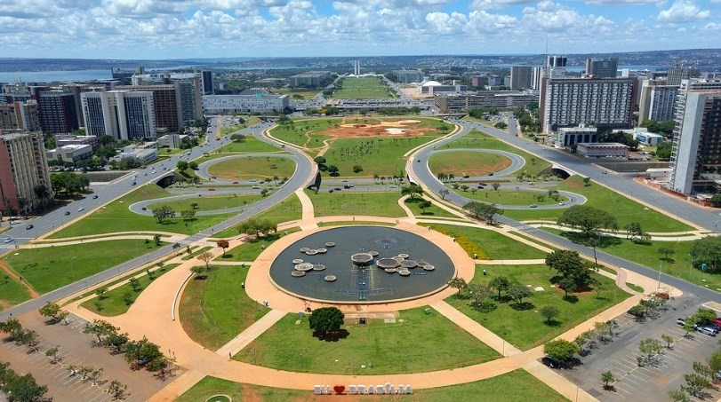
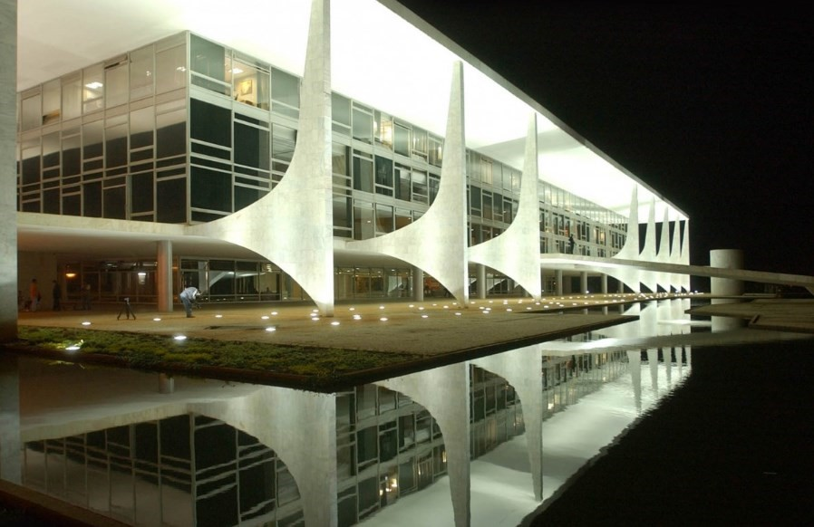

# 🌄 Brasilia

Brasilia has been the capital of Brazil since 1960 and has become an important urban landmark, for which it was declared by UNESCO in 1987 as Cultural Heritage of Humanity. The renowned architect Oscar Niemeyer was one of the main artists who collaborated in the design of this city and that is why many buildings bear his stamp.
It is a minimalist, modern and elegant city, perfectly planned from the beginning and with much to offer. We will give you a guide to the most important places you should visit if you go to the capital of Brazil.

## Brasilia Cathedral

The impressive Nossa Senhora Aparecida Metropolitan Cathedral is one of the designs of Oscar Niemeyer, who managed to complete this true work of art in 1970. This large hyperboloid structure is built of concrete and its glass roof seems to rise into the open sky. This cathedral is considered one of the architectural wonders of the world and every year receives thousands of travelers from all over the world. Both outside and inside, this cathedral will leave you speechless.

## Planalto Palace

The Planalto Palace is where the executive power of the Brazilian federal government resides. The building was also designed by Oscar Niemeyer and is located in the Square of The Three Powers and this building represents an avant-garde vision of architecture, part of its decoration includes Brazilian furniture in the modernist style of the 60s.

On the first floor you will find a reception area and you will be able to admire some of its exhibitions related to the federal government. The second floor is where the signing of decrees and legislative norms is presided over; on the third floor is the Presidential Cabinet and the rest of the offices of his senior team, while on the fourth floor are the offices that belong to the high government. This place is completely open to the public on Sundays from 9 am to 2 pm.

## Paranoa Lake

The Paranoa Lake is an immense 80 km artificial lake that was created parallel to the construction of the city and the dammed waters of the Paranoa River were used. On the shore of the lake you can find several restaurants that offer you both local food and international fusion dishes. But it also has artificial beaches such as Piscinão do Lago Norte and Prainha, in addition to being able to bathe in an artificial beach, there are also plenty of activity offers in which you can sign up.

## Juscelino Kubitschek Bridge

This bridge crosses Lake Paranoá and has a length of approximately 720 meters. It has been awarded for its great architectural beauty, obtaining awards for being the most beautiful bridge in the world. It was designed by the architect Alexandre Chan and the structural manager was the engineer Mario Vila and thanks to this work they were world renowned, in addition to a large number of distinctions. The name of the bridge was chosen to honor the former president of Brazil who decided to build Brasilia and make it the capital of this beautiful country.

## Honestino Guimarães National Museum

The Honestino Guimarães National Museum is another magnificent work within this capital, its perfect hemispherical shape, its minimalist expression and a prominent ramp, give this architectural marvel a surreal character, where the architect Oscar Niemeyer once again shows his style in this design. This museum and the Leonel de Moura Brizola National Library are the representation of the largest cultural complex in the country and inside the museum, you can find a large number of excellent art exhibitions where you can admire wonderful works.

## Pantheon Tancredo Neves

The Pantheon of the Fatherland and of Liberty Tancredo Neves pays homage to those Brazilian heroes who fought for freedom and democracy. The pantheon is shaped like a dove, it has an area of 2,105 m² and on its exterior you will find a burning flame to represent the independence of the country and the freedom of its inhabitants. Although it is true that the three-story building has the name of pantheon, inside it there is no tomb of the honorees.

## TV Tower

After crossing the Juscelino Kubitschek bridge you will find the Brasilia TV Tower with radio and television broadcasting antennas, it was inaugurated in 1967 and designed by the architect Lúcio Costa, who was inspired by the Eiffel Tower. The recommendation is to visit it on Sundays, since around you can find hundreds of craft vendors and street food stalls, with the Fountain Square and the craft fair being one of its main attractions. You can also have excellent panoramic views from its viewpoint at 75 m high and it is important to see the sculpture "Space Age" made by Alexandre Wakenwith, which is definitely a marvel.

## Square of the Three Powers

Square of the Three Powers is a real visual delight because from an aesthetic point of view it is a very artistic place, all adorned with sculptures. Around it are the headquarters of the Executive Power, Legislative Power, Judicial Power (hence the name of the Square of the Three Powers) and the most significant buildings of Oscar Niemeyer.

## South Lake Jetty

In Pantalán del Lago Sur you can try the best cuisine in Brazil, it has a wide variety of restaurants where you can try the delicious local food. At nightfall, you will be able to witness a beautiful view of Paranoá Lake.

## Sanctuary Don Bosco

The Don Bosco Sanctuary appears on hundreds of postcards as its beauty is unparalleled, it was built between 1963 and 1970 as an initiative between the federal government and the Salesian Congregation. This place was built as a tribute to Saint John Belchior Bosco who is the patron saint of Brasilia and is considered by the International Bureau of Cultural Capitals as one of the seven wonders of Brazil in 2008, so it is an essential place to visit in this city.
Brasilia is one of the most modern and planned cities in the world by the best architects and engineers in the country, full of buildings with great architectural beauty and many beautiful places to visit.

## About the Author

Idais, Graduated in Mechanical Engineering, and a master’s degree in teaching component, she gave classes in several institutes of mathematics and physics, but she also dedicated several years of my life as a television producer, she did the scripts for mikes, the camera direction, editing of video and even the location. Later she was dedicated to SEO writing for a couple of years. she like poetry, chess and dominoes.
