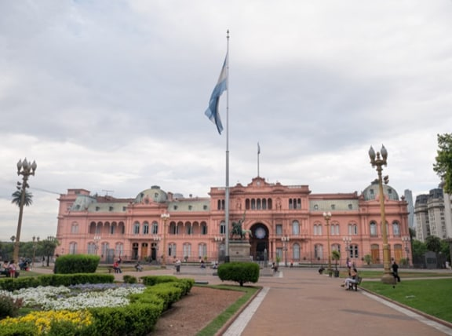
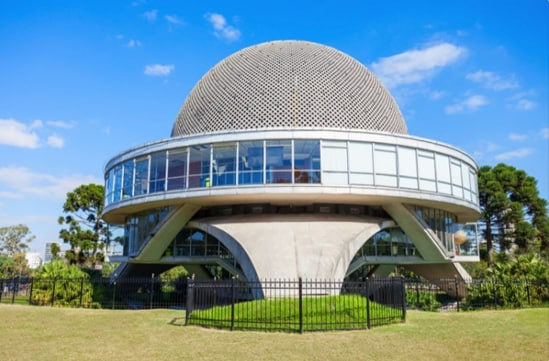
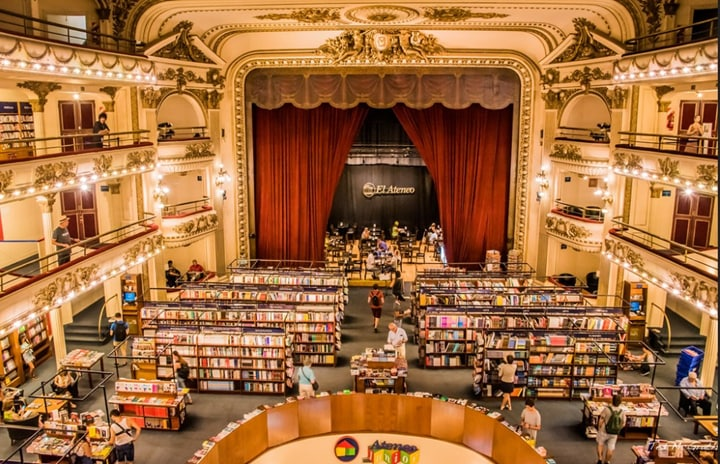

# 🏠 Buenos Aires

Buenos Aires is a city full of soccer, tango and exquisite meat. It is a city full of emotions and contrasts, where history plays an important role. It is among the 20 largest cities in the world and that is why you cannot get to Buenos Aires without meticulous planning.

The Plaza de Mayo was an important scene of the events that left their mark on the history of Argentina, where every Thursday the "Mothers of the Plaza de Mayo" meet there, who were dispossessed and lost their children during the military dictatorship. The square is full of emblematic buildings such as the metropolitan cathedral, the historic town hall and the famous Casa Rosada, which is where the executive power of Argentina resides and you can visit several of its impressive halls or the beautiful Patio de las Palmeras.

Every Sunday you can see the antiques and browse endless things to buy, going to the San Telmo Flea Market. But you can also enjoy living statues, musical performances, a large number of cafes and restaurants. But if you prefer tango, in the La Boca neighborhood you will find a very popular alley that inspired the famous tango "Caminito", its colorful houses, its high cultural value and its tango venues make it the best place to live the experience. of the Argentine dance.

Anyone who has read Mafalda will want to take a photo next to the life-size statue of her sitting on a bench in San Telmo.

A perfect place for leisure and weekends is Parque 3 Febrero, which has an area of 40 hectares where you can find three artificial lakes where you can go boating, there is also the Buenos Aires Zoo, the botanical garden, the impressive white bridge of the Rosedal park and the Planetarium.

In the planetarium you will realize that the building is inspired by Saturn, which also has its rings and was built in 1962. There you will find interactive activities that use virtual reality, astronomy projections and travel simulators.

It is essential that you live the passion of Argentines for football, being one of the best options to go to a game in what is owned by the Boca Juniors Club, the Alberto J. Armando Stadium also known as "La bombonera", there you can see playing renowned soccer players with a long history.

You must see the Obelisk that is located in the Plaza de la República that measures almost 70 m and was built in 1936 in commemoration of the fourth centenary of the founding of Buenos Aires.

If you like to go shopping, it is recommended that you visit the busiest shopping center in the city, the Galerias Pacifico, designed in 1888. Not only will you find international brand stores, but the building has been declared a National Historic Monument, its architecture is special by the dome that is inside where you can admire the frescoes by prestigious artists such as Antonio Berni.

You can get to any point of interest in the city using the six subway lines, it is the cheapest option to get around since each trip costs about 25 cents on the dollar.

If you want to visit the luxurious area of Buenos Aires, you should go to Recoleta, an area well known for its French-style architecture, it is even called the Argentine Paris. Luxury shops are concentrated on Alvear Avenue and there you will find the most select restaurants in the city. On this site you can also see the works of art found in the Recoleta Cemetery, inaugurated in 1822, it is full of mausoleums, pantheons with vaults and sculptures of great artistic value.

If you are a lover of reading you should visit the El Ateneo bookstore where you can lose yourself among thousands of books, it is a magical place built in the old Grand Splendid theater and still preserves all the elements of the magnificent theater, both the original railings, the curtain, the frescoes of the dome and the current cafe was the setting.

If you want to disconnect a bit, we recommend you spend a day in Tigre, which is a town about 30 km from Buenos Aires. There you can do different activities such as sailing on the Paraná River, visiting the Museum of Arts, different types of rowing tours and buying handicrafts on the Puerto de Frutos promenade.

It is a must for every tourist to taste the authentic Argentine barbecue that usually includes strips of churrasco, chorizo, chicken, black pudding, liver and other types of viscera. The meats in Argentina are of unbeatable quality.

Puerto Madero is the most modern place in the city that contrasts with the center of Buenos Aires, it is there where the highest residential towers in Argentina are found, such as the Renoir Towers that are 175 m high, and it is also a very exclusive and frequented by great personalities like Messi.

Another of the places that you cannot miss is the Teatro Colón, which is among the five best in the world both for its size, its trajectory and acoustics. This theater is on the same level as the Scala in Milan or the Vienna State Opera. It is covered by an art deco style dome and in its center hangs a chandelier that weighs just over 1 ton.

Chinatown is like being on the Asian continent but without leaving Buenos Aires and was founded after the arrival of Chinese and Taiwanese immigrants in the last decades of the 20th century. You can see at its entrance a traditional arch decorated with dragons and inside you can find restaurants and all kinds of shops with Asian import products.

It is recommended to visit the University City created in 1822 where you can enjoy the student atmosphere and the imposing columns found in the law school, you can also see that the land behind the pavilions reaches the Río de la Plata.

Finally, be sure to see the works of Frida Kahlo or Diego Rivera, as well as many of the modern Latin American painters, at the Museum of Latin American Art (MALVA).
Buenos Aires is definitely a beautiful dream city, which if you have the opportunity to go will leave you with wonderful memories.

## About the Author

Idais, Graduated in Mechanical Engineering, and a master’s degree in teaching component, she gave classes in several institutes of mathematics and physics, but she also dedicated several years of my life as a television producer, she did the scripts for mikes, the camera direction, editing of video and even the location. Later she was dedicated to SEO writing for a couple of years. She likes poetry, chess and dominoes.
