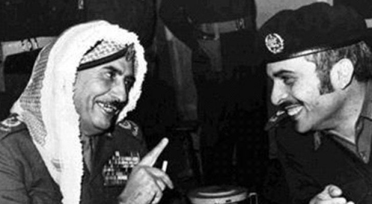

# 🎖️ Captian Habis Al-Majali, the legend of the battles of Latrun and Bab Al-Wad

His Excellency Field Marshal Habis Al-Majali / (Habis imprisoned them in the
valley... Habis and his soldiers and Tadi)

The year of Hayya is that revolution that was ignited by the men of Karak and
those around it, bearing hundreds or even thousands of pages of ancient history.
The divinity or identity of Karak is a decisive moment in the history of the
struggle of the Arab people, and a first sign of the transformation from a dark
era to another filled with hope and obsessions together, here. in This
historical moment, and the freemen scatter their souls for the land and dignity
to lift the injustice and darkness, so they spread it merrily, as they shoot
bullets from guns that are numbered and counted. To fill the castle with
detainees and prisoners, which was built civilization after civilization to
preserve the land, souls, and honor.

In the midst of all this, amid his harbingers, Bandar al-Karakiyya gave birth to
Habis al-Majali and gave birth to him in prison while accompanying (Makhshas).
They were the first two political detainees in the region, revolutionary free
women and the wives of elders, who led a revolution that was a major gateway
through which the Arab liberation movements crossed until the start of the Great
Arab Revolution.

Habis Al-Majali was born from the womb of the revolution, and on his forehead
are the banners of the next stage. In that year 1910 AD, he dated the birth of
Field Marshal Habis al-Majali, although some argue that his birth was in the
year 1914 AD, but the Arabs were chronicling the events and he was one of the
sons of the Hayya year, and perhaps one of the effects of that stage If I pushed
Habis to join military service at an early age, he is predisposed to struggle
and equestrianism, bearing in his memory and thought the images of those
tournaments that parents and grandparents wrote in the records of Jordanian
pottery. The orientations of a young man crowned his life and his homeland with
heroism and redemption, as the Karaki boy began to prove his military genius and
true loyalty through his ascension through the ranks and military positions,
which the higher and more advanced his responsibilities became, the heavier his
responsibilities and the greater his duties.

Habes al-Majali is a military legend whose images were evident during the wars
of the Salvation Army in Palestine in 1948 AD. Israeli and Arab documents still
testify to his courage and skill whenever the battle heated up. He is the lion
of the battles of Jerusalem in Latrun and Bab al-Wad.

In the Battle of Latrun, during which Habes led the Jordanian forces, consisting
of (1200) soldiers, in a fierce confrontation with a well-armed number of (6500)
soldiers, this young commander was able to push the Jordanian forces to excel
and achieve a victory of his peers in those wars, calling on the army's
fighters. The Arab, with his famous phrase (death or worldly life), inflicted a
heavy defeat on the Israeli forces. Some Jewish parties estimated their losses
at two thousand dead. A large number of Israelis, including the former Prime
Minister of Israel (Ariel Sharon), were captured and transferred to the prisoner
camp in the city of Mafraq. This battle was A major step in the liberation of
Jerusalem, so that Captain Habis Al-Majali would have broken the expectations of
the enemy, and raised the morale of the Arab armies that had suffered from
successive failures.

In difficult circumstances that Jordan faced, Field Marshal Habis al-Majali
became commander-in-chief of the army in 1970 AD, to prove once again that he is
the loyal and courageous soldier, and that he is able, if the need arises, to
respond to the call of duty in the darkest of circumstances so that Amman will
return as the capital of security and tranquility, and a home for the free Arabs
and their distress. (Abu Sattam) Habis did not spare a single day of his life
for the dear homeland.

He held several positions and endowed him with everything he could do to
preserve the Jordanian land and serve its people and leadership. He was
appointed chief of His Majesty the King’s trustees, minister of the court,
minister of defense, and a member of the Senate until his death.

Field Marshal Habis al-Majali lived for nearly ninety years, which he spent as a
combat soldier, a brave leader, and a high-ranking official until his death on
4/24/2001.

## About the Author

Mujahid Al-Majali, a 29-year-old former air force soldier and an economic
development and business specialist, also does translation and copywriting.
Loves long drives, chill music and old school movies. A nicotine addict and a
huge fan of Jack Daniel’s whiskey. Owned multiple businesses in Amman and
southern of Jordan PRE-COVID and now focusing on translation and copywriting
part of my experience through Upwork.
