# ♘📐Chess And Mathematics

## The Close Relationship between Chess and Mathematics

## The Legend Of The Origin Of Chess

It all begins with the deep sadness of a king of India named Sheram, who had lost his son in of the battles and there was nothing that could make him happy.

One day someone named Sissa appeared at his court and requested an audience with the king, where he presented a game in which he assured him he would succeed
in cheering him up again and amusing him: **Chess.** After introducing him to the board and explaining the rules, the king began to play feeling absolutely in awe
and after playing many games, he realized that his grief had been largely mitigated, so Sissa had succeeded.
Sheram was very grateful for such a wonderful gift, so he wanted to reward Sissa and suggested that she ask for whatever he wanted, since the king was rich enough to fulfill the most burdensome wish.

Sissa made a wish that left the king shocked by his infinite modesty, she wanted them to place a grain of wheat in the first box of the chess set and two in the second, four for the third box and double the grains of wheat for each of the squares on the chessboard.

The king's mathematicians were taking too long to perform the calculations, and the kingdom understood the reason for their delay, until they finally came up with the answer.
They explained to Sheram that fulfilling Sissa's wish did not depend solely on his will, since in all the barns that existed in the world there was not such a large quantity of wheat.

We are going to mathematically calculate the amount of wheat required by Sissa, the first thing to know is that it corresponds to the sum of a geometric series of 64 terms, since this number represents the number of squares that a chessboard has and the series can be expressed as follows:
`T_(64=) 2^0+2^1+2^2+⋯+2^63`
`T_64= ∑_(i=0)^63▒2^i`

The easiest way to solve this sum is with a little mathematical trick, if we multiply the equation on both sides by 2 we have that:

`2T_64 〖=2〗^1+2^2+⋯+2^63+ 2^64`

Now we subtract T_64 from both sides of this equation:

`T_64- T_64 〖=2〗^1+2^2+⋯+2^63+ 2^64-(2^0+2^1+⋯+2^63 )`
`T_64= -2^0+ 2^64`
`T_64= 2^64-1`
`T_64= 18.446.744.073.709.551.615`

To get an idea of how much wheat is that amount, since of course it is not easy to relate it to anything known, we can estimate that there are 20,000 grains of wheat for each kilogram, if we divide the total amount of grains required by Sissa by the 20,000 grains, we will obtain approximately the number of kilos that this large number represents

`(18.446.744.073.709.551.615 grain/kg)/(20000 grain)=922.337.203.685.477 kg`

Which are approximately 922,337,203,685 metric tons (Tm) and according to the FAO for the year 2017 the world wheat production was:

||(Tm)|
| ----------- | ----------- |
|Asia|335.444.298|
|America|106.754.182|
|Europe|270.142.633|
|Oceania|32.223.937|
|Total|771.718.579|

If we take the total value as the annual average wheat harvest worldwide, we can say that:

`(922.337.203.685.477 Tm)/(771.718.579 Tm/year) = 1195,7 años`

It would take that many years to be able to gather the wheat that is produced all over the world and to be able to pay the king's debt to Sissa.

## Chess and Mathematics

The reasoning used to play chess is very similar to the reasoning used in mathematics and that is why this magnanimous sport can become an exceptional pedagogical tool when it comes to stimulating the skills and abilities of students in this area.

In a game of chess, multiple resolutions are applied within a complex puzzle and there are a large number of possible ways to solve the problems that arise during the game. It is necessary to calculate an endless number of possible variants for each movement and it is also composed of a cluster of successful movements to decipher the solution of the game and be victorious.

The proofs, the theorems, the axioms and the mathematical models are ultimately very similar to the fundamental principles of chess, both in the opening, the rules of the game and the theory of endings, to name some of its most important aspects.

Experts say that for any movement that can occur within the board, there is a mathematical function that can evaluate this position and that is why chess has attracted the attention of many famous mathematicians over time.

## The Horse Problem

Since time immemorial, mathematicians have posed various problems around the game of chess. One of the best known examples of this type is "the horse problem" which consists of finding a sequence of the horse's movement within the chessboard, where the horse begins its movement in a square on the board and must go through all the squares , but going through each of them only once.

In the following image we can see one of the solutions to this problem, where the horse starts from square number 1 and moves through each of the subsequent numbers, that is, 2, 3, 4 and so on.

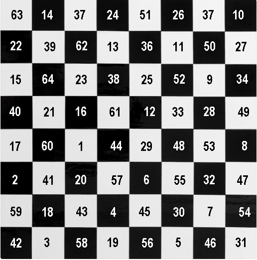

The mathematician Leonard Euler solved the horse problem and was also approached by many other great mathematicians. This problem, known since ancient times, focuses on a branch of mathematics that is commonly known as "graph theory" and specifically this problem, it would be a variant of what they call the "Hamiltonian cycle problem", the latter is focused on find a certain Hamiltonian path but circumscribed within a certain graph. The answer to the number of possible runs of the horse is 33,439,123,484,294.

## Mathematical Curiosities In Chess

There are many curious data around the mathematics applied in this game, among which is the Shannon number that indicates an estimate of how complex chess can be, in this case it establishes the number of possible moves in a game.

This number was estimated by Claude Shannon through a statistical average, where it is established that each player has an average of 30 choices in each movement and must be calculated for two players. We also start from the average of 40 moves in each game, so the Shannon number is calculated as follows:

`〖(30*30)〗^40= 900^40≈10^120  `

Today the approximations to the Shannon number are close to the value 10123, to get an idea of how immense this number we can take into account that the number of atoms in the universe is estimated at a number around 1080, therefore, it is shocking to know that there is a greater possibility of obtaining different and unique chess games, than atoms in the universe.

## Game Theory And Chess

There is a branch of mathematics that is dedicated to studying games and is known as "game theory", this area is responsible for representing and modeling games as mathematical structures, also having applications in other areas such as economics and finance.

If we study chess within game theory, it would be classified as a non-cooperative game, since each player chooses according to his personal benefit. It is also considered a game whose sum is zero, this means that the losses of one player are balanced with the gains of the other, for example, when an opponent has an advantage piece, this material value not only implies his advantage, but the disadvantage of your adversary for that gain.

On the other hand, it is a game in which you can notice an absolute absence of chance.

## Certain Geometric Aspects To Take Into Account In Chess

As we all know, this game is developed on a board consisting of eight rows by eight columns that generate a total of 64 squares. Each piece has specific rules of movement, for example, bishops move diagonally, while rooks in straight lines.

Each of these features mentioned above, provide chess with certain geometric properties that can be seen reflected on the board. When we talk about the Cartesian plane, we can say that the shortest distance between two points is of course a straight line. However in chess, we can notice that the movement of some pieces does not agree with this rule. Let's set an example with the king's movement on the board.

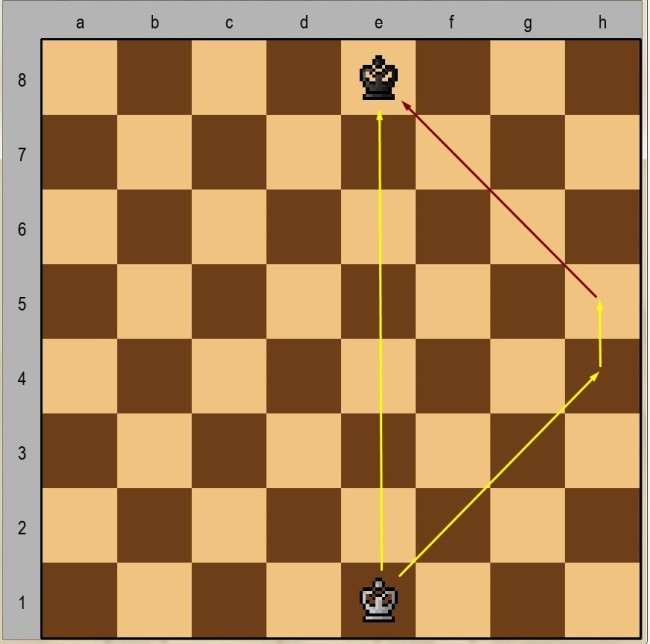

As we can see in the image, the king can be moved from square E1 to square E8 in seven movements if it follows a straight line. But we can also observe that the king, in the same way, would take seven movements diagonally, so in this case the shortest distance is not the straight line, since it is the same for both movements.

Another relevant aspect regarding the geometry of the chessboard is the importance of its center, which we can see in the following image:

Those four boxes that are within the green square indicate exactly the center of the board and their importance lies in trying to dominate these four boxes, in order to obtain a positional and strategic advantage, in order to substantially dominate the game throughout the match.

In the game of chess there are some situations that coincide with certain mathematical theorems, it is the case of the remarkable rule of the square, which is based on applying the Pythagorean theorem to the famous game.

The rule of the square is used when a pawn that is close to king but cannot be defended by its own king, with the circumstance that there are no other pieces on the board other than the opponent's king. Using mathematics to know if the pawn has a chance of winning or not can be of great help in this type of situation.

The rule of the square some say that the pawn reaches the crown when the number of rows between the pawn and the square to crown is less than the number of columns between the pawn and the king of the opposing player.

It is best to make a square that includes the pawn whose side is equal to the number that corresponds to the rows that the pawn is missing to reach the crown. If the opponent's king is inside this square, the distance indicates that he gets to capture the pawn, if on the contrary, the king is outside this square, the king pawn.

## A Chain Of Pawns Against The Rule Of The Square

In the next game Black plays and we can see that the king cannot capture the pawn that is in position e5 because he is defended by the white pawn that is in position f4. But what if the king captures the f4 pawn? At that point he would cease to be inside the square and the other pawn would crown.

Isolated pawns and the rule of the square

In the next game presented below, Black plays

The king tries to get closer to capture one of the pawns with the Rf4 move, then the white pawn moves to position h4, this move forces the king to retreat, since If he captured the pawn on f3, the king would be outside the square rule and the pawn on the h-file would crown.

So the king goes back to Rf5, the white king advances to Ra2, since if the pawn advances 3 advances to the position f4, the black king would capture the pawn 3 and also would remain inside the square to capture the other pawn, in this way he would win the game, but let's go back and assume that the white king is the one who advances.

Then the following movements are performed:

1. Rg6 and f4
2. Rf5
3. h5 and Rf6
4. Ra2 and Rg7

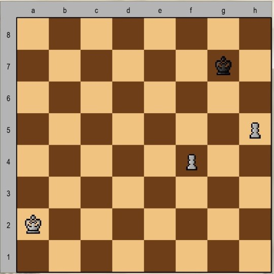

5. f5 and Rf6
6. h6 and Rf7
7. Ra1 and Rg8

8. f6; Rf7
9. h7; Rf6
10. h8 and the pawn crowns a queen

It is important to note that the more columns there are between the two isolated pawns, of course it will be much easier to leave the king out of the square.

## Exceptions to the rule of the square

In the next game, the king has only one way to capture the pawn that he is going to crown, but first we must make sure that there is no obstacle that could prevent the king from approaching. So if we look at the next board, the only way the king can approach is through the diagonal, but there is a pawn of the same color that is blocking it and the time it takes to move the pawn and clear the way, lets the king out of the square and therefore the opposing pawn kings.

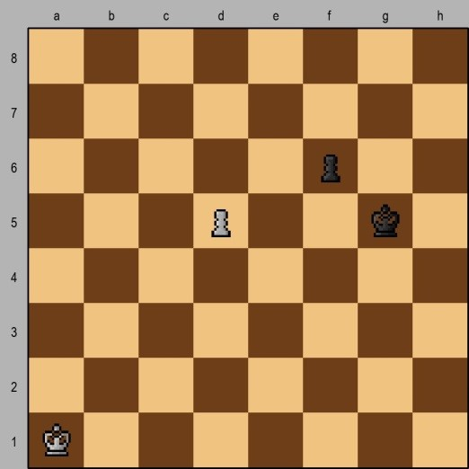

In the next chess game if the black king manages to capture the pawn instead of capturing the knight, the game would be drawn. The problem is that the only way to approach the pawn is through the diagonal and that square is threatened by the knight, so that if the king approaches the pawn from the f5 position, the king is then out of the square and not achieves its objective of preventing the opponent's pawn from crowning.

The following image presents a problem that can be solved thanks to the rule of the square, in the next chess game everything indicates that White loses since the black king is inside the square, which can lead him to capture the pawn white before it crowns.

However, thanks to the geometry of the chessboard, the white king can approach from the diagonal and change the fate of the game, since if the black king has the purpose of capturing the white pawn, the movements would be as follows following:

1. Rg7; h4
2. Rf6; Rb6

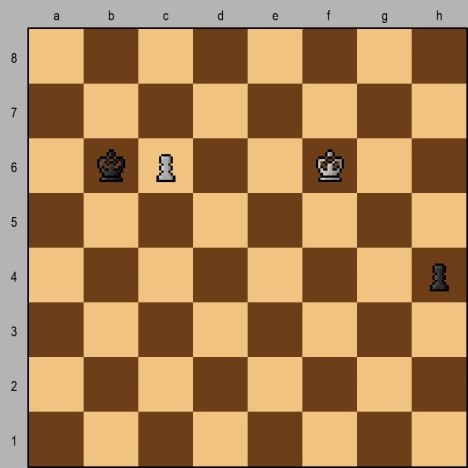

If the black king is to prevent the white king from defending his pawn, he must try to capture it.

3. Re5 and the black king captures the white pawn with Rxc6
4. With this strategy of the opponent who represents the white pieces, he moves his king to Rf4 and in this way he is already inside the square, with which he will capture the black pawn and achieve a draw in a match, which at the beginning had all of miss.

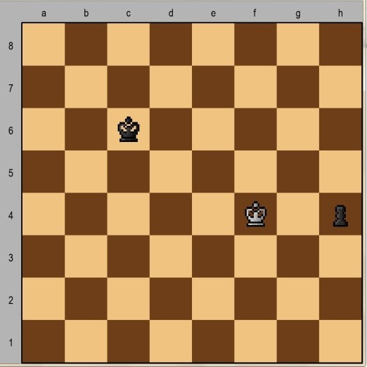

## Avoid Checkmate Against A King And Knight

The checkmate with these two pieces can be avoided as long as one wants, while the king is directed to the center of the board and the most important recommendation is that the king should occupy the squares of a different color from the knight. This is because the squares that the knight occupies always change color with each jump, so that if the king and the knight occupy different colored squares, the knight will never be able to have the king within reach of him. The only danger that exists in this situation is to get trapped in a corner where they can force the king to move diagonally and in this way he will suffer a check on the next play, which is why it is necessary to go to the center of the board.

## The Problem Of The Kings

How many kings can be arranged within a chessboard without succeeding in threatening each other?

The easiest way is using graph theory, let's think that each graph represents a vertex for each square of the board and as we know, the king can move from one vertex to another with one movement. Let's start by drawing the squares or vertices for a 4 × 4 board.

To solve the problem of having the maximum number of Kings possible, both on this board and on others of different dimensions, the idea is to find the largest number of independent vertices found in the graph. When we talk about a set of independent vertices, it is that none of them is directly connected to another vertex, that is, for this specific case it is that no king is threatened by another king.

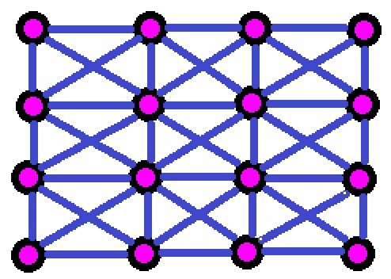

The reality is that finding the independent vertices within a graph through an algorithm that solves it can take too long to find the answer. However, for this case associated with chess it can be solved directly.

If those vertices that do not have a direct connection with the next vertex are colored with another color, it can be seen with the naked eye that no more than four kings can be placed, even starting from different squares the same conclusion can be reached.

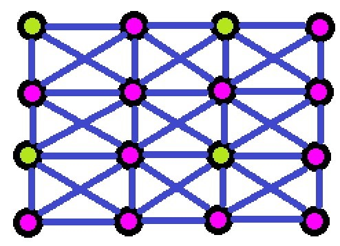

The mathematical formula to solve this problem on a board of n x n dimensions, given the case that n is an even number, is:

`Number of kings = n^2/4`

The formula for when n is odd:

`Number of Kings = 〖(n+1)〗^2/4`

This implies that for a chessboard such as the 8 x 8 we are used to, the maximum number of kings that can be placed without threatening each other is:

`8^2/4 = 16`

## The International Game Classification System(FIDE)

Chess has an international classification system that is based on mathematics.

The international organization that governs chess is FIDE, whose name comes from its French acronym that stands for Federation International des Echecs. This federation works with an international ranking or classification system better known specifically as the ELO ranking (in honor of Arpad Elo its creator). In this system each opponent has a score that depends on the development of his strength within the game.

The ELO ranking is based on mathematics and is closely related to the logistics function, in this way the first player has an ELO P_A score, while the second opponent has an ELO P_B score, we can then conclude that the first player has a higher probability and is represented mathematically through the following formula:

`E_1=  1/(1+ 10^((P_1-P_2)/400) )`

Regarding the second player

`E_2=  1/(1+ 10^((P_2-P_1)/400) )`

Suppose that the first player has 2000 points in the ELO, while the second player has 1600 points, we can calculate the formula and establish that the first player has a probability of:

`E_1=  1/(1+ 10^((1600-2000)/400) )`

`E_1=  1/(1+ 10^(-1) )= 0,9090`

According to this ranking, the first player has a probability of approximately 90.91% that is in his favor and we can see that the system used by FIDE is based on mathematics when classifying the chess players that make up the various national federations around the world.

## Find The Position Of 8 Queens On The Board

The problem of the 8 queens was first raised by a German chess player named Max Bezzel. The idea is to try to place eight queens on the chessboard arranged in such a way that none of them threatens another queen in the position they occupy.

As we all know, the lady can move horizontally, vertically or diagonally. The first step is to place each of the eight checkers, so that no two of them exist in the same column, row or diagonal.

This problem was analyzed by multiple mathematicians, including Gauss, who was able to find 76 of the possible 92 solutions. However, the first to find all the solutions was a friend of Gauus named Franz Nauck, a mathematician in 1850 who was also blind.

Fundamentally, there are only 12 basic solutions, while the rest of the 80 possible solutions can be obtained through symmetrical positions or turns, in addition, 11 of these basic solutions end up each of them equalling 8 more solutions, since turning any of these 90 °, 180 ° or 270 ° solutions are obtained 3 new alternatives and the other four remaining to arrive at 8, are obtained by specular symmetry.

On the other hand, the twelfth solution found in placing the queens in the following squares on the board: a3, b5, c2, d8, e1, f7, g4 and h6, is equivalent to only four more solutions, since it has a central symmetry . If we calculate the number of solutions generated by the 12 basic resolutions we will obtain: 11x 8 + 4 = 92 different solutions in total.

Since we know that only one queen can be located per column, we can simply express the numerical solutions from left to right that the number in the column represents, and the number that is expressed in that position is the row that the queen occupies in each column. For example, suppose in a solution as expressed in the following vector: 3, 5, 2, 8, 1, 7, 4, 6. This means that in the first column the queen is in row 3, while that in the second column another queen is in row 5 and following the same pattern we can deduce that there is a third queen in the third column and row 2.

Once we have the notion of permuting all the digits from 1 to 8 and knowing that they are located in different columns, we can realize that we still have a long way to go on the way to the solution. Since an eight-digit permutation is equal to:

`8! = 8.7.6.5.4.3.2.1 = 40320`

This number tells us the number of possible solutions restricting only the rows and columns (they must be different for each queen), but as we already know there are only two 92 that meet all the conditions.

Of course, they still need to restrict the diagonals where each queen can also threaten the other queens. While it is true that there are some analytical solutions where you can generate an explicit formula to locate the queens. Backtracking used in game theory can very well solve a problem of this type.

Computer programs solve the number of iterations that would take too long to be able to corroborate at a manual level, so not only is Backtracking used, others have applied genetic algorithms to solve this problem and have also modified a Hopfiel model using neural network algorithms. Even algorithms for minimizing conflicts with local search.

Suppose we place the first queen, we must generate an algorithm that avoids placing the next queen in any square that is in the path of any of these directions or arrows.

When placing the second queen, we will mark with points those boxes that are restricted by both queens, since they represent the rows, columns and diagonals that must be avoided so that another queen can be threatened, by one of the two previously located.

But placing the third queen should avoid some of the points that eliminate the boxes that correspond to the horizontal, diagonal and vertical lines that are in the environment of both queens.

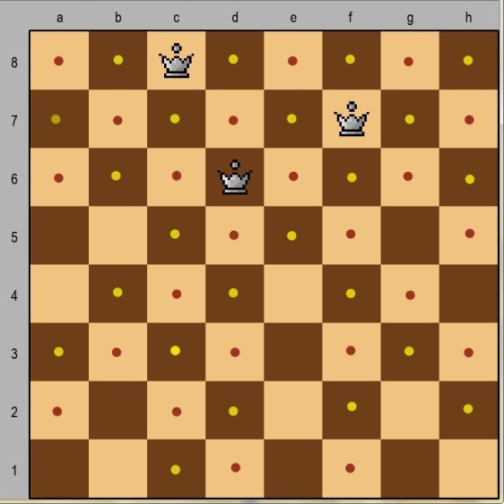

In this way we will be locating queens and our possibilities will diminish according to the sum of restrictions imposed by each one of them.

 

 

The last queen has only one chance to locate it and it is in the only empty square left on the board.

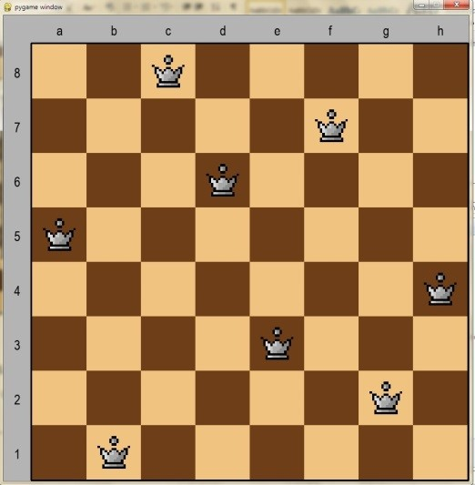

That is why computer programs must intervene, to establish a trial and error method, until we can iterate all the possibilities and find some of the solutions or being a little more ambitious, with each and every one of the possible solutions.

The solution to the problem of the 8 queens is considered as a model to follow for other applications, thanks to its maximum coverage. This implies that each element is observed and measured from all its neighbouring directions, that is, 2 horizontal directions, 2 vertical and 4 diagonals.

This is very useful when it comes to avoiding conflicts of an element with the rest of the objects in its environment, therefore a world of possibilities opens up for us in terms of its application and here we will name some of them:

- In communications to control air traffic
- In understanding data
- Communications systems
- In the programming of computational tasks
- For parallel optical processing
- In load balancing on multiprocessors
- Routing of data or messages in multiprocessors

Another important application is to locate the transistors and avoid that they do not interfere with each other, to achieve a directional communication system and thus achieve a greater bandwidth. In this way, each transistor can achieve greater communication with the outside world, if it can be released in its eight directions that are around it, that is, without being inhibited by any other transistor.

## Can A Chess Game Be Infinite?

One of the great dilemmas regarding chess is whether a game can become infinite, this implies that there can be a series of valid moves, so that the game never ends. Regarding this question, the International Chess Federation (FIDE) established two rules that limit the number of moves and therefore the duration of the game. These rules are as follows:

1. It is established that a game ends in a draw, when after 50 movements completed by both opponents none of the pawns has moved and that neither piece has been captured
2. It is established that a chess game ends in a draw, if one of the players who is in play, claims when the same movement is repeated for the third consecutive time.

These two rules lead to chess games having a maximum limit of moves and therefore, the game becomes finite.

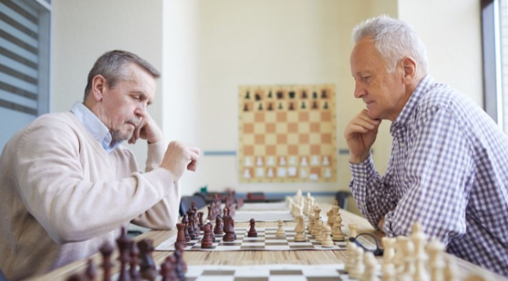

The latest advances in science have attempted to solve the endings of chess games up to a limit of seven pieces, including the two kings. This is a major step towards the resolution of generating a perfect game. As we already know that chess is a finite game, given the case that the 64 regulatory squares are not expanded and the 32 pieces are not changed or reclassified, it is possible some distant day we will get to see this type of feat. What we are sure of is that reaching that conclusion will take the experts a great deal of time.

What is most surprising about this game is that with a moderate amount of chips, not even the most powerful NASA computers are capable of generating the perfect game today. Although it is true that chess is not infinite, it definitely lacks very little to become so and we hope it continues to be this way, so that they do not end the magic of this great sport of Kings.

## About The Author

 Idais, Graduated in Mechanical Engineering, and a master’s degree in teaching component, she gave classes in several institutes of mathematics and physics, but she also dedicated several years of my life as a television producer, she did the scripts for mikes, the camera direction, editing of video and even the location. Later she was dedicated to SEO writing for a couple of years. she like poetry, chess and dominoes
