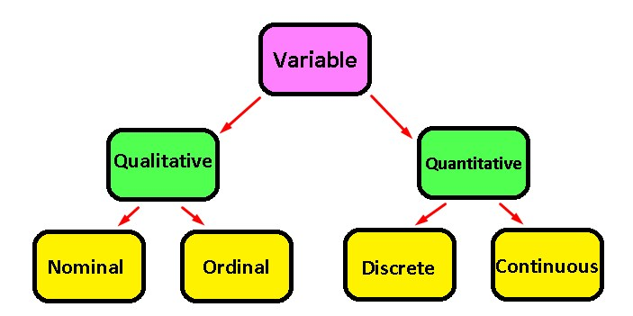
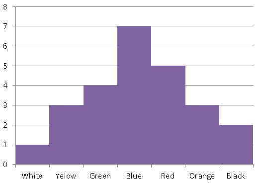
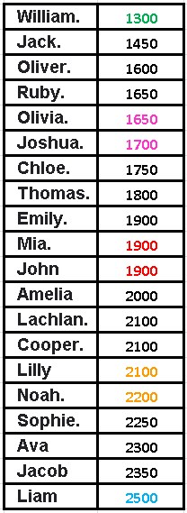
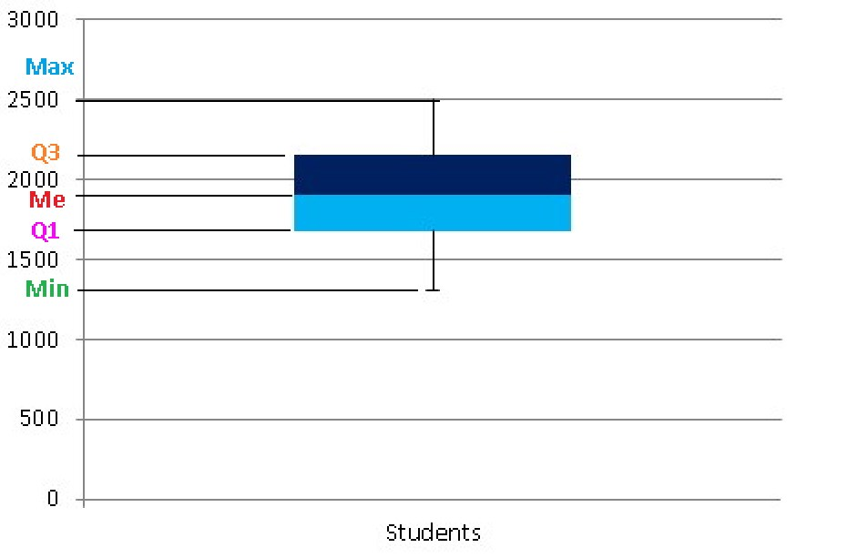
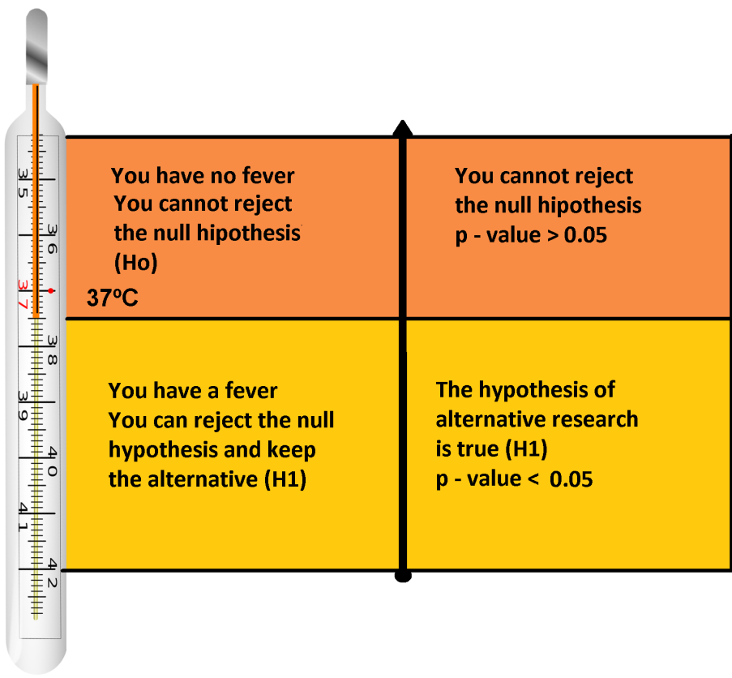
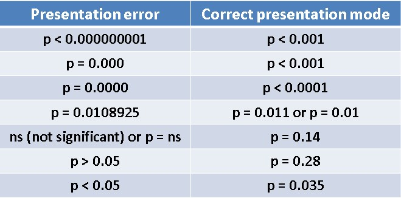

# ⚠️ The most common statistical errors used by researchers in their studies

Most of the people when applying the statistics for a study or research, in
general, they make certain mistakes that we will and we will try to focus on, in
order to avoid them.

The first thing a researcher does is design a plan, with a hypothesis and a
defined objective, then he plans how to collect the data and get it, analyze the
information, and then reach conclusions regarding the data obtained through
experimentation. empirical.

In this process, it is when statistics become an important part of the
investigation and it is important to know how to use it, so as not to make
mistakes that divert the researcher from achieving their goal.

1. The first error is not knowing how to distinguish the typology of each of the
   variables. Most likely, the researcher's data is organized in a database or
   table, where each variable is specified in a column. While each individual is
   usually placed in a row.

   For example:

   

   It is important to identify the class of variables that are present in the
   informational table or database, since it is necessary to be able to
   statistically analyze them and differentiate their typology will allow you to
   choose the ideal method to evaluate and visualize each of the variables in
   the way more correct.

   The most common classification that you can find are only variables of two
   types:

   - Quantitative: They are those that are accompanied by their corresponding
     units and are subdivided in turn into whole numbers (discrete) and decimal
     numbers (continuous)

   - Qualitative: These types of variables are usually identified by groups that
     have a certain characteristic and are subdivided into the qualitative
     nominal ones: Which are, for example, a group of individuals with a certain
     hair color, or of a certain sex, types of patients, and so on. But there
     are also the ordinal qualitative ones: Which are identified by measuring a
     qualitative state and have a sense of scale. To better exemplify we will
     have measures such as: Very bad = 1, Bad = 2, Normal = 3, Good = 4 and Very
     good = 5.

   

   Now, once you have identified the typologies of the variables, you will avoid
   many planning errors when making your statistical analyzes.

2. The # 2 most common mistake is not being able to visualize and understand
   your data, which is ultimately essential. Before starting to perform
   statistical tests, it is important to understand not only what data you have,
   but also how they behave according to some descriptive techniques.

   Descriptive techniques allow you to visualize graphs and convert your data
   table, which at first glance does not communicate anything, into
   understandable numbers and graphs. This stage of the research is called
   "exploratory data analysis" and it should be noted that it is a very
   important phase in deciding what type of statistical analysis you are going
   to use. You will also be able to see broadly, if your hypothesis has enough
   evidence, if your data has the ideal quality or if you have enough
   information to verify your study.

   The most used descriptive techniques are:

   - The box plot: It is usually used for the purpose of comparing groups of
     numerical variables.

   - The histogram: It is used to evaluate the distribution of data that have
     numerical variables.

   - Contingency tables: They are used to compare qualitative or categorical
     variables.

   - Scatter diagrams: They are used to compare the numerical variables with
     each other.

   - Numerical summary: Here you enter the standard deviation, the mean, etc.
     and they are used to be able to mathematically analyze numerical variables.

   To give you an idea of what you can do with these descriptive techniques,
   once visualized you will be able to answer questions such as:  Among the
   following numerical variables, can we conclude that there is a normal
   distribution? For this we will use the histogram

   Example: Let's suppose that we ask each of the 25 workers in an office which
   of these seven colors they prefer and we obtain the following frequency
   table:

   

   With this frequency table, we will build our histogram, where we place the
   variable (in this case the taste for colors) on the "x" axis and the response
   frequencies on the "y" axis.

   

   It should be noted that if the data in a histogram are grouped around a
   central value and the values on the sides of the mean are approximately
   symmetric, it is said to have a normal distribution.

   - Are there differences between the groups of this or that numerical
     variable, which are in my database? In this case it is best to use the box
     plot.

   Box plot example: In the following table we will show the daily water
   consumption (ml) of 20 students who are in a class. We will call the minimum
   consumption (Min), the least amount of water that the student who drinks the
   least water ingests and the maximum consumption (Max), therefore, will be the
   one corresponding to the student who ingests the most water daily in that
   classroom.

   

   In order to make our box plot, we will divide the data set into quartiles to
   generate our graph and the quartiles are those values that divide our amount
   of data into 4 equal parts.

   We will call the first quartile Q1 and therefore it is the value that comes
   from exceeding the data that represents 25% of all the data, that is, if
   there are 20 students, Q1 would be 20 x 0.25 = 5 (the data that is in the
   position 5) and is averaged with the following data, therefore the fifth data
   is 1650 and the sixth is 1700, its average will be:

   Q1 = (1650 + 1700) / 2 = 1675 and we would already have our first quartile.

   The second quartile is given by the median, which as we saw in the previous
   article, are the middle terms and in this case both are worth 1900, it is
   important to take into account that the median is also equivalent to the
   second quartile (Q2). While the third quartile is the one that represents the
   data that occupies the positions that constitute 75% of the data, yes, the
   data must be ordered from lowest to highest.

   Q3 is given by 20 x 0.75 = 15, this implies that the data that occupies the
   fifteenth place are averaged with data number 16, so that Q3 = (2100 + 2200)
   / 2 = 2150. Now, as we see in the Table the Min = 1300 and the Max = 2500, we
   can now build our box plot.

   

   - Which numerical variables are related to each other? To answer this
     question it will be necessary to use a Scatter Plot.

   Example: Suppose we take 10 students in a classroom and we want to know if
   there is any similarity between their grades in physics and mathematics, that
   is, if those students who do well in mathematics also do well in physics and
   vice versa, if those students who tend to do poorly in mathematics also do
   poorly in physics. Let's see a table with his grades in both subjects:

   

   Let's now make a scatter plot:

   

   - Are the groups that I have in my database very different with respect to
     the different qualitative variables? For this it will be necessary to use a
     bar diagram or contingency tables. We have already made at least one
     example of a bar chart, in a previous article.

   As you can see, with these tools you can carry out an exploratory study of
   the information contained in your database and it will not be necessary to
   use very complicated mathematical analyzes, or statistical tests, to achieve
   a rough understanding of where your research is headed. With these
   statistical contrast techniques, you will be able to know if you need a
   greater amount of data to be able to verify your hypothesis.

3. The third most common mistake made by researchers when using statistical data
   is to incorrectly interpret the value of “p” and not understand well what it
   is to test their hypothesis with the research.

   We will try an example to explain in a simple way what these two concepts
   consist of. Suppose you wake up one morning with chills, a headache, a heavy
   body, and a feeling of discomfort. The first thing that comes to mind is to
   rest and have a hot tea, but after a while, you just don't get better.

   It occurs to you then that you should take an Acetaminophen pill, since
   everything indicates that you must have a fever. But since you don't like to
   self-medicate like crazy, you need to check if you are right, so you go to
   the thermometer and it effectively tells you that you have 39 ° C. After
   confirming your assumption of having a fever, you take the Acetaminophen.

   Now, since you have that situation in mind, we can say that by placing the
   thermometer when you suspect that you may have a fever, it is very similar to
   testing a hypothesis within a scientific investigation, that is, it can be
   classified as a small investigation.

   In the same way as in the example mentioned, a study also assumes what is
   going to happen, a hypothesis that needs to be tested and in this case it is
   “I have a fever”. You must take into account that the research hypothesis is
   not a frequent state and it is precisely what you are looking for.

   We must also fix the null hypothesis (Ho) which is nothing more than the
   opposite hypothesis to the alternative (H1) and it is Ho that we consider the
   most normal state, which in this case is "I have no fever".

   On the other hand, the statistical test to use in this case is the
   thermometer, which will determine which of the two options is the most
   likely? Where the mark of the thermometer is what we consider the value of
   "p".

   

   If the value of "p" is greater than 0.05, it is not advisable to reject the
   null hypothesis, which as we established previously is "I do not have a
   fever", therefore, you cannot assume that you do not have a fever. If, on the
   other hand, the value of “p” is less than 0.05, the most advisable thing is
   to reject the null hypothesis (Ho) and accept the alternative (H1), that is,
   “I have a fever”. There is a small margin of error that allows you to leave
   some effects of chance, although it is true that levels higher than 37 ° C
   can be considered as fever, no one in their right mind will think that if
   they have 37.1 ° C they will have a fever. The same happens when you contrast
   any type of hypothesis and that is why the value of "p" is a measure of
   uncertainty, which you can somehow use to regulate small differences that are
   not significant.

   Summarizing, if the value of "p" is very small, that is, p-value <0.05, it
   can be concluded that the alternative hypothesis H1 is not a consequence of
   possible random deviations and you can come to accept it as true. In the same
   way, if the p-value is very large, that is, p-value> 0.05, we can conclude
   that the levels of chance are very high and you cannot reject the null
   hypothesis (Ho).

   Suppose that the value of "p" is very close to 5%, for example, p = 0.049.
   The recommendation is that you can continue to maintain your research
   hypothesis, but yes, doubting the evidence or significance a bit, since You
   could end up making the mistake of refuting the null hypothesis and therefore
   conclude that you do not have a fever, which could become true and end up
   accepting the alternative hypothesis of "I have a fever", which is not true.
   In a few words, you could end up concluding that you have a fever, when in
   fact it is not true.

   This potential error can be reduced although you can never eliminate it,
   since statistics is a science based on interpretations and therefore its
   conclusions will always be surrounded by uncertainty.

   We have prepared some very simple steps to follow during the process when
   testing hypotheses:

   - You must formulate both hypotheses, both the hypothesis of your research
     for anomalous or rare cases, which is the so-called alternative hypothesis
     (H1) and also the hypothesis for common or normal cases, that the so-called
     null hypothesis (Ho).

   - Externally, you must establish the margin of error capable of rejecting the
     null hypothesis, this is also known as a Type 1 error and in general, an
     error of 5% (0.05) is taken for this.

   - You must then make a decision, so that if the p-value <0.05, then you can
     reject the null hypothesis and keep your research hypothesis (H1).

   - But if p - value> 0.05 you will not be able to reject the null hypothesis
     (Ho) and neither will you be able to assume that your research hypothesis
     has been proven. The only conclusion you must reach is that you cannot
     reject the null hypothesis, it is important to emphasize that if this
     situation arises, you do not have enough elements to say that the null
     hypothesis is true, only that you cannot reject it.

   Recommendations:

   When the value of "p" is very small, you will be able to accept very firmly
   that your research hypothesis (H1) has been verified. But if the value of "p"
   is very close to 0.05, you should not affirm anything at all, so you must be
   very careful in that case and look for more information to corroborate your
   hypothesis. You can also assume at that time that with the data you have, the
   hypothesis of your research may seem true, but that you need a greater number
   of cases to corroborate it. You must remember that the hypothesis of your
   investigation (H1) is always the unusual case, while the null hypothesis will
   always be the most "normal" case. It is necessary to take into account that a
   very small "p" value does not necessarily imply that it is too important a
   result, but that the hypothesis of your research may be accepted and that the
   results you have obtained are not the product of the random. It is therefore
   advisable never to place the word "important" in relation to the value of "p"
   in your conclusions.

4. Error # 4 in order of importance that many researchers make is not presenting
   the value of "p" in an adequate way. We are going to suppose that after
   carrying out the study you obtain a too small value of "p", being "p" almost
   zero. As we already know, this is great evidence when it comes to accepting
   the hypothesis of your research.

   This implies that when writing your conclusions regarding the investigation,
   it is necessary to take into account some additional tips:

   - When you use a statistical program that gives you an extremely small "p"
     value, for example, p = 0.000000154 or perhaps you obtain as a result that
     p = 0.0000, always represent it in your research as p <0.001, since a value
     of p = 0, it just doesn't exist.

   - On the other hand, it is recommended that you always use absolute values
     with at least two decimal places and also, when reporting your cutoff
     value, use the most common, which we already know is 0.05.

   

5. The fifth most notable mistake is failing to justify the restrictions that
   statistical tests have. Before applying any type of statistical test, you
   must make sure that your data meets the minimum requirements that the test
   requires, to carry it out.

   We will try to illustrate the above, with an example. We begin by assuming
   that you want to see if you can improve a certain disease with a new
   treatment. For this, it will be necessary to use a group of patients to whom
   the standard treatment is applied, this will be your control group. On the
   other hand, you will have to use another group of patients in which you will
   provide the new treatment. It will also be necessary to use an indicator,
   capable of quantifying the potential effects of each of the drugs applied in
   each of your groups.

   In this case, you will have the opportunity to use two techniques that are
   capable of testing your hypothesis within the investigation. You can use a
   non-parametric test capable of comparing the two groups such as Man Whitney's
   U or a parametric test such as the student-test.

   You may wonder, what difference could there be between this pair of tests, if
   the two allow you to contrast the differences that exist between the two
   groups?

   The parametric test works with known distributions such as the normal
   distribution, while the non-parametric test does not usually work with known
   distributions. So that you can get a better idea, we anticipate that
   parametric tests have a greater strength than non-parametric tests. Not only
   are they much more powerful, but you can reach much more reliable
   conclusions, but yes, they are also more restrictive. So your data must meet
   a series of conditions to be able to carry them out.

   To use the parametric test, you must comply with certain restrictions such
   as: When you are comparing groups, you must be aware that their variances are
   equal, in addition, that the data must have a normal distribution and the
   sample size must not be less than 30 individuals.

   It is advisable that you use the parametric test whenever you can, but
   without forgetting to argue, how your data manages to overcome the
   restrictions required by the test you are going to use.

   Many times the data do not meet the minimum restrictions to apply a
   parametric test, but many scientists still insist on applying this type of
   test and that is where the error lies. In this case, they should apply
   non-parametric tests, which although it is true they are less powerful, their
   restrictions are also less.

   Now, depending on the existing equality of the variances between groups, the
   normality of the data and the groups or independent variables, we will select
   the most appropriate statistical test.

   With respect to one of the constraints, it is necessary to know if two groups
   are independent. Let's start by defining what an independent variable is: It
   is a characteristic that is usually measured in an experiment or
   investigation and is not affected by any other variable. In an investigation,
   it is precisely the independent variable that the researcher changes, to see
   how the other variables are affected. That is, an independent variable is a
   cause, capable of producing an effect.

   The dependent variable is the result or effect caused by the change in the
   independent variable. To clarify a bit, let's go with an example, imagine for
   a moment that a scientist studies a certain headache medication, headache
   relief after taking the medication is the dependent variable.

   On the other hand, you must take into account that a dependent variable can
   never change to an independent variable. For example: "A 10 mg dose of the
   new drug causes immediate headache relief" this makes much more sense than
   saying "Headache relief can cause a 10 mg dose of the new drug."

   In the case of dependent variables, you should use a test for dependent
   groups. But if the variables are not dependent, it is best to use some test
   for independent groups.

   Researchers also apply tests capable of comparing two independent groups,
   when it turns out that they are actually related groups. That is why it is
   absolutely necessary to know the dependence or independence between groups,
   before applying any type of statistical test.

6. We now come to the sixth mistake mostly made by researchers who use
   statistics and that is to use linear regression, when it is not always
   applicable. Although it is true that one of the most widely used statistical
   analyzes is ultimately linear regression, we must bear in mind that it is not
   always recommended in all cases.

   This is because a linear regression is nothing more than a model capable of
   predicting the dependence between two variables, you will use this model to
   predict the values that you are going to obtain from one variable, based on
   the values of the other. variable. But one variable must be dependent on the
   other, otherwise this method is not the most suitable.

   For this we can generate a scatter diagram composed of these two variables
   and thus create a predictive model, since this type of diagram is capable of
   comparing two variables with each other and there you will be able to know at
   first glance if one variable depends on the other. If so, it is convenient to
   use linear regression.

   One last recommendation is that you should be aware of the units and the
   precision of the result. When dealing with very large or very small numbers,
   it is best to work with scientific notation and not with decimals.

## About the Author

Graduated in Mechanical Engineering, and a master's degree in teaching
component, I gave classes in several institutes of mathematics and physics, but
I also dedicated several years of my life as a television producer, I did the
scripts for mikes, the camera direction, editing of video and even the location.
Later I was dedicated to SEO writing for a couple of years. I like poetry, chess
and dominoes.
