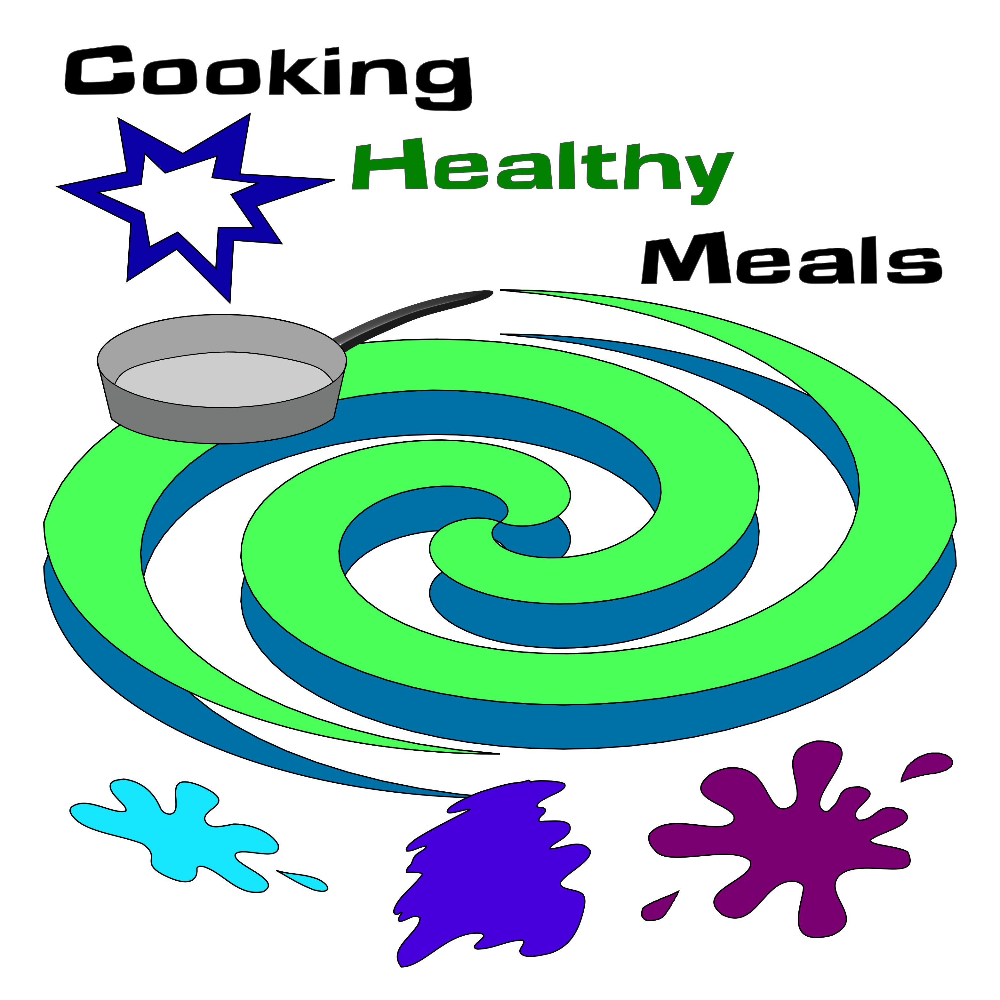

# 🍲 Cooking & Healthy Meals

This is a HUGE category and will require research on your part, but here’s some
general guidelines/thoughts on the subject.

Generally speaking, fresh beats frozen or canned. Whole foods beat processed.
What these two statements really mean is that elements that are often added to
processed foods are not all that healthy. SALT is a big offender BUT, keep in
mind that we need some salt. Preservatives are a big offender. Avoid chemicals
in general.

This is not to say that we don’t want to add anything to our food. Spices are
some of the healthiest things we can consume. The list of healthy ones is long
and includes Cardamom, Chili peppers, Cinnamon, Cocoa (yeah, really), Cumin,
Garlic, Ginger, Rosemary and Turmeric. Research will tell you that these spices
have many health benefits and can prolong your life and your productivity in
many ways. Turmeric is the giant among these in my mind and I’ve been consuming
almost daily doses of it for many years. It reduces inflammation, may ease pain,
and research shows that it may help to prevent dementia. YIKES! My research
tells me that it is better, tastier and less expensive to just add the spices to
my food rather than to buy “supplements”. Lucky for me, I like spicy foods.

Generally speaking, veggies and fruit provide the fiber, vitamins & minerals
that we need, while avoiding the fats that we don’t need (but like salt, we need
some fat). Potatoes were classified as a starch in the past but have recently
been reclassified as a vegetable. Colorful veggies & fruits sometimes provide
specific benefits/vitamins & minerals. However, meats provide protein that we
need to grow and maintain muscle, bones, connective tissues, etc. We can get
these proteins from other sources and you will need to seriously research that
if you want to lead a vegan lifestyle. It is best to avoid fatty meats if we are
going to eat them though. I try to avoid meats grown by cruel factory farms in
particular.

Many people advocate consuming organic foods. They CAN benefit us by avoiding
the multitude of intentional and unintentional additives introduced into our
diets in the processes of feeding and protecting plants and animals that we
consume. These additives do harm to us and to our environment. Just be aware
that some foods labeled as organic are not really organic. As always, there are
bad actors out there who are willing to take advantage of us in pursuit of their
greed. DRAT - more research!

There are foods that some of us definitely want to avoid, such as those
containing gluten or lactose. If you are gluten or lactose intolerant, switching
to foods free of those substances can be super helpful to enjoying life without
serious digestive issues, but again research will be required and there may be
some higher costs. There are quite a few alternatives available though and many
are quite tasty. I even found that there are gluten free beers and one of them
is my new favorite beer.

There are quite a few gluten free breads and pastas available as well. One can
find them in many grocery stores just by reading the labels.

OK, on to the actual cooking…. That will frequently require my last category,
oils & fats. I think by now everyone knows there are many choices out there and
some are tastier or more healthy than others. Some of the healthy ones are very
tasty. I prefer olive oil and I buy good quality ones simply for the good taste.
Other oils that are frequently referenced as healthy are Canola, Corn, Peanut,
Safflower, Soybean, and Sunflower. Opinions differ on these regarding the health
merits of each.

So we can cook our foods, or in many cases just cut them up and assemble them
into all kinds of dishes. Baking, grilling, frying/sauteing them all have their
uses and advocates and really, the only way to find the ones you like best are
to get yourself a cookbook or two and start experimenting. This last paragraph
is somewhat of a let-down, eh? But entire big, fat books are written on the
subject because the combinations are endless. Have fun! “Just do it”

## About The Author

Harley Armentrout is a happy husband and father, former silversmith, aerospace
electronics prototype assembler, test, calibration & repair technician, also
writing test procedures at [BallAerospace](https://www.ball.com/aerospace). Then
21 years in the gaming industry, in a range of positions, culminated as a Gaming
Inspector, observing and reporting on rules violations, safety issues and
criminal activities for the
[Yavapai Prescott Indian Tribe](https://buckyscasino.com/). After “retiring”
Harley taught himself a few graphic design skills and he works as a freelance
designer.
