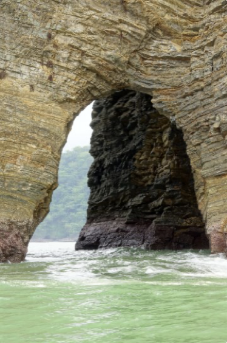
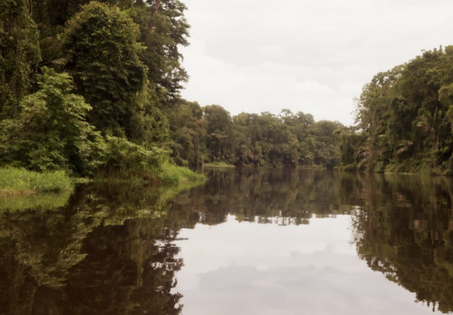
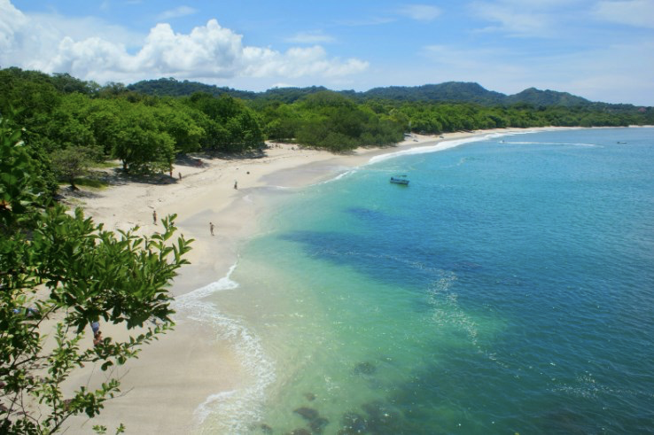
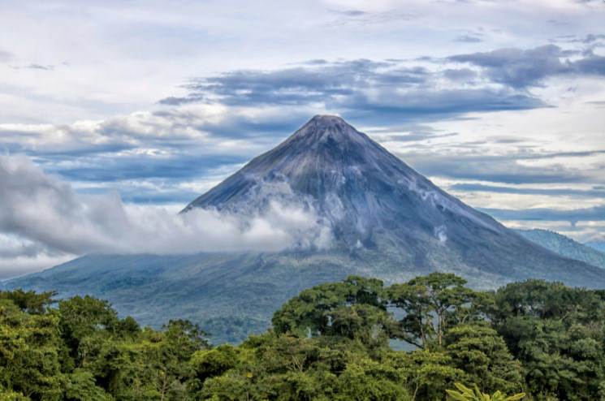

# 🇨🇷 Costa Rica

It is not exactly a coincidence that this country has the name of Costa Rica, since ultimately the beautiful coasts are one of its great attractions. Puntarenas, El Limón and Guanacaste are three Costa Rican provinces that have access to the sea. This country has access to both the Pacific Ocean and the Caribbean Sea and its beaches are worth knowing.

We are going to name the places that you cannot miss if you visit Costa Rica:

## Manuel Antonio National Park

It is one of the most impressive places in the country and where you can find white sand beaches, as well as an absolute connection with all the fauna that roams around the park.

## Marino Ballena National Park

This is a protected place because it houses an enormous marine biodiversity, with an amazing beach and the best thing is that you can take a whale watching tour.

## Corcovado

Corcovado is a sample of everything that the country can offer you, not only because of its large size, but also because of the immense amount of fauna that is found in freedom. Although it is true that it is one of the few parks where access with a guide is mandatory, it is really worth it!

## Puerto Viejo and Cahuita

Puerto Viejo is one of the towns with the greatest personality in the country and it is there where a large part of the black community is concentrated. This site is characterized by its long party nights and its food. A few kilometers from this town is the Cahuita National Park, where you can enjoy spectacular beaches and irresistible seabeds.

## Tortuguero

This town surrounded by canals is famous for the spawning of turtles between the months of July and October. However, if you travel at another time, the visit is equally interesting since, in addition to seeing how the locals live, you can take a tour where you are taken by boat through all the channels of the national park and it indeed has many experiences to offer.

## Guanacaste

Liberia is the central city of this province of Costa Rica and among its attractions is culture, the Rincón de la Vieja volcano and, above all, its amazing beaches (whose offer is endless). Being the best known Flamingo, Tamarindo, Coco, Concha and many others.

## Malpais and Santa Teresa

On the Nicoya Peninsula are Malpaís and Santa Teresa, where yoga and surf lovers tend to go. A relaxed atmosphere with a rough sea and wide beaches make this place attractive for fans of these disciplines and it is recommended to see the Cabo Blanco Absolute Nature Reserve in the village of Malpais.

## Montezuma

This place is the country's hippie paradise and legend has it that some soldiers who did not want to participate in the Vietnam War took refuge there. The truth is that Montezuma is a place with a lot of magic to spend a couple of days.

## Poas Volcano

Although it is true that there are more than 100 volcanoes in this country, only five of them are active and although there are other inactive volcanoes that are also worth knowing, the Poas Volcano may be one of the most interesting, since it can be seen its immense crater and is one of the largest in the world, it is also located in a national park with a lush forest.

## Peace Waterfall

Very close to the Poas is the most impressive waterfall in the country, but it is located inside a private enclosure where they have already built a zoo, so the entrance fee is 48 dollars. It is not recommended for the price, especially in a country where you can see a diverse fauna that is free.

## San Jose, the capital of Costa Rica

<<<<<<< HEAD
In San José you can learn a little about the history of the country, mingle with the local people and immerse yourself in their culture. It is advisable to take a walk through the center, visit the National Theater, see the majestic Metropolitan Cathedral, the Central Market, a colorful Church called Nuestra Señora de la Merced, stroll through one of its many museums and also in a good place to have a drink. , eat or go dancing.
=======
In San José you can learn a little about the history of the country, mingle with the local people and immerse yourself in their culture. It is advisable to take a walk through the center, visit the National Theater, see the majestic Metropolitan Cathedral, the Central Market, a colorful Church called Nuestra Señora de la Merced, stroll through one of its many museums and also in a good place to have a drink, eat or go dancing.
>>>>>>> 930b1fb35290fd22496f5d1d2c2bb60e8f0e2b83

## Irazu volcano

This volcano is the second highest peak in Costa Rica and reaches 3500 meters high, the view from this place on a clear day is simply spectacular and the landscape is purely volcanic.

## Turrialba volcano

You can finally see this volcano since it was closed for a long time due to its intense volcanic activity. This route is special for lovers of hiking and adventure sports, its offer of activities is very wide, but it includes rafting down the Pacuare River, being one of the most important places in Central America when it comes to practicing this sport.

## Arenal Volcano

This is one of the most popular volcanoes in the country, but you need a clear day to fully see it. This is because its almost 1,700 meters is usually covered by clouds. In the event that it is cloudy, do not worry too much, because this volcano is within a national park that bears the same name and also has Lake Arenal, which is the protagonist of certain tours and is completely navigable.

## Hot springs of La Fortuna

La Fortuna is at the foot of Arenal, where you will find one of the attractions of a volcanic region: its hot springs. Although it is true that most of these places are private, there is a free hot spring and if you prefer you can stay in a hotel that includes hot springs.

## Rincon de la Vieja volcano

Although this volcano is less known than the previous ones, it is really impressive and especially beautiful, and you can also find a beautiful waterfall in the surroundings.

## Green Mount

Green Mount is a mountainous area whose landscapes are very green and there is a large concentration of tourist elements, it stands out for its suspension bridges and its cloud forests. One of the most amazing activities you can do in this area is to go on a zip line tour, where you are thrown suspended from a very inclined cable and you descend by gravity hanging from a pulley at a considerable height, it is an experience full of adrenaline.

## Cities and towns

While it is true that Costa Rica is not exactly famous for its towns and cities, we can still tell you which are the most interesting options. Zarcero is a town with a very photogenic central park that has a topiary garden, as well as a very nice church called San Rafael. One of the most important cities in addition to the capital is Cartago, where the basilica Nuestra Señora de los Ángeles stands out, which is the most famous temple in the country and you can also visit the ruins of Cartago, to see the remains of a church destroyed by the strongest earthquake that shook the area.

Costa Rica in a country with spectacular beaches, interesting volcanoes, a biodiverse fauna and very warm people, where you can spend wonderful moments.

## About the Author

Idais, Graduated in Mechanical Engineering, and a master’s degree in teaching component, she gave classes in several institutes of mathematics and physics, but she also dedicated several years of my life as a television producer, she did the scripts for mikes, the camera direction, editing of video and even the location. Later she was dedicated to SEO writing for a couple of years. She likes poetry, chess and dominoes.
