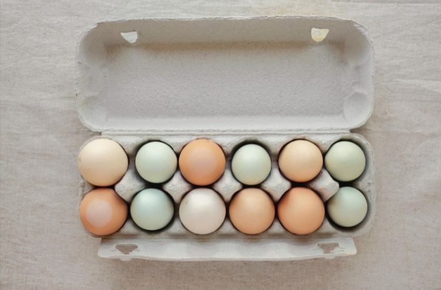

# Mathematical curiosities

## 1) Kaprekar's constant is a mysterious number

This constant is named after an Indian-born mathematician named Dattatreya
Ramachandra kaprekar, who discovered the wonders of the number 6174 and
presented it in Madras in 1949, specifically at the Mathematics Conference that
was held in this Indian city. Kaprekar was dedicated to recreational mathematics
and made several contributions in this regard, not only with this constant, but
also with self-numbers, Karshad numbers, and Kaprekar numbers.

Let's now play with this constant 6174:

- Choose any four-digit number, for example, 2431
- Now you must order their figures in descending order, if we do it with the
  previous example we would have: 4321
- Then order the same number, but this time in ascending order and in our case
  it will be: 1234
- Subtract the largest number from the smallest: 4321 - 1234 = 3087
- You must repeat the previous steps with the new number, first we order it in
  descending order: 8730
- Ascending: 0378
- We subtract them: 8730 - 378 = 8352
- We repeat the operation with the last result
- 8532 - 2358 = 6174

Believe it or not, whenever we apply this method we will end up reaching the
same number 6174. You can even loop with different numbers and you will always
reach the same result, with certain exceptions. For example, when you have four
equal digit numbers: 2222, since as you can see, when subtracting both numbers,
its result will always be the number zero. It also does not work with four
digits, when three of them are the same number, unless you add zeros to the
largest number to the right, let's go with an example: 2223, when ordering it in
descending order we have the number: 3222, then it We subtract from the previous
one, which as you will notice is already ordered in ascending order: 3222 - 2223
= 999

This is when we must add a zero to obtain the number greater than four digits
and repeat the operation: 0999, ordered in descending order: 9990 and remainder
the previous number 9990 - 0999 = 8991 9981 - 1899 = 8082 8820 - 0288 = 8532
8532 - 2358 = 6174

It is important to take into account that all those numbers that come from
subtraction, in addition to those numbers ordered in descending and ascending
order, are divisible by 9.

## 2) Where does the sexagesimal system come from?

As we can see, a minute is the equivalent of 60 seconds and this explanation
dates back thousands of years of history. This system comes from our hands,
since more than 2,000 years ago, this system was used based on 60 and what we
know as the sexagesimal system.

The origin of this system arises from counting with the thumb each phalanx of
the fingers of the right hand, if you notice, each finger is subdivided into
three phalanges and if you count them with the thumb, the count is: 3 x 4 = 12.
Of course, the thumb is only used to count each of the three parts of each
finger. However, until now we only have a dozen and if you look closely, that is
why many of our products come in dozens, for example, the eggs that we buy in
the market.

Now, if every time you count each of the phalanges of your right hand until you
complete them all, you lift a finger of the left hand, you can have 12 phalanges
five times, that is, 12 x 5 = 60, this is when we arrive to the number used so
many times since that time, to the present day.

On the other hand, the number 60 also has many divisor numbers: 1, 2, 3, 4, 5,
6, 10, 12, 15, 20, 30 and 60.

As you can see, it is from there that our minutes are divided into 60 seconds
and at the same time, that an hour is equivalent to 60 minutes. But also the
sexagesimal system is the basis of astronomy, for the same reasons. Angles can
even be measured in degrees, minutes, and seconds.

It is no secret to anyone that the circle is divided into 360 ° which is a
multiple of 60 and is also closely linked to the lunar cycle. The year is made
up of 12 months and you can get multiple examples, where we currently use this
system.

## 3) Some mathematical tips that may interest you

- Until the 16th century, multiplications were only taught in universities,
  because they were considered extremely difficult.
- The equality symbol (=) was invented by Robert Recorde more than 400 years
  ago, since “two things cannot be more equal than two parallel lines”.
- Negative numbers began to be used in the 7th century, specifically in India,
  to represent debts. However, it was not until the 18th century that negative
  numbers were universally accepted.
- The solution of equations of the first and second degree dates back to the
  third century.
- Lewis Carroll the author of "Alice in Wonderland" was a mathematician and this
  work is loaded with mathematical symbolic logic.
  
- In 1939, a certain graduate student was late for his statistics class at the
  University of Berkeley. In his rush, he saw two problems on the board and
  copied them, thinking they were homework, handed them over to his teacher a
  few days later and apologized for the delay, because they had seemed more
  difficult than usual. The funny thing is that the student had solved two
  famous theorems, which until that moment no one had been able to verify.
- The binary system used today for computer programming was invented by
  Gottfried W. Leibnitz more than 300 years ago.
- The decimal system comes from the number of fingers we have on our hands.
- Geometry originated in Babylon and ancient Egypt, to develop other sciences
  and be able to make the measurements they needed in construction.
- The day of Pi was created in honor of the widely used mathematical expression
  (3.1415826). To choose the day, the North American date format (month, day)
  was used, so that it is celebrated every year on March 14 and to be more
  exact, specifically at 1:59 a.m.
  
- Although there are very strange elements in mathematics, they can become
  useful at the least expected moment. For example, quaternions were discovered
  in 1843 and are currently used to describe how objects rotate in 3-D. While it
  is true they were considered very beautiful, but also useless, it was not
  until 1985 that scientists applied them in digital animation.
