# 📌 Discriminant Analysis

This type of analysis can be used as a statistical tool to forecast the nominal behavior of dependent variables, if we use a linear combination of independent variables (also called predictive variables), so that the average scores of the dependent variables differ too much. in this linear combination. For example, in market research, when predicting whether potential sales in a certain territory will be "good" or "bad", we will consider these to be our dependent variables; while the evaluations regarding the income of available personnel in the territory, its population density and the amount of sales, will be our predictive variables.

It is also widely used in financial institutions where it is possible to establish which are the "problem" accounts and which are the "stable" accounts, where each of these accounts can describe parameters such as credit rates, existence of demands, number of times in delinquency, debt ratios and then the predictive variables that are capable of better discriminating the unit of analysis, objects, individuals are obtained, or for this case, it is frequent that it can turn from a "stable" account to a "problematic" account.

Discriminant analysis that focuses on two main objectives:

1.- To be able to predict the category of a certain unit of analysis

2.- To be able to determine the predictive variables that have a greater discriminating power when classifying the units of analysis, so that they have this or that attribute of the dependent variable.

The idea is to obtain a discriminant function obtained by computer programs and determine the values for each of the independent variables, which are called discriminant coefficients. It is important to emphasize that each of these coefficients has its corresponding sign, whether positive or negative, which will determine its assignment in the groups defined by the variables depending on. The main objective is to replace a unit of analysis with its independent variables, characteristics or parameters, in the function obtained and to be able to calculate a priori what its category is.

Algebraically speaking, a determining function is a linear combination of the original data and which at the same time is capable of maximizing the variability between problem accounts and stable accounts.

In short, it is a classification technique whose main objective is to obtain a function that is capable of classifying the unit of analysis, but based on prior knowledge of those values that certain discriminating variables have.

Let's suppose that we have a sample of patients, who have previously had a set of variables measured, we can divide the sample into diagnostic groups. But then we measure the same group of variables to a new patient and the discriminant analysis, based on the values obtained, allows the new patient to be assigned to a group of maximum probability and that at the same time, the value of that probability can be quantified. In short, it allows to classify new individuals to those groups that have already been defined in advance.

Problem Statement

A data table made up of N individuals is the starting point and for these individuals, a p number of variables have been measured for the usual cases and an additional dependent variable, which defines the group to which each individual belongs.

Points to consider:

- A matrix with a dimension of N x (p + 1) is generated

- Each case has a certain profile and is assigned to a group.

- The objective is to obtain a discriminant function with which the profile of the new individuals can be contrasted, so that, depending on the numerical result, they are assigned to the most probable group.

- It is important to emphasize that the more reliable the starting group, the better the subsequent assignments.

- It has a double purpose, the first is to explain the membership of each individual in a certain group, according to the variables that their profile has and thus verify their membership in the pre-established group in a quantified way with respect to weight that each variable has in discrimination. The second purpose is to predict to which group a new individual should belong, if we only know their profile of variables, that is, the first purpose is to explain and the second is to predict the group or categorical variable to which the new individual belongs analysis unit.

Example:

Suppose we have two defined groups and three variables V1, V2 and V3 that are explanatory, with 10 individuals of whom we know, both their profile and their assignment.

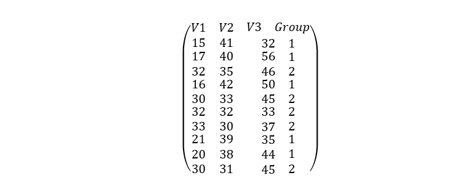

In the matrix we can see that the first individual takes values in the first, second and third variables of 15, 41 and 32, respectively and that he belongs to group 1. We can also observe that group 1 includes individuals 2, 4, 8 and 9, while group 2 includes individuals 3.5, 6, 7 and 10.

We can realize that the belonging of individuals to each group is not determined by the value of the variables and that is why our main objective is given by relating these two information.

The belonging of individuals to each group is established by other means and the variable capable of assigning individuals in each group is qualitative, but it becomes numerical for statistical treatment.

The idea is that for each new individual its values of V1, V2 and V3 are obtained so that we can use that information, to be able to classify it either in group 1 or 2.

It is important to determine which variables carry the most weight when assigning the most probable group to the individual.

Discriminant functions are similar to multiple linear regression equations and consist of obtaining linear functions from the explanatory variables with the ability to classify other individuals. That is, these functions are applied to each new individual and the one with the highest value will be able to define the group to which it belongs.

To achieve this we are going to use an IBM program called Spss, which helps us with the calculation and discriminant analysis.

SSPS comes from the acronym in English that stands for "Statistical Product and Service Solution" and is a widely used software to capture, analyze data, create tables and make statistical graphs. This program is capable of managing very large volumes of data and contains a very extensive range of statistical analyzes, among which we can name: descriptive statistics (frequencies, means,), Bivariate statistics such as analysis of variance, T tests, correlation analysis, ANOVA, factor analysis, regressions, models linear and non-linear, representations of data graphs, management decisions, among others.

You can make predictive models, as well as validate them using advanced statistical techniques.
The SSPS is capable of analyzing texts, for example, if you have a survey whose answers are mainly text, this program has a text analyzer, capable of obtaining information from each of them.

The main window of the SSPS is similar to a spreadsheet where there are multiple cells to store the data, which you can manually enter or import from a text file, spreadsheet or other format. However, unlike programs such as Excel, the analysis is not carried out precisely in the spreadsheet, but through the commands found in its drop-down menus. You just have to select the statistical test you want to perform and the output is generated in a new window.

You can also create your own survey with the QuestionPro where you can select a template, include the survey in your email or social networks in real time and for free.

The Spss works in the following way, we must introduce a database on the subject that we want to treat statistically. Before entering the database, we must ask ourselves what our units of analysis are, for example, if our database is a public opinion survey, our units of analysis or individuals will be the people surveyed.

We are going to organize our database by placing the units of analysis or individuals from our sample in the rows and the characteristics referring to those units of analysis will be our columns. If, for example, our statistical analysis deals with international relations, the units of analysis par excellence will be the countries of our interest and each of our rows will be a different country, while our columns will be made up of the
characteristics that we want to analyze for each of those countries.

Now, as soon as we open or begin to execute our SPSS statistical program, a window appears where we must indicate if we are going to import our database from a file where we have previously entered it or if we are going to enter the data of our sample, one by one and directly within the SPSS.

To show an example, we are going to import the data from a previous exercise, which will help us to show some points of interest to use our statistical program, so we will leave checked the box that the program has by default that urges us to "Open an origin of existing data ", after" Accept "a new window will be opened where we will have the possibility to search in which part of our computer the file that contains our database is located, we choose the address with its respective extension and click on "Open", where again another box will appear with the title of "Opening data source" and we are simply going to "Accept" the configuration that the program offers us by default, that is when the database will be imported and we can see it in the following environment:

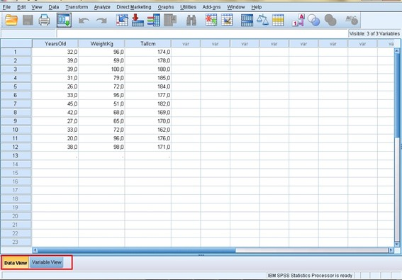

Now, we can see two tabs that are in the lower left part of our environment. If we open the "Variables View" tab, another window will open where the columns containing the characteristics of our unit of analysis will appear in a list of variables, each occupying a row in this new window. This is where we can change or modify the attributes of our variables as convenient.

In the first column we can see the name of our variable and it is usually placed in lowercase and without any spaces. In the second column we can establish the type of variable, if we position ourselves on any of the boxes we can see three points on the right side and when we choose them a new window appears where we can change the type of variable that Spss shows us by default, it is there where we can define if the decimals are separated by periods or commas, if the number is in scientific notation, is a date, a currency, etc.

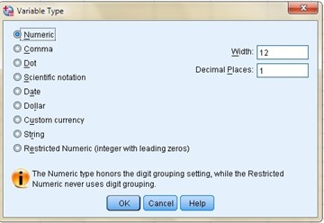

The third column defines the width of our variable, for example, if we have a numeric variable and we define a width of 4, the maximum number that we could place would be 9999, since 10000 has a width of 5 digits.

In the fourth column we define the number of decimal places that our figure will have. Our fifth column is dedicated to the labels, which help us to better describe our variable, since many times the name is not enough to make clear what our variable means and to be able to recognize the meaning of the values it takes and there we can place it. that we want when describing our variable, including capital letters, spaces, symbols, etc.

The sixth column is intended for the values, it is in this column when we can assign the values to an ordinal or nominal variable, for example, if our variable is gender or sex, we can assign the number 1 to the male gender and 2 to the feminine.

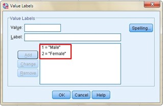

In the case of having an ordinal variable, for example, confidence in the National Police, we can see that the values range from 1 "No confidence", to 4 "Total confidence", going through all the possibilities between these two extremes and defining them with a number that identifies that possibility.

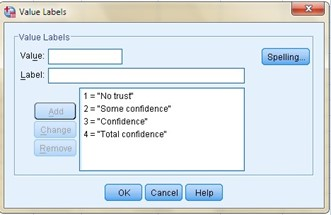

In the next column "Lost" is where we can establish what values we should consider and what values we should not consider in the analysis, we are talking about missing values when the value is a blank box and the Spss will place a point (.) By default, but I can give instructions to the program that for a certain variable I don't want it to consider me the number "3", so I go to the row where the variable is located and the column "Lost" I go to the cell "None" and choose the three points on the right side and the following window opens:

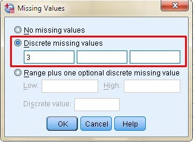

It is there where I must put the number "3" and the program will consider all the values, except that one.
In the next column you can specify the number of characters that will be displayed with the specified width, however, the width of the column only affects the presentation of the values, it does not change the defined width of the variable.

In "Alignment" as its name indicates, it helps us to align the data within the cell either on the left, right or
centered side.

In "Measure" we must define the type of measurement:

When we choose "scale" it is for quantitative measures such as income, age, height, temperature, etc. while "ordinal" is for quantifiable but categorical measures, for example, social class or educational level and finally we have the "nominal" measure where the variable is not quantifiable, as in the cases of gender, place of origin or classification ethnic.

Now, if we want to analyze a particular variable, we choose our top menu "Analyze" and in the drop-down we will find a whole list of analyzes, we just have to choose the one that suits us and a new window will open where we will choose the variable we want analyze. We will position ourselves on it and click on the arrow pointing to the right, and then choose if we want to obtain graphs, statistical data, etc., and then "Accept". It is there where the results viewer will open in a new window, there we will find the results of the instructions that we have asked the program.

On the other hand, the program has a syntax area, it is a kind of notebook where the commands that we have asked our program are placed are placed, if we go to "File" → "New" → "Syntax" and the following completely empty environme

It is very useful if I want to keep a log of the commands that I am asking the program to carry out, for example if I give an instruction to Spss that gives me a table of frequencies of my first variable, I go to "Analyze" → " Descriptive Statistic ”→“ Frequencies ”→ I choose my variable → Click on the arrow → As you can see we have repeated the procedure to analyze, but now we are not going to“ Accept ”but to“ Paste ”, apparently the program does nothing, however If we go to our syntax we can realize that it is no longer empty, but we will find the command that we have just asked the program to do and it will look like this:

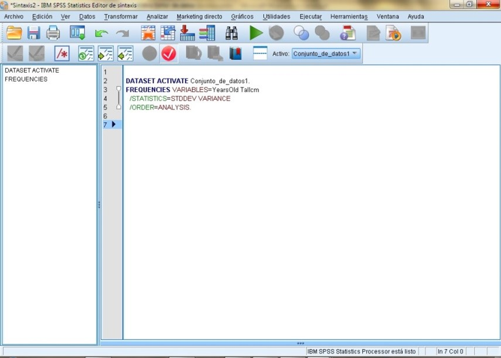

This will be very helpful if we carry out several steps to reach a specific result, we can save all the commands that we have carried out, to repeat the procedure at another time. We are now going to ask the program to carry out other actions: "Analyze" → "Descriptive Statistic" → "Frequencies" → I choose my variable → "Statistics" → I mark the boxes of "Median", "Mode", "Standard deviation" and " Variance ”→“ Continue ”→ It returns me to the previous window and I continue with“ Graphs ”→ I mark the box of“ Bar graph ”→“ Continue ”→“ Paste. ”We will notice that other commands appear in the syntax such as What:

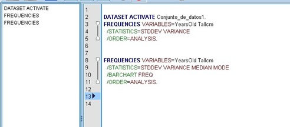

There we can visualize the variables that we chose for our analysis, in the following line we can see the instructions for: standard deviation, variance, median and mode, a line below we will find the bar graph and finally, the analysis.

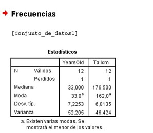

Now, if we go to the results viewer we will realize that the expected results have not been included, that is, our second frequency table does not appear, nor the bar graph, etc. and it is because we have given the order to the Spss to give us the result, we have simply given it instructions that appear in our syntax. So to get the result, we must select the order in our syntax box with the mouse and then click on the green arrow, which is at the top.

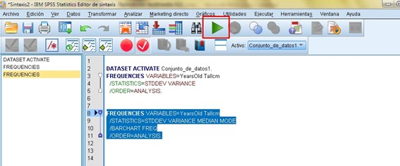

Our results viewer automatically appears with the table of median, mode, standard deviation and variance. Later our frequency table, but this time of the second variable, which was the one we chose.

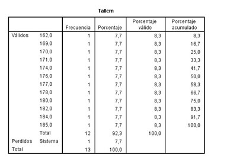

Lastly, our bar chart:

If we want to choose a different variable and delete the previous one, we only have to position ourselves on the variable that we want to delete and click on the arrow, but this time the one that points to the left side and that is when we will choose the new variable by positioning ourselves on it, where Again we will choose the arrow to the right side, which is the one that tells us that we will include our other variable, to be able to analyze it.

It is very important to take into account that both the data set and the syntax are saved in separate files and it will be necessary to open both when having the result set again. When opening the file where the syntax is saved, we will again have to choose those commands that we want to be carried out in our results viewer and once again position ourselves on the green arrow and click on it.

We are going to perform a discrete analysis where the dependent variable is categorical. Let us remember then what a categorical variable is, it is that qualitative variable in which I can take values such as categories or qualities, for example, gender (male, female), health conditions (very good, good, fair, bad, very bad), etc.

In this example, our independent variables are continuous and are capable of determining the groups to which individuals belong. So the idea is to find linear regressions, between those independent variables that best discriminate the groups.

The focus of this discriminant analysis is to carry out a pattern that allows classifying the new individuals. Starting from the explanatory variables, linear functions are constructed and these equations are applied to each new case, where the function with the highest value is the one that will define the group to which it belongs.

The example that we are going to analyze is a financial institution that initially grants a loan to 16 clients and after three years of having granted the loan, 8 of those 16 clients were classified as failed and those clients, we are going to classify as the group 1. While the rest of the clients that we will call compliant, will make up group 2.

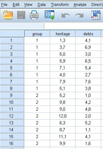

We have information regarding the net worth of each of those 16 clients and also their outstanding debts. We will then try to construct a discriminant function that is capable of substantially differentiating these two groups, starting from these two variables (equity and debts) and that also allows us to classify, with a minimum of error, the new clients in each of these groups.

This is how better decisions can be made, based on the statistics of previous clients, it is possible to predict whether a new client is suitable or recommended for a loan.

Now, the information we have about the 16 clients, with respect to their assets and debts is the following:
These amounts are multiplied by 103 and are expressed in dollars ($).

Let's suppose that the analyst of this financial institution receives two new loan applications. Where the first one is from an individual with a net worth of 10.1 and has outstanding debts of 6.8; while the second request is from an individual with an equity of 9.7 and his outstanding debts are 2.2. We must help you decide which of these two requests is the least risky, so that the analyst accepts the most suitable one when granting the loan.

Let's start with the discriminant analysis, the first thing we are going to do is go to the "Analyze" tab and in the drop-down we are going to "Classify" and then choose "Discriminant", a new window opens where we must choose by positioning ourselves on the dependent variable "group" and then enter it in the "grouping variable" box with the arrow pointing to the right. Then we must define the range, so we choose the button that contains that instruction and we place a minimum range of 1 and a maximum of 2, since we only have these two numbers to define this dependent variable, then we choose "Continue".

Now we must position ourselves on the two independent variables, that is, equity and debt, and then enter it in the "independent" box with the arrow pointing to the right. Later we choose the button "Statistics" and a new window opens where we must mark the boxes of "Means" and "Fisher's" then "Continue" and finally "OK".

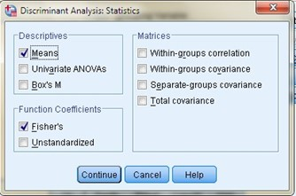

The results viewer will open in a new window and we will be able to see the "Processing summary for case analysis"
There we can see that the 16 cases (100%) were processed and no case was excluded.

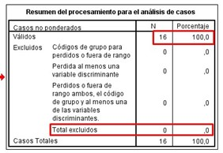

In the following box that represents the group statistics, we can see the mean and the standard deviation for both the groups of failed clients and for the compliant clients. The cut-off point of the discriminant for the two groups is also observed: the cut-off point for the equity has a value of 7, which implies that if the equity is less than 7 the client is classified as failed and if it is greater than this value , the client will be classified as compliant.

The same occurs with the cut-off point for outstanding debts, as we can see it has a value of 4, which indicates that if the client has outstanding debts greater than 4, it is classified as bankrupt and if their outstanding debts are less than 4, will be classified as a compliant customer.

The following table to take into account is that of the eigenvalues found in the summary of the discriminant canonical functions:

If we square that term and multiply it by 100, we will obtain the percentage that this function is capable of achieving when explaining the variance, so:

(0,795)2\*100=63,2%

The experts affirm that a percentage greater than 45% is a positive indicator of the variance, so since we obtained 63.2%, we can affirm that the function is valid for what we want to do.

Now we will observe the Wilkes Lambda value to know if the function is statistically significant, we can realize that we obtain a value of 0.002 and that it is also a number much less than 0.5. As we have explained in previous articles, since it is much lower than this coefficient, we can conclude that it is indeed statistically significant.

The following table to take into account is that of the standardized coefficients of canonical discriminant functions, these values tell us which ones contribute the most to our function, it is important to note that these values range between -1 and 1, whichever value is closest to the unit, it is in short, the one that has the greatest weight in the function. Of both values, the one that corresponds to equity is the closest to 1, since it has a value of 0.922 and therefore, it is the one that contributes the most to the function.

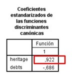

We now turn to the last table of this summary that corresponds to the coefficients of the classification function. It is from these coefficients that we are going to generate the discriminant functions with which we are going to be able to classify the new individuals, therefore, this box is the most important of all.

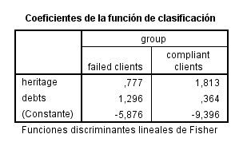

We go first with the function that we must generate starting from the failed clients, our predictive function being the constant to which we will add the coefficient that corresponds to the patrimony, multiplied by the value of the patrimony of the new client, plus the debt coefficient multiplied by the value of your debts.

Let us remember that the first applicant that the analyst had to evaluate had a net worth of 10.1 and his debts payable were valued at 6.8; While the second applicant had an equity of 9.7 and his debts were 2.2, with these data and those obtained in the last table of the summary we can now generate the functions of group 1, which correspond to the failed clients and would remain then as follows:

For applicant 1 = [-5.876 + 0.777 x (10.1) + 1.296 x (6.8)] = 10.7845

For applicant 2 = [-5.876 + 0.777 x (9.7) + 1.296 x (2.2)] = 4.5121

We repeat the operation to generate the functions of group 2, which, as we already know, belong to fulfilled clients, but this time with the coefficients belonging to that item, therefore the functions will be:

For applicant 1 = [-9.396 + 1.813 x (10.1) + 0.364 x (6.8)] = 11.3905

For applicant 2 = [-9.396 + 1.813 x (9.7) + 0.364 x (2.2)] = 8.9909

The recommendation that we can make to the financial institution analyst is to choose the new applicant, whose values that are evaluated in the functions are the highest and in this case, it is the first applicant who counts those values, which are: 10.78 and 11.39 (values higher than 4.51 and 8.99 corresponding to the second applicant).

## About the Author

Idais, Graduated in Mechanical Engineering, and a master’s degree in teaching component, she gave classes in several institutes of mathematics and physics, but she also dedicated several years of my life as a television producer, she did the scripts for mikes, the camera direction, editing of video and even the location. Later she was dedicated to SEO writing for a couple of years. she like poetry, chess and dominoes.
