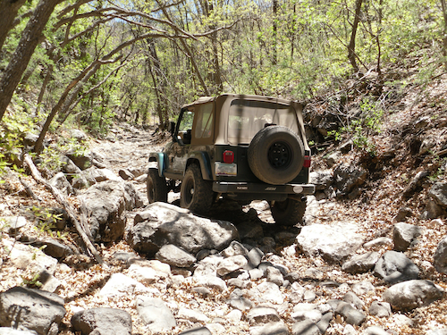

# 🛻 Driving Off-Road

One of my favorites, going off-road is like a little vacation. I get to see beautiful scenery,
sometimes wildlife, and since it requires some concentration, I’m not thinking about other
responsibilities. It’s a kick to share with someone else or just enjoy by myself. The important
thing is to do it deliberately, not like Tiger Wood.

When going off-road it’s important to prepare for the experience because many things can go
wrong. I drive a 2000 Jeep Wrangler TJ and because I take care of it, my 21 year old Jeep is
still going strong. It hasn’t had a back seat in years. Since I don’t have a lot of money, many of
the things that others add to the outside of their vehicles, I keep inside.

Among these things are my “high lift” jack. I also have an air tank which I fill up before I leave
home. And rather than a winch, I have what’s called a “come along”. It’s a little hand
operated winch that takes up little space and weighs very little. I can hook it up to the rear,
the front or the side of the Jeep, so it’s versatile. You may think that limits me because I cant
operate it and drive at the same time, but that’s not exactly true. I have a chain for some
added length and more importantly, I have a stretchy, heavy duty nylon tow strap.

One day I got stuck and needed to use the “come along”. All I needed was just a couple more
feet of forward movement to get to the place where I could drive without assistance. So I
hooked the device to a tree and then to the tow strap, which I hooked to the jeep. Then I
cranked the “come along” until the tow strap was stretched very tight, got into the Jeep and
the tension I had cranked into the tow strap was enough to pull me forward just enough to get
some good traction so I could just drive. WHEW!

I also carry a tool kit and a tire patch kit. The air tank will fill up a patched tire. Binoculars
come in handy and one never knows, so I carry a pistol and ammo “just in case”. A cell phone
sometimes does not get a signal, but most of the time does. Sturdy shoes/boots, appropriate
clothing, water, a blanket, and a folding shovel can come in handy. I also have a flashlight,
some matches, a fire extinguisher, a utility knife and a rather large “emergency knife” with a
saw blade on one side. Just for pure enjoyment, I have plenty of music on a USB stick.

The Jeep itself is somewhat reasonably equipped. I have skid plates under the oil pan, and the
gas tank and “rock sliders” under the rocker panels. The front differential has a “cable locker”
to send power to both front wheels at the same time and it has its own HEAVY DUTY cover.
The rear differential has a skid plate and an electronic locker to send power to both wheels, so
it is a true 4 wheel drive vehicle.

The tires and suspension are quite important. The slightly oversized, knobby tires, and my
lower gearing, get power to the wheels more effectively. I also have a smallish “lift” in the
suspension, so the bottom of the Jeep will clear rocks, logs & other objects more easily.

The shocks are adjustable. The overall effect of the lift, with longer springs and adjustable
shocks, is to make the suspension more flexible. On-road, one usually wants a suspension that
will keep a vehicle sitting flat on the road and stiff enough, like a sports car or a racer, to keep
it from leaning a lot on corners, . Off-road that is just WRONG. Off-road, one WANTS the
suspension to flex - a lot - as much as it needs to, to clear objects. The long springs combined
with shocks that will adjust to a softer setting, allow that flex and clearance. With the soft
shock setting, the vehicle does not get thrown around by all that flexing.

I have also added some tweaks for more power. A throttle body spacer, high flow air cleaner,
and high flow exhaust provide that power while NOT hurting my gas mileage.

Of course all these modifications come in handy in deep snow or mud too. The low range of
the normal Jeep power train will let me literally climb fairly steep inclines at an idol. The good
old Jeep 4.0 liter, inline 6 cylinder motor with tons of torque, lets me use the clutch at very low
RPMs and the result is that after over 165,000 miles, I’m still on my original clutch.
Can you tell? I really like my Jeep. Here’s a couple of pretty places I’ve been.

