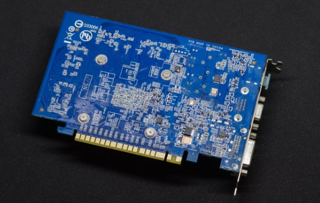

# ✖️ Exponential Distribution

The exponential distribution is equivalent to the discrete geometric distribution, but for continuous random values ​​and we know that we are in the presence of an exponential distribution when, for example: We are interested in knowing the time it takes for a certain event to occur, but knowing that the time elapsed and measured from any time t until the event occurs at instant tf, it will not depend on the time elapsed in advance in which absolutely nothing happened.

## Some examples of exponential distribution

1. When we successively repeat an experiment in a Poisson process but in equal time intervals and the time elapsed between the occurrence of two consecutive events, is in accordance with an exponential probabilistic model. To clarify a little more, suppose that we are going to measure the time elapsed between two injuries that have occurred in the body, which may be relevant.

2. The elapsed time in which a radioactive particle takes to disintegrate. This is very commonly used in science for dating fossils or some organic matter through the carbon 14 technique.

3. The time elapsed in an emergency service for the arrival of a patient.

4. The time it takes for a pharmacist to serve a client or for a doctor to carry out a certain examination.

## The density function of a continuous random variable that is exponentially distributed is defined by

 = \\lambda e^{-\\lambda x}" )

Being 

The distribution function is determined as:

 = \\begin{cases} 1 - e\^{-\\lambda x} \& \\quad \\\ 0;\\varepsilon \\text{ the other case } \\end{cases}" ) si 

The formulas corresponding to the expected value and the variance have:

 = 1/\\lambda" )

 = 1/\\lambda\^{2}" )

## Applications of the exponential distribution

This type of distribution has a wide practical utility, which can be considered as a perfectly adequate model when we refer to a probability distribution of the time that occurs between two events and that in turn follow a Poisson process.

An exponential distribution can be derived from an experimental Poisson investigation, even with its same characteristics when denouncing the Poisson distribution, only in this case, the random variable is taken as the time it takes for an event to occur.

When we refer to the Poisson distribution, in this case the events per unit of time are described, while the exponential distribution is responsible for studying the time that exists between each of these events. Therefore, when the arrivals are Poisson, it can be said that the time between these arrivals is given by an exponential distribution.

Another big difference is that the exponential distribution is continuous, since the time between one event and another does not necessarily correspond to an integer, while the Poisson distribution is completely discrete.

When we are using the exponential distribution, it is important to assume that the arrival times are not random, that is, that a certain arrival time will not depend on another arrival or service carried out in advance, nor on the possible queue that may form. An important feature to take into account in this type of distribution is precisely that it has no "memory". We will try to clarify this point through an example: suppose that in a surgical room the attention time dedicated to a patient follows an exponential distribution. Given the case that a certain patient has already been operated on for 6 hours, the probability that the operation will last one more hour is going to be the same as if the patient had had two or 10 hours of operation up to now (whichever they may be). This is because the times of the operation have a great variability and this happens in the exponential distribution. Perhaps the next patient to be operated on will only last an hour in the operating room, since his surgery is likely to be much simpler than the previous patient's.

Let's go with the first example of exponential distribution: suppose we have an online computer terminal whose response time is x, specifically the variable x being the time that elapses between the user's query and the beginning of the system's response to this query, we also know that it has an exponential distribution and that the expected response time is 5 seconds. It is required to calculate the probability that the response time is at most 10 seconds.

As we know then the random viable follows the exponential distribution so that:

" )

We can see that this type of distribution only depends on the parameter λ that we do not know at first. However, in the problem statement we are informed that the time elapsed between the user's query and the system's response has an expected time of five seconds, this indicates the expected value. On the other hand, we know that the expected value is equal to:

 = 1/\\lambda = 5"), therefore:

When calculating the probability that the response time is a maximum of 10 seconds, we can express it as:

 = 1 - e\^{-\\lambda x} = 1 - e\^{-0.2 x}\|\_0\^1\^0 = 1 - e\^{-0.2(10)} = 0.8646" )

We can conclude that the response time is a maximum of 10 seconds is 86.46%.

Example two of exponential distribution: a certain company manufactures video cards for PCs and the following information is available: the duration of the video cards expressed in years are distributed exponentially and 9.6% of these video cards fail before after one year of use. It is required to determine the probability that a randomly selected computer video card will fail after two years of use.

X = lifetime of PC video cards in years

" )

 = 0.096" )

The answer to the question of what is the probability of a randomly chosen PC video card failing after two years of use expressed mathematically is:

 = ?")

In order to obtain the probability, we must calculate the λ value and we know that the probability distribution is given by:

 = 1 - e^{-\lambda x}" )

 = 1 - e^{-\lambda * 1} = 0.096" )

Clearing we have:

To clear λ I must apply the natural logarithm to both sides of the equation

-0.1 = -λ

λ = 0.1

Once we have the value of the parameter we can calculate the probability:

 = 1 - P(x \leq 2) = 1 - (1 - e^{-\lambda x}) = 1 - 1 + e^{-0.1 * 2} = 0.8187" )

We can already conclude that the probability of a business PC card failing after two years is 81.87%.

At a bank teller window, service times are exponentially distributed with an average of 2.5 minutes. Suppose a customer arrives at the bank teller window at 11:00 a.m., what is the probability that the customer will still be at the teller window after 11:04 a.m.?

X = The attention time measured in minutes

" )

We know that the average value is 2.5 minutes and also that the mean is equal to the expected value, so:

 = \mu = 1 / \lambda" )

We must take into account that our variable is determined by the attention time expressed in minutes and if the client arrives at 11 in the morning, from that moment until 11:04 4 minutes have passed, so the probability that the client find in the window after four minutes have passed is:

 = ?" )

Recall that the probability distribution function will always be equal to `P(X ≤ x)`. But in this case, as well as many others that we have seen before, we need to know when the variable is greater than or equal to a certain value. That is why we must use the complement of the probability that is:

 = 1 - P(x < 4) = 1 - F(x) = 1 - (1 - e^{-\lambda * 1}) = 1 - (1 - e^{-0.4*4}) = 0.2019" )

We can then conclude that the probability that a customer arrives at 11 in the morning and is at the window after 11:04 is 20.19%.
