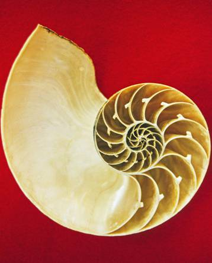
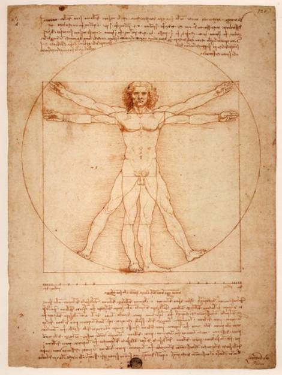

# 🥇 Fibonacci series

## The Fibonacci series, the Phi number, and how they manage to describe the universal proportions, which are part of the world around us

Leonardo de Pisa was an Italian mathematician, who is better known
throughout the world as Fibonacci. This mathematician discovered a sequence
commonly known as "The Fibonacci series"; he came up with this idea when
calculating the number of rabbits that could be obtained over the period of
several months, after inducing them to breed.

Suppose that at the beginning of the first month we have a pair of newborn
rabbits. Therefore, we have one (1) pair of rabbits that will take a month to
develop enough to be able to mate. So at the end of the first month, we
mate this pair of rabbits and, adding together the number of pairs in this
generation and the previous generation, we have 1 + 0 = 1 couple---the same
pair of rabbits, because the babies have not yet been born.

Now, at the end of the second month the first couple gives birth to a second
pair of rabbits and then mates again. The newborn pair is (of course) not yet
matured and the next pair of babies has not yet been born so we have
1 + 1 = 2 pairs of rabbits.

By the end of the third month, the first pair of rabbits gives birth to a third
pair and mates again. The second pair is now mature and mates. The first pair
has already sired two pairs of rabbits, but neither of these pairs has sired any
of their own children yet. Two pairs---the ones from one month ago---survive
into this generation, but only one pair---the one from two months ago---is
old enough to birth a new pair for this generation. Therefore, the number of
pairs for this month is: 2 + 1 = 3

At the end of the fourth month, the first pair of rabbits has sired three
pairs, while the second pair has sired their first pair of rabbits. So we have
one pair for each of the rabbits in the previous month, 3, plus one extra pair
for each of the pairs two months ago, 2, because only those pairs are old
enough to produce children for this generation. This gives 3 + 2 = 5 pairs of
rabbits this month.

If we keep doing these calculations from the starting point of 0 and 1, adding
the previous two numbers together, we can continue the sequence:

- 0 + 1 = 1
- 1 + 1 = 2
- 1 + 2 = 3
- 2 + 3 = 5
- 5 + 3 = 8
- 8 + 5 = 13
- 13 + 8 = 21 and so on

## How this sequence influences the explanation of certain proportions in nature

This type of mathematical pattern is found in countless places within nature.
For example, the number of petals a flower has almost always matches a number in
the Fibonacci series. Some flowers have 3 petals, you will
find others that have 5 petals, some will have 8, and you can even find
flowers with 13 petals. Much less often will you find a flower
with a number of petals that does not match a Fibonacci number. That is, with 4,
6, 7, 9, 10 or 11 petals.

The numbers that belong to this series are presented in a big part of the world
that surround us.

In the year 1753 a Scottish mathematician named Robert Simson discovered that
the quotient of two consecutive numbers in the Fibonacci series tends towards
1.6180339... as the numbers get larger. The result will always be alternatively
somewhat above or somewhat below 1.6180339... but trends closer and closer without
reaching it absolutely.

The number to which the relationship between two successive numbers of this same
series converges is called the golden ratio. It is an irrational number, like
the more well-known irrational numbers pi and e, and is denoted by the Greek
letter phi.

If you closely track the angular positions of the seeds of a sunflower as they
spiral out from the center, you may notice that each seed is at a certain fixed
angle from the one next closest to the center, and that this angle is
approximately 137.5º. This is called the golden angle, and it is obtained
by partitioning the 360º degrees of a circle into two parts according to the
golden ratio.

This angle allows the seeds to pack into the space available in the most optimal
way, that is, with the least leftover space. This causes the seeds or florets to
completely cover the disk of the sunflower in a characteristic spiral pattern.
This angle allows the new leaves that are generated in the sunflower to
not block the sun for the previous leaves and also cover the maximum amount of
surface, thus receiving as much sun as possible. The same phenomenon
occurs with the leaves of an artichoke.

But it does not end there. If you count the spirals that form in the center
of a sunflower, you will realize that there are 89 spirals in one direction and
55 in the other; they can also have 144 and 89. Both are successive pairs
from the same illustrious sequence.

Trees do not escape this phenomenon. If you look closely at the angle that is
formed between two consecutive branches, you may realize that they too have an
angle of approximately 137.5º between them.

The sequence discovered by Leonardo de Pisa is also related to the so-called
golden spiral, which is generated by drawing a series of adjacent squares, the
sides of which are made up of the terms of the Fibonacci series. The spiral is
formed by combining quarter-circle arcs with radii equal to the side lengths
of these squares.

The shell of a nautilus (a type of cephalopod mollusk) has a similarity with
the golden spiral, only that instead of forming the spiral with
arcs through the sides of squares, it is formed with arcs through the sides of
equilateral triangles. Both spirals differ at the opening, but in both cases
they have the same length to generate the first polygon.

Not satisfied with the similarities described in advance, we can also note that
equivalent spirals are present in certain galaxies and hurricanes.

## The Fibonacci series and the golden ratio in art

Great music composers in the 20th century, such as Olivier Messiaen, Delia
Derbyshire, Béla Bartók, and the band Tool, used this famous succession to
invent new structures for their musical chords.

This Phi number has been directly involved in art for thousands of years. Since
it also interferes with the ideal proportions of certain ancient architectural
structures.

This is because again the Phi number is also obtained when we divide a line into
two certain unequal parts. If we take the quotient of the longest part and the
smallest part, it will end up being equal to the total length of the line
divided by its longest part. That is to say:

a / b = (a + b) / a

Where “a” is the longest part of the line and “b”, the shortest. We can see that
the Pyramid of Giza has a length of 230 meters on each side of its base and its
height is 146 meters. The relationship between the two measures is approximately
1.575, which, as we can see, is quite close to the golden number.

Those numbers can be applied to the proportions of a rectangle, called the
golden rectangle, considered one of the most visually satisfying geometric
shapes.

Even the famous mathematician and sculptor Phidias, born in 500 BC, is believed
to have applied the Phi number to the design of the sculptures in the Parthenon.

On the other hand, a Franciscan friar named Luca Bartolomeo de Pacioli was an
economist, accountant, mathematician and highly recognized for being one of the
forerunners of probability calculus. This friar published a book on mathematics
in 1509 called "De divina proportione", which was illustrated by none other than
Leonardo da Vinci. There he claimed that "Without mathematics there is no art"
and this compendium of writings, only intended to reveal the secret to the
artists about harmonic forms, using the golden ratio as the main tool.

In fact, Leonardo da Vinci himself, through what he called the "sectio aurea",
defined the ideal symmetry in his paintings such as "The Mona Lisa", "The Last
Supper" and "The Vitruvian Man".

Da Vinci claimed that the ideal proportion of a person is closely linked to the
quotient between the measurement of his height and the distance from the ground
to his navel, since for a harmonious human being this relationship tended to
Phi. In the same way, this number was repeated in an approximate way with the
relationship between the distance between his fingers to his shoulder and the
measurement from the elbow to his fingers. In fact, "The Vitruvian Man" was
designed with these proportions.

As if that weren't enough, this sequence has multiple applications in
mathematics, computer science, and even game theory. A mathematical curiosity is
to add ten consecutive numbers chosen at random from the famous series; You will
notice that the result of the sum will always be a multiple of 11. As we can
see, that the Fibonacci series is full of mathematical anecdotes, which can
fascinate anyone who delights in this type of event.

## About The Author

Graduated in Mechanical Engineering, and a master's degree in teaching
component, I gave classes in several institutes of mathematics and physics, but
I also dedicated several years of my life as a television producer, I did the
scripts for mikes, the camera direction, editing of video and even the location.
Later I was dedicated to SEO writing for a couple of years. I like poetry, chess
and dominoes.
