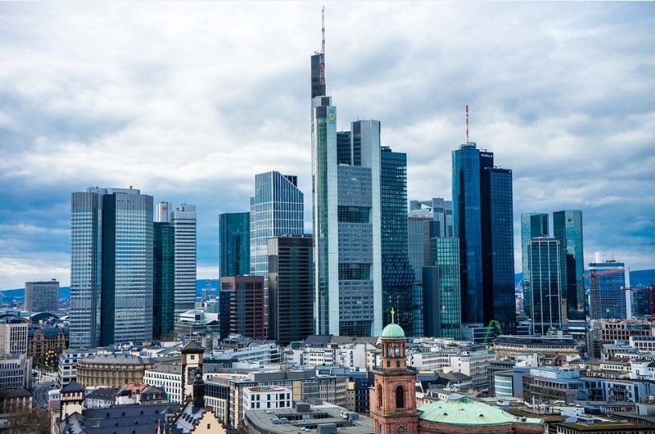
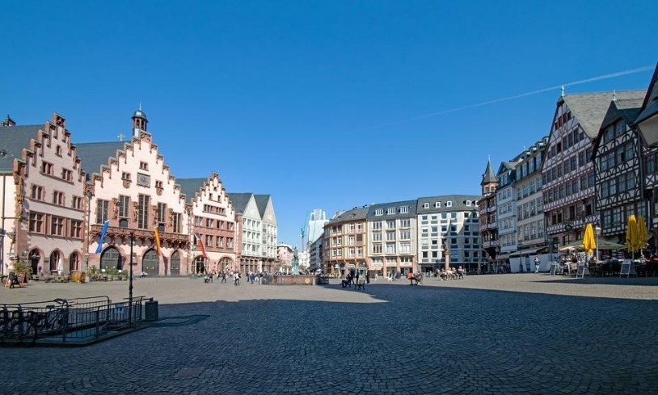
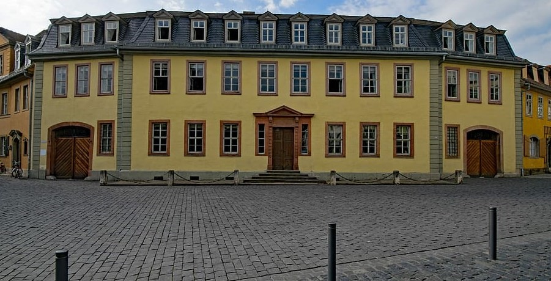
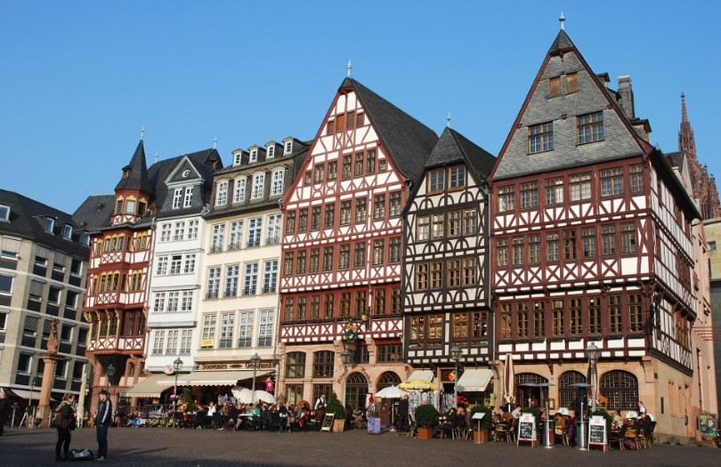
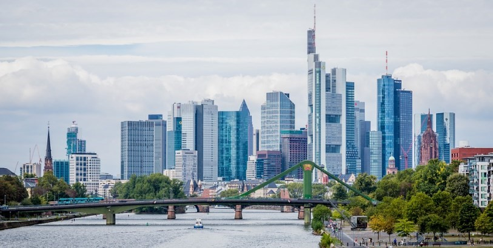

# 🏰 Frankfurt

Frankfurt is one of the most important cities in Germany, being the headquarters of the European Central Bank and the financial center of the country. This city was practically completely destroyed during World War II, however, it has recovered in such a way that it has become another tourist destination to consider. Around Römerberg square revolves its beautiful historic center where you can visit one of its important museums or visit the skyscrapers on the skyline, perhaps relax in any of its well-kept parks or drink a good mug of beer, accompanied by a delicious Frankfurten Würstchen sausage.

We have made a list of the most important places to visit in Frankfurt, so that if you come to the city, make the most of your time.

## Romerberg square

The Römerberg Square is the heart of the historic center, in addition to the main square of the city, it is surrounded by traditional houses built between the 15th and 16th centuries, with their colored facades and their half-timbering. Several of the most important historic buildings in Frankfurt are concentrated in the square, such as the Iglesia Sant Pablo, the Ayuntamiento, the Fuente de la Justicia built in 1543 and the Antigua Iglesia de San Nicolás. The City Hall is based in the Romer building built in the fifteenth century and was the coronation site of the most important emperors and kings of Germany.

Another of the important sites found in this square is the church of Sant Pablo where the first parliament met in 1848, which was democratically elected, a symbol of the city and democracy.

## Goethe's house

Johan Wolfgang von Goethe was born and lived in Frankfurt, one of the great writers of literature and author of famous works such as Faust or The Sorrows of Young Werther. Although it is true that his house was destroyed during World War II, it was restored and a large number of original objects, paintings, family portraits, etc. were recovered. You will be able to visit this three-story house full of memories of the famous author, where you will see his different rooms and the common instances such as the dining room, the kitchen and the library.

## Sachsenhausen district

An Iron Bridge stands between the historic center and the new quarter (Sachsenhausen). On this neo-Gothic style bridge built in steel in 1868, you can enjoy excellent views of the buildings located on the banks of the Main River and the skyline.

Once you are in the Sachsenhausen neighborhood you can go through its oldest area to see its wooden houses, its cobbled streets, numerous fountains and a large number of taverns where you can try the apfelwein, it is a kind of cider and the most traditional drink in the city. The most popular streets where these taverns are located are Paradiesgasse, Rittergasse, Brückenstrasse, Klappergasse and Schweizer Strasse, there you can also taste German cuisine, the oldest being Zum gemalten Haus and Wagner.

## Main Tower

Frankfurt is dotted with large skyscrapers, among which is the Main Tower, which is 200 meters high and its construction was completed in 1999. It is made up of two buildings, one cubic and the other circular, interconnected with each other and in its 56 floors you can find television studios and several bank headquarters, it also has a fantastic terrace where you can watch a beautiful sunset or dine in its revolving restaurant. Main Tower is located within the business area of the city, where the tallest skyscrapers are concentrated, among which the Europaturm (337 meters), the Westendtower (208 meters) and the Commerzbank Tower (259 meters), among others.

## Collegiate Church of Saint Bartholomew

The Frankfurt Cathedral or Collegiate Church of Saint Bartholomew was built between the fourteenth and fifteenth centuries, it is the largest and most important temple in the city and was the coronation site of both kings and emperors between the years 1356 and 1792. This impressive church at the Gothic style stands out for its tower 95 meters high and its red sandstone facade, from the top of the tower you can get excellent views of the historic center. Inside, it stands out for its Gothic altarpiece from the 15th century, the chapel of Santa María and the chapel of the Electorate, where the emperors were elected.

## Stroll along the banks of the Main

On both banks of the Main you will find trails for playing sports or walking, as well as a grassy area for small picnics with impressive views of the skyline. You can also take a cruise on the Main River to see the financial district and the historic center from a different perspective.

## Frankfurt Stock Exchange

Transactions of billions of euros a year are moved on the Frankfurt Stock Exchange, as it is one of the most important stock markets in the world. It has an impressive façade in the neoclassical style and nearby are the structures of the Bull and the Bear that respectively symbolize the ups and downs of the Stock Exchange.

Two other important buildings are located near the Stock Exchange are the Eschenhaimen Turm, an old medieval city gate and the Alte Oper, the old opera house. After viewing these important buildings, the recommendation is to take a walk along Zeil Street where the MyZeil Shopping Center is located with an amazing mirrored facade and the Zeil Gallery with incredible views of the skyline and Hauptwache Square. Finally, you can approach the covered market Kleinmarkthalle where you can give great pleasure to all your senses.

## Palm Garden

The Palm Garden has an area of 22 hectares where you can see different types of plants from around the world such as vegetation from Patagonia, New Zealand, Asia, etc.

The park was inaugurated in 1870 and its most outstanding areas include the rose garden, the bamboo gardens, the rock garden, the tropicarium and the Palmenhaus, where you will feel as if you were inside a tropical jungle.

## Museums to visit in Frankfurt

On the banks of the Main River is the area known as the Museums' Bank, being one of the most important cultural regions in all of Europe and where most of the city's museums are concentrated. The most important are the Städel Museum, with one of the most relevant collections in the world and works ranging from the 15th century to the present day. The Liebieghaus Museum with a wonderful collection of Greek, Egyptian and Roman sculptures. The last recommendation is the Giersch Museum with its excellent temporary exhibitions.

## Jewish cemetery

In the Jewish cemetery you will see a wall that contains more than 11,000 plaques with the inscribed names of the Jewish citizens of Frankfurt who died in the concentration camps, victims of the Holocaust.
Frankfurt is a modern city with great skyscrapers, interesting historical sites and beautiful tourist attractions to see.

## About the Author

Idais, Graduated in Mechanical Engineering, and a master’s degree in teaching component, she gave classes in several institutes of mathematics and physics, but she also dedicated several years of my life as a television producer, she did the scripts for mikes, the camera direction, editing of video and even the location. Later she was dedicated to SEO writing for a couple of years. She likes poetry, chess and dominoes.
