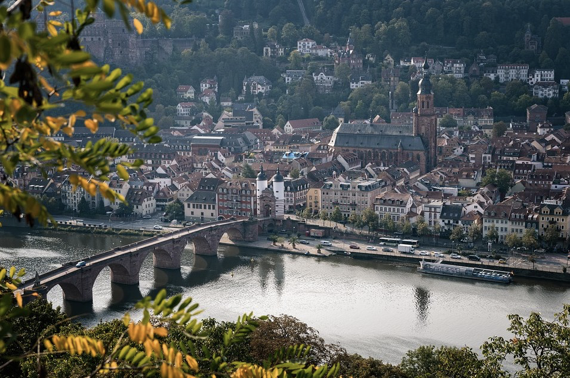
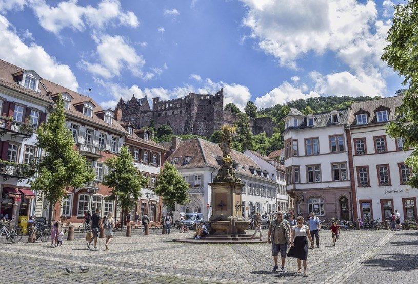
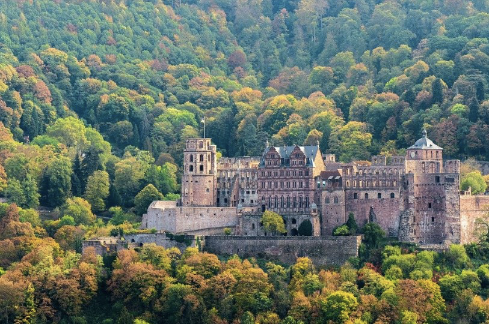

# Heidelberg

Heidelberg, is one of the most touristic and romantic cities in Germany, it is located in the Neckar river valley. This city is home to the oldest university in Germany, founded in 1386. Being a university city, it is extremely lively and has a wide variety of restaurants, shops and breweries to serve the student population.
Heidelberg is located in one of the warmest areas of Germany, so you can find in some of its gardens, rare species in these latitudes such as fig trees, almond trees, vines and even olive trees.
We are now going to inform you about the most important places in this city, so that if you decide to visit it you can get to know the best of Heidelberg.

## Altstadt or Old Town

Altstadt is the oldest site in the city and is located below the castle. A succession of narrow streets stretches along the river and there you will find baroque buildings, restaurants, shops and the most famous attractions of the city. Altstadt was practically destroyed in the 1690s by French troops and was rebuilt during the 18th century. Unlike most German cities, however, it was almost undamaged in World War II, as it became the American seat of military command. Marktplatz or the Market Square is the meeting point since the Middle Ages, so there is always activity, as well as being a market that still survives on Wednesday and Saturday mornings, where you can find fresh produce, fish, flowers, etc.

In the center of the square you can see the Hercules Fountain built between 1706 and 1709 in order to commemorate the efforts to rebuild the city. Right there you can see the Town Hall and the Church of the Holy Spirit built in the fifteenth century. You will also be able to see one of its most unique buildings which is the Casa del Caballero built in 1592, it is one of the few that remain after the destruction of the city and is currently a hotel and restaurant.
The Marktplatz is a perfect place to stroll, full of restaurants and cafes where you can enjoy an excellent beer on any of its terraces. But if you prefer to know the most important religious place in the city, there is also the Church of the Holy Spirit built between 1398 and 1544, in the Gothic style and with a Baroque bell tower that was added in 1709. This Church was used by Protestants and Catholic at the same time, with a wall that separated them for more than 200 years and you can enjoy a beautiful view of the city if you climb the 208 steps of the tower.
Hauptstrasse or Main Street is the one that crosses the historic center from where a large number of alleys leave where you can see old churches, medieval architecture, galleries, boutiques, cafes, restaurants and breweries full of people at any time of the day, being the favorites of students and locals. In the surroundings of the Main Street you can find outstanding historical sites such as the Providence Church, the Giant's House built in the 18th century, the Morass Palace, which is a majestic baroque palace where the Palatinate Museum is located with a large collection of sculptures, Applied Arts, a cast of the lower jaw of Homo heidelbergensis dating back 500,000 years, but the original jaw is in the Geological Museum of the University of Heidelberg (in case you want to stop by to see it).

## Karlsplatz or Charles Square

Karlsplatz square was built in 1805 and has a fountain in the center commemorating cosmographer Sebastian Münster and is also home to the Palais Boisserée and the Heidelberg Academy of Sciences, alongside them are several student fraternities including the historic Mittermaierhaus , the Zum Roten Ochsen inn built in 1703 and the Zum Seppl inn built in 1634, which were boarding houses where several generations of students stayed, are now restaurants.

## Charles Theodore Bridge

This is one of the most visited bridges in the city and one of its icons, it crosses the Neckar River and was built in the 1780s. In the old area there is a beautiful medieval gate that is part of the city's fortifications and has with two twin towers, being next to it is the sculpture of the Bridge Monkey, which contains a mirror where legend has it that if you touch it it will bring you riches and if you touch the monkey's fingers one day you will return to Heidelberg.

## Philosopher's Walk

Crossing the Carlos Teodoro Bridge and going up a cobbled staircase, you reach the Paseo de los Filósfos, which is a path of approximately 4 km where the philosophers of the University walk looking for inspiration. Here you can find wonderful views of the Neckar River and Heidelberg Castle.

## The King's Chair

On Mount Silla del Rey is the famous Heidelberg Castle where you can go up by funicular, bus or bicycle. The funicular is one of the most modern in Germany and is taken from a station behind Kornmarkt, its first stop being Heidelberg Castle and then continuing up to Molkenkur where you can find a hotel and a restaurant.
From there you can change funiculars to get to the top of Königstuhl and this second line is from a funicular dating back to 1890, with its historic carriages. The top of the Königstuhl is a magical place to see the stars and there you will find the Heidelberg State Observatory which was built in 1898.

## Heidelberg Castle

This castle was built in red sandstone and its ruins are the result of two lightning strikes, one in 1573 and the other in 1764, as well as the destruction of the French who devastated the Palatinate in the 17th century. The castle features German Renaissance architecture and although it is in ruins, some rooms have been restored as has the interior of the King's Hall and is now used for seasonal festivals and other events. You can enjoy the Gothic courtyard and the views over Heidelberg from the terrace, visit the German Pharmacy Museum, walk through the gardens that were considered the Eighth Wonder of the World and admire the largest wine barrel on the planet that holds 22,000 liters of wine.

## Old University of Heidelberg

It is one of the oldest universities in Europe founded in 1386 where you can admire the Plaza de la Universidad and the building of the old University dating from the 18th century where the Rectory and the University Museum are located. The University Church dates from the 12th century and the library was built in 1421. Behind the old University building is the old student prison where students were incarcerated for minor behavior such as drunkenness, fighting or theft. The students had to spend several days or weeks in jail but continued to attend classes.
Heidelberg is a vibrant student city steeped in historical legends, beautiful old buildings and wonderful sites.
