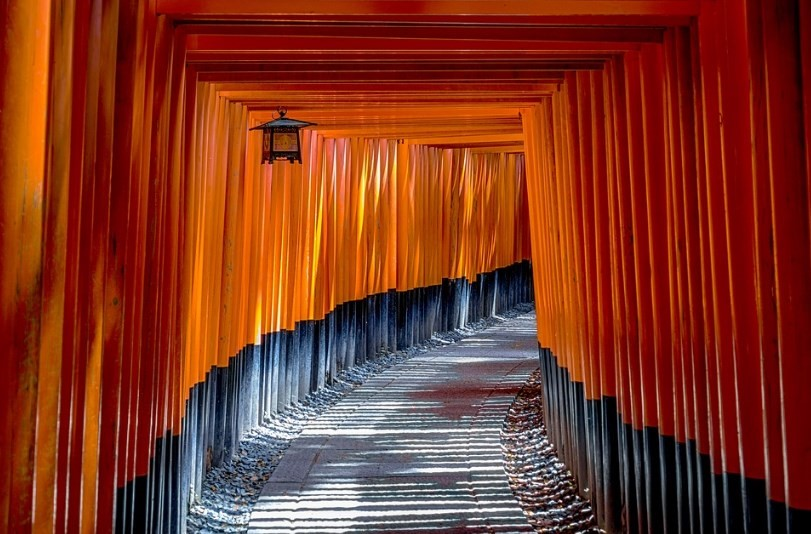
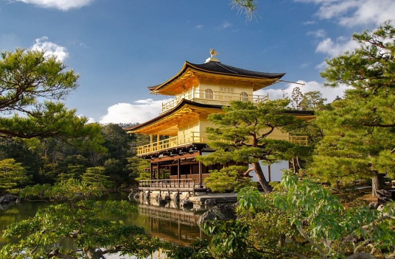
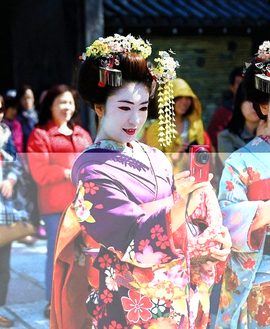

# 🏯 Kyoto

In the central area of the island of Honshu is Kyoto, an important city in Japan that has managed to harmonize its oldest traditions with modernity. There are still neighborhoods that preserve their traditional wooden buildings with hundreds of sanctuaries and incredible temples, large palaces, beautiful gardens and are also visited by maikos and geishas.

Its delicious cuisine is another of its great attractions, so you can try dishes such as sushi, tempura, sashimi, ramen, okonomiyaki, miso soup, Kobe beef, gyozas, etc. to fully enjoy your palate.

If you plan to get to know this incredible city, we will give you a list of the essential places that you cannot miss.

## Fushimi Inari Taisha

Fushimi Inari-taisha is a shrine to honor the goddess of rice built in the 8th century, famous for its many orange or red torii winding a 4 km long walkway up the Inari Mountain path.

The sanctuary can be reached on foot to enjoy the beautiful view offered by the toriis. However, it can also be reached by train from Kyoto Station.

## Kinkaku-ji

Kinkaku-ji or also called the Golden Pavilion, is a temple that stands out for its pavilion that is covered with pure gold leaves, built in 1397 and rebuilt in 1955, since it was burned down by a monk with poor mental faculties in 1950 In the temple you can see a Japanese garden, with a beautiful pond known by all as the Water Mirror and that is really worth seeing.

## Gion District

Gion, is famous for being the neighborhood of the geishas and take a walk towards sunset through its narrow streets with its Japanese-style wooden houses, where you can see the occasional maiko or geisha on the way to the tea house, you will provide an unforgettable experience.

It is advisable to pay attention to Hanamikoji Street or Pontocho Street near the Gion neighborhood, as both are full of teahouses and restaurants where geishas go when they go to work between 5:00 p.m. and 7:00 p.m. or at the time They leave work between 8:00 p.m. and 10:00 p.m.

## Kiyomizu-dera

Kiyomizu-dera is one of the most touristic temples in Japan, located on a hill on the eastern side of Kyoto and built in the year 778. It stands out for the magnificent views of the city, the pavilions, the pagodas, the doors and the exuberant surrounding nature.

## Arashiyama Bamboo Forest

You will be able to walk through more than 50 varieties of bamboo that are perfectly aligned, while listening to their sway produced by the wind. In this bamboo forest you can find specimens that measure just over 20 m in height, it is a unique experience that we are sure you will remember from your trip to Japan. But the Arashiyama area, in addition to the bamboo forest, has other places that are worth visiting, such as several temples, among which is the Tenryu-Ji and the Togetsuky bridge.

## Ginkaku-ji

Ginkaku-ji or also called the Temple of the Silver Pavilion is a Buddhist temple that somewhat mimics the Temple of the Golden Pavilion, only covered with silver panels. Although it is true that this temple was not completed as a result of a civil war, in no way does this circumstance detract from the beauty of the temple. You can find beautiful gardens in the Japanese style, the most relevant being the moss garden with ponds and streams or the dry white sand garden, where you can see that they are one of the wonders of Kyoto.

## Path of Philosophy

One of the best walks is definitely the Kyoto Philosophy Path or Philosopher's Walk, especially in spring because you can see the cherry blossoms. Its name is due to the Japanese philosopher Nishida Kitaro, who meditated while walking through this place to go teach at Kyoto University. This route of approximately 2.5 km runs parallel to the Shishigatani canal, but it is also very close to numerous shrines, temples, cafes and charming craft shops, where you can make several interesting stops. The most prominent temples are Otoyojinja, Reikanji, Nyakuojijinja, Mirokuin, Honen-in, Ginkaku-ji and the closest ones are Nanzenji and Eikando.

## Ryoanji

Ryoan-ji is a Zen temple with the most famous mysterious dry garden in Japan. Although it is true that this type of Zen garden has few decorative elements, the monks use it for meditation. The garden has a distribution of its elements such as moss, sand, gravel, rocks and the shape of raking that although it is quite subjective, most people notice a relaxing effect when observing it. You can also walk around the temple area where you can see several beautiful gardens and ponds with a variety of vegetation.

## Sannenzaka and Ninenzaka streets

In the Higashiyama neighborhood you can find the essence of a more magical and traditional Kyoto in its Ninenzaka and Sannenzaka streets. These two streets that will take you back to ancient times with their typical wooden houses and the recommendation is to walk them towards sunset, since it has a special light at this time of day. But if you want to enter one of the souvenir shops, it is best to go in the morning. Although legend has it that if you fall on Ninenzaka street you will die in two years and if you fall on Sannenzaka street you will die in three years, so be careful where you walk.

## Heian Jingu and Sanjusangendo

Heian Jingū Shrine is notable for its huge red torii that stands at the entrance to the temple. Although the main building and the red torii are very relevant, the area of its gardens is no less so, which are truly impressive.

Another of the most important temples to see in Kyoto is Sanjusangendo, where you can delight yourself by observing the 1001 statues of the Buddha goddess of mercy "Kannon". Each of these wooden statues are handmade and covered with gold leaf, they are also housed in the longest wooden hall in all of Japan and although they do not allow taking photos inside, the visit is still worth it.

Kyoto is a city steeped in ancient history and is the land of geishas, an interesting place to visit.

## About the Author

Idais, Graduated in Mechanical Engineering, and a master’s degree in teaching component, she gave classes in several institutes of mathematics and physics, but she also dedicated several years of my life as a television producer, she did the scripts for mikes, the camera direction, editing of video and even the location. Later she was dedicated to SEO writing for a couple of years. She likes poetry, chess and dominoes.
