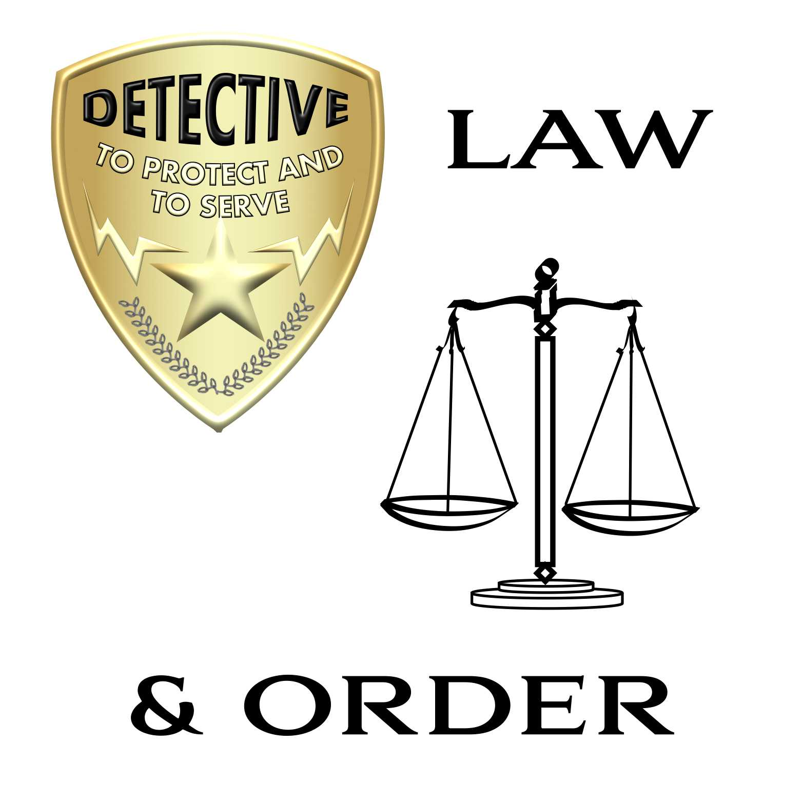

# 👮 Law & Order

From 1990 to 2010, Law & Order was a powerful example of police/courtroom drama
exemplified by other series listed at the end of this article, such as CSI
(Crime Scene Investigation) and NYPD Blue. The series’ idea, conceived by Dick
Wolf, was originally considered by Fox and then CBS, but after they decided to
pass on the opportunity, NBC made the decision to order one season of the
series. 19 more seasons followed.

The basic format, followed for the most part of its 20 year span, was the
discovery of a crime, usually, but not always, murder, followed by the normal
sequence of investigation and subsequent prosecution of a suspect in court.
Crimes depicted on TV were very often based on actual current events, or as the
series said “ripped from the headlines”. The plots highlighted “legal, ethical
or personal dilemmas to which people can relate”. The location was New York City
and often depicted intimate details of big city life.

Investigations could be very detailed, including wide ranging and in depth
scientific analysis of evidence, psychoanalytical/psychiatric analysis of
motives and methods, and in the later years, digital evidence was included, such
as video surveillance, cell phone and GPS tracking. A senior and a junior
detective would interview suspects, witnesses, scientific investigators, medical
examiners and forensic technicians. Victim’s family members and friends were
often consulted, as well as friends and family members of the suspect(s). The
suspect would then be interrogated and the Defense Attorney would have his or
her input. Detectives would then normally consult with their commanding officer
and devise a plan of action to apprehend (if not already in custody) and charge
the suspect. Sometimes an Assistant District Attorney would be part of the
procedure in order to ensure that the prosecution would be successful.

The second part of each episode would move on to the prosecutors’ jobs. A pair
of prosecutors, the Executive Assistant District Attorney and the Assistant
District Attorney, would outline their plan for prosecution and at times, the
District Attorney, being an elected official, would introduce political
considerations into the equation (aaarrrggghhh!). The prosecutors and the
Defense Attorney would all have their input and often jockey for position using
admissibility of evidence, jury selection, plea bargaining and other legal
maneuvers. This is the approximate time when action would move into the
courtroom. Scenes would show a judge ruling on the various legal maneuvers in
preparation for the trial.

During the trial, we see professional testimony from the medical examiners,
crime lab technicians (including fingerprint analysts, DNA profilers and
ballistics analysts), and psychologists or psychiatrists and many of the
characters already introduced: witnesses, family members, and of course
suspects. Occasionally, the action would move into the judge’s chambers for
rulings outside of the public trial procedure. Many moral, ethical and just
plain crazy defense arguments are made at this point. Back in the courtroom,
both sides present their arguments and then the action breaks while the jury
deliberates.

Once the jury has reached a verdict, the scene often depicts the reactions of
the concerned parties, the families of the victim and the suspect (whether found
guilty or not), the detectives and the prosecutors. If found guilty, the suspect
is led away and then after some observations from police and prosecutors,
sentencing follows.

The final scenes will usually be the prosecutorial team’s further observations
and sometimes the detectives will discuss the case and outcome. The moral and
ethical issues are often discussed.

Law & Order received many awards over the years and the list of noteworthy
actors involved, both as regular cast members and as guests is huge. The cast
maintained continuity, with characters coming and going from time to time, but
always following a story line that explained every change. A huge part of the
charm of the series was that the story of the cast, the characters, captivated
the audience. I was happy to be part of that audience.

- https://en.wikipedia.org/wiki/Law_%26_Order
- https://www.imdb.com/title/tt0098844/
- https://lawandorder.fandom.com/wiki/Law_%26_Order
- https://www.nbc.com/law-order

## Related TV series and shows:

Hill St. Blues, NCIS, CSI, NYPD Blue, Law & Order Special Victims Unit, Law &
Order Criminal Intent, Law & Order Trial by Jury and Law & Order LA, "Exiled: A
Law & Order Movie", "Law & Order: UK" Mayors Rudy Giuliani and Michael Bloomberg
and many other real personalities appeared.

## About The Author

Harley Armentrout is a happy husband and father, former silversmith, aerospace
electronics prototype assembler, test, calibration & repair technician, also
writing test procedures at [BallAerospace](https://www.ball.com/aerospace). Then
21 years in the gaming industry, in a range of positions, culminated as a Gaming
Inspector, observing and reporting on rules violations, safety issues and
criminal activities for the
[Yavapai Prescott Indian Tribe](https://buckyscasino.com/). After “retiring”
Harley taught himself a few graphic design skills and he works as a freelance
designer.
