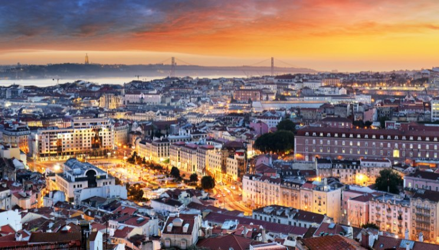
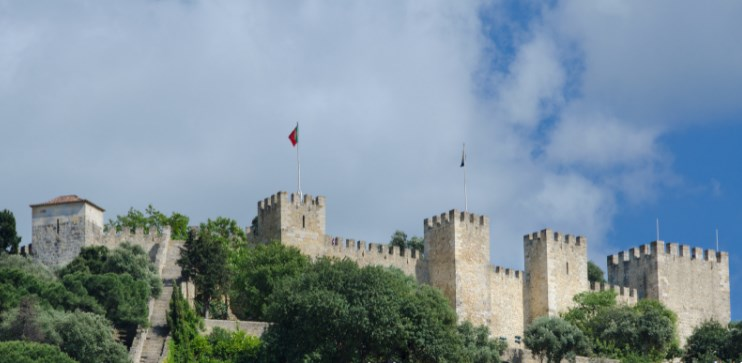
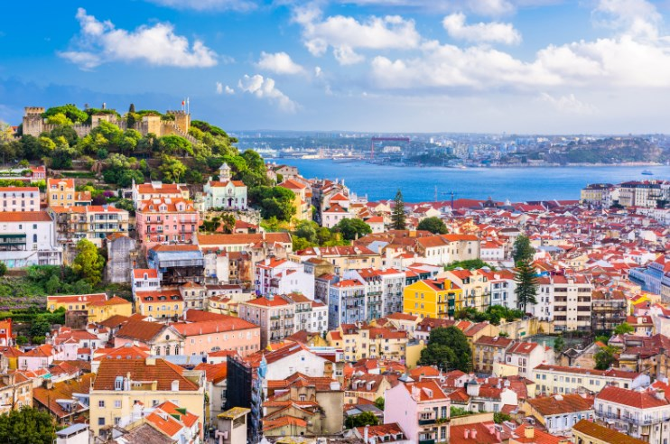
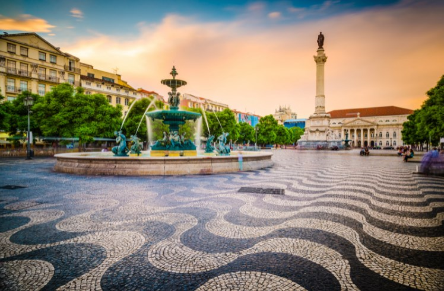

# 🇵🇹 Lisbon

Lisbon in the capital of Portugal and one of the most beautiful cities
in Europe, being a mixture between a traditional city but at the same
time cosmopolitan, which gives this metropolis a special attraction.

This city has one of the oldest histories on the European continent
since it was founded 3000 years ago and after Athens, it is the oldest
capital in the entire European Union, being built 400 years before Rome.

The Tagus River flows into Lisbon, which is the longest in the Iberian
Peninsula, thanks to its strategic position, in its port the ships that
traded between the Mediterranean and the North Sea were replenished.
Also because it is located in the southwestern corner of Europe, it was
an important point for trade routes with America and Africa.

To get to know Lisbon, there are countless tours that can show you the
city, but if you prefer to travel on your own, we are going to give you
some tourist tips that can be very useful for you in the brand new
capital.

The first thing is that the airport is in the same city, so it is a very
good option to take a taxi from the airport to the center of Lisbon.

One of the most emblematic attractions is the Castle of San Jorge, a
large fortification that stands on one of the city\'s hills. This castle
originated after the Arab invasion and later became the Royal Palace,
after the reconquest of King Alfonso I for Christianity. The castle was
destroyed after the Lisbon earthquake in 1755, but even so it is one of
the main monuments that you must visit, also from there you will have
the best views of the Tagus Estuary and the city, being the great
viewpoint over Lisbon. But if you want different panoramic views, you
can go to the Santa Lucía viewpoint that is located over the popular
Alfama neighborhood, whose view is more oriented towards the inner part
of the Tagus estuary. Even if you walk around the surroundings you can
see the church of Santa Lucía built in the 18th century and reach the
Puerta del Sol viewpoint, where you can see the perspective of the
eastern part of the city.

Going down you will see the neighborhood of Alfama, one of the most
authentic in Lisbon, where you will find small houses with colored
facades and several traditional restaurants where you can enjoy the
musical expression of Fado and arriving in the city along the same
route, you will find with the Sé de Lisboa Cathedral that was built from
the year 1147 and is the oldest church in the city, in a romantic style,
next to which a Gothic-style convent was later built, where
archaeological excavations are currently being carried out.

One of the most typical events is to get on one of the old trams, one of
its most popular lines among tourists being tram 28, which runs from the
Baixa neighborhood to the Castle hill.

Most of Lisbon\'s commercial life takes place in the Baixa neighborhood
and you can take the Santa Justa elevator from the lower area of ​​the
neighborhood to the upper area, where the Alto and Chiado neighborhoods
meet. One of the attractions is precisely getting on this elevator built
in 1902 and this metal structure is more than 45 m high, from its top
you will have the best panoramic views of the city.

The Chiado neighborhood is one of the most luxurious areas of the city
where you can find modern shops, restaurants and cafes. The Barrio Alto
stands out for being a space to enjoy nightlife, full of bars,
restaurants and terraces where you can drink until dawn and you can also
get there from the Santa Gloria elevator, which is a rack tram that
takes you You can go up from the Plaza de Restauradores.

The nerve center of the city is the Rossio Square that extends to the
Restauradores Square, in its center is the monument to Don Pedro IV who
was the first emperor of independent Brazil.

If you like Portuguese tiles, you should visit the Tile Museum located
in the old convent of the Madre de Dios, where in addition to seeing the
vision of Lisbon made in a spectacular set of tiles, you can see the
interesting corners of the Church. This artistic gem made of tiles
demonstrates Lisbon at the beginning of the 18th century, before the
earthquake leveled the old Royal Palace and the Baixa district.

Your visit to Lisbon will not be complete until you go to the Belem
neighborhood where you can see some of the most emblematic monuments of
the city, such as the Torre de Belem, the Jerónimos Monastery or the
Monument to the Discoveries.

The Jerónimos monastery is the best example that exists in Portugal of
the Manueline style in architecture, founded at the beginning of the
16th century and you can walk through its beautiful cloister and other
outstanding rooms such as the church of Santa María, which is from the
same period and gothic style. While the tower of Belem located in front
of the monastery is also from the 16th century and was built to defend
the city from attacks by corsairs or other enemies. During your visit
you will be able to visit all the floors of the Manueline-style tower
and when you reach the terrace you will have the best panoramic view of
the monastery.

But if you have a passion for sweets, you should visit the establishment
where the popular Belén cakes are made. These sweets that are so famous
in Lisbon have been produced in this historic factory since 1837 and
today, it has numerous rooms where you can taste these delicious cream
cakes.

This beautiful city is made up of seven hills and uses an elevator and
three funiculars to transport the population to the highest parts of
Lisbon. Lisbon is full of history and can offer you a warm stay, as well
as a large number of interesting places to discover.

## About the Author

Idais, Graduated in Mechanical Engineering, and a master’s degree in teaching component, she gave classes in several institutes of mathematics and physics, but she also dedicated several years of my life as a television producer, she did the scripts for mikes, the camera direction, editing of video and even the location. Later she was dedicated to SEO writing for a couple of years. She likes poetry, chess and dominoes.
