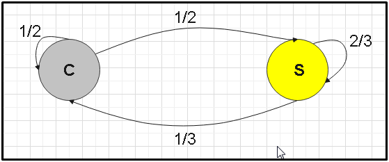

# 🔗 Long-term behavior of Markov Chains

One of the most interesting aspects that Markov chains can give us is to be able
to predict their long-term behavior, yes, if it exists. If so, we will obtain a
probability vector "X" that will indicate the probabilities of being in each of
the states, but after a large number of repetitions. So in a Markov chain, its
long-term behavior if it exists is defined as:

We must take into account "if it exists" it is because there are Markov chains
whose long-term behavior is not defined. But even if this is so, we can
establish conditions that guarantee long-term behavior in a Markov chain.

For example, if we have a transition matrix P made up of strictly positive
elements, we can show that this Markov chain can have a long-term behavior, in
addition that it is well defined and this behavior is unique.

Let's suppose that we have a transition matrix P from a Markov chain. We can
then say that there is a vector "X" that is stationary, given the case that "X"
is a probability vector, which is fulfilled if its elements are positive, they
add up to 1 and also PX = X.

If all these conditions are met, we can say that a Markov chain can have a
perfectly defined long-term behavior and also that this long-term behavior is
unique and can be represented with a stationary vector.

When it is true that PX = X, this implies that "X" is going to be a vector of P
but associated with the eigenvalue λ = 1 and it is also a probability vector.

## Stationary Vectors

Let's suppose that we have a Markov chain with a transition matrix P, we can
define a stationary vector as a probability vector X that fulfills the condition

PX = X.

We must take into account that a stationary vector is an eigenvalue vector of P
but that it is associated with the eigenvalue λ = 1.

When we have a Markov chain that has a defined long-term behavior, then we can
say that this long-term behavior will be given by the stationary vector. That
is, the stationary vectors establish the long-term behavior of a Markov chain.

It is important to take into account that not all Markov chains have a
well-defined long-term behavior, but if all the elements or inputs of the
transition matrix P are strictly positive and the matrix is stochastic, there is
a theorem that guarantees that this matrix P has a defined long-term behavior
and this behavior will be precisely the stationary vector.

To find the long-term behavior, we must find a probability vector that satisfies
PX = X and this means that this vector is an eigenvector of P with λ = 1.

Now, to find this proper space, it is defined as the null space of the matrix
(P - λI), where I is the identity matrix, that is:

E= Null (P - λI)

But we are interested in finding the proper space for when λ = 1, therefore the
equation would remain as:

Let's remember a bit of linear algebra to know the method How is the null space
of a matrix found?

Let M = (P - I) be a matrix made up of m rows and n columns, the null space of
this matrix is defined as:

In other words, the null space of the matrix M is a set of elements that belong
to R^n that when multiplied by the matrix M, its result is the vector

that belongs to

Let's go to an example: Let's find the null space of the matrix A

For this we must multiply the matrix by
,
that is:

It is important to take into account that the vector

must have as many elements as there are columns in the matrix, in this case
matrix A has 3 columns and therefore the vector will have 3 elements: x, y, z.
While vector

will have as many elements as there are rows in matrix A, which in this case
also has 3 rows, therefore, vector

is composed of 3 elements.

Then we simply multiply the matrix A by the vector

and set it equal to the vector

To solve this system of equations, it is best to stagger the matrix and for
this, it will be necessary to create the extended matrix:

Now, what is staggering a matrix?

An echelon matrix is characterized by only containing the unit on the main
diagonal and below the diagonal, all elements must be null, but the elements
above the diagonal can contain any value. This way of treating matrices greatly
facilitates the calculation of its variables and to convert any matrix into a
stepped matrix, it will be necessary to perform some operations with the rows of
the matrix.

You can exchange rows, multiply the entire row by any convenient scalar number
and add or subtract the rows, until the matrix can be scaled without affecting
the result. If the first element in the upper left corner of the matrix is zero,
it is advisable to exchange the rows for any other whose first data is different
from zero.

We are then going to carry out the necessary operations to convert the augmented
matrix into an echelon matrix.

The upper left number of the matrix is 2, to convert it to 1 since it is a
condition to convert the entire diagonal of the matrix into unit elements, for
this it is advisable to multiply the first row by ½

½

We are now going to try to convert the numbers that are below the first one (1)
into zeros, for this it will be necessary to have row one previously multiplied
by (4) in row 2, and the result will be our new row 2. From the In the same way,
our row 3 will be the effect of adding to row 3, row 1 multiplied by (6).

in addition to
,
I have the following matrix:

Translating the result into an equation we have:

x - (1/2) y + (3/2) z = 0

We have the following system, where we realize that there are infinite
solutions, since the variables "y", "z" can adopt different values and is what
are called free variables, the best way to express a system with free variables
is :

x = (1/2) y - (3/2) z

y = y

z = z

Now, only "x" depends on the other two variables, since both "y" and "z" can
adopt any value, so that the system can have infinite solutions, we are going to
organize the above a little better and we are going to make a parameter change
to find one of the possible solutions.

y = t

z = s

Where "t" and "s" are any scalar values or numbers

Since t and s are scalar numbers, we can extract them from the matrix

Therefore, each solution vector can be generated by means of the linear
combination of these two solution vectors, so as we give atys values, a new
solution vector will be generated and it is important to take into account that
both Vectors are linearly independent of each other and they also generate a
solution space for the system. So now we can extract the core of the solution
and describe it as follows:

Once we have learned the corresponding handling of linear algebra for solving
these types of problems, we can return to the topic that matters to us and that
is the long-term probability of Marcov chains.

Let's go to an example: In a certain region we have the following sequence of
atmospheric weather, we will call "S" when the day is sunny and we will call "C"
when on the contrary, it is cloudy. On the other hand, we have knowledge that if
there is a cloudy day, most likely the next day it will also be cloudy. But if
the day is sunny, there is a 2/3 probability that the next day it will also be
sunny. Suppose that today the day is cloudy:

- What would be the probability that in three days it will also be cloudy?
- What would be the probability that it is sunny?
- What would its behavior be in the long term?
- Will your long-term behavior depend on how you are on the day we take as your
  initial reference?

Leaves C S C 1/2 1/3 S 1/2 2/3

It reaches

In the initial situation, the day is cloudy, so the initial vector will be:

To know the probability within three days we must apply the formula:

The probability that it will be sunny three days later will be 59.72%, while the
probability that it will be cloudy that day will be 40.27%

We now go with the long-term behavior and for this we must find the null space
of the matrix (P - I), then let's first find the result of it and remember that
I is the identity matrix

To find the null space of the resulting matrix, it is best to express the
extended matrix, whose last column is made up of null elements, that is:

Now we will have to perform the necessary operations to scale the matrix, to row
1 I will add row 2 and the result will be placed in row 2

As we know, to stagger the matrix, the numbers on its diagonal must all be 1, so
I will multiply row 1 by scalar 2 and the result will be my new row 1.

As we realize we have a single equation with two unknowns, so we can say that "y" is a free variable, therefore:

x -2/3 y = 0

y = y

Clearance x:

x = 2/3 y

I change the parameter and set that:

y = t

The system looks like:

As it is very uncomfortable to work with fractions, I extract (1/3) from the
vector and we are left with:

Therefore:

But remember that the long-term vector is going to be a stationary vector, that
is, an eigenvector of P associated with the self-value λ = 1, but the stationary
vector must be a probability vector and this implies not only that its elements
must be greater than or equal to zero, but also, when adding the column of the
vector, the result must be unity (1).

As we can see, in this case the sum of the vector gives us 5, so to find the
stationary vector what we have to do is find a multiple of that vector, whose
sum of elements gives us as a result (1). We can realize that if we multiply the
vector by (1/5), we can obtain the vector that meets all our expectations, in
this case the stationary vector remains:

By adding 2/5 + 3/5 = 1

This vector will indicate that the long-term behavior of the weather in that
region is a 40% probability that the day is cloudy.
 While the probability that
that day is sunny will be 60%. 
Once we know the method, we will try to find the long-term behavior of two
problems that we developed in the previous article.

Remember when we were looking for the probabilities that a student will spend
his time studying mathematics or physics?

Well, starting from the transition matrix that we calculated previously, we are
going to try to find the long-term probability, to see which of the two subjects
the student will end up spending more time on.

Recall the transition matrix P

Let's apply the method again for long-term behavior, the first thing we must do
is look for the matrix (P- I), so that by subtracting the identity matrix from P
we obtain:

Doing the operations between the rows, we are going to add row one with row two,
to place the result in our row two and I am also going to multiply row one by
(-2) to convert its first element to (1), since As we know, to scale the matrix
we must have the unit in all its diagonal.

To find the null of this array I must extend it with null elements

As we realize we have “y” as a free variable, therefore the system will be equal
to:

x - (4/3) y = 0

y = y

We make a parameter change:

y = t

We substitute in the system:

x = 4 / 3t

y = t

We can express it as:

For convenience we extract 1/3 of the vector and we have:

The space will be as:

Again we realize that the vector generated is not a probability vector, since
the sum of its elements gives us the number 7 instead of the unit (1), so again
we will have to find a multiple of the vector so that we gives as a result a new
vector, whose sum of elements is (1).

If we multiply the vector by (1/7) we will achieve the proposed

As we can see: 4/7 + 3/7 = 1, therefore we have already reached the probability
vector that represents the long-term behavior

Recall that the first row represented the time spent studying mathematics, while
the second row indicated the study time for physics.

With this result we can deduce that in the long term, the student has a 57.14%
probability of studying mathematics and a 42.85% probability of spending his
time studying physics. 
Let's keep looking for the long-term behavior of exercises that we performed in
the previous article. Remember the problem with the trucks moving between
Brisbane, Sydney and Melbourne?

Now we are going to see the probability of the number of trucks found in each of
these cities, but in the long term. Recall its transition matrix P

We are now going to calculate the matrix (P- I)

Now we do the operations between rows to try to scale the matrix, in this case
we are going to add row 1 with row 2, to place the result in row 2.

We are now going to expand the matrix to find the null of (P- I)

This matrix is translated into two equations:

x - y = 0

y - z = 0

z = z

Remember that "z" is a free variable, because we have three equations with two
unknowns, so we set "z" as our free variable.

We now carry out the parameter change where z = t and we solve for the rest of
our variables

x = y

y = z

z = t

By mathematical transitivity, if z = t and y = z, then y = t, the same happens
with "x", so:

x = t

y = t

z = t

We can then represent it as follows:

So that our space will be generated by this last vector and therefore:

As we can see, this vector is not exactly a probability vector, since when
adding its elements it gives us 3 instead of 1, so we look for a multiple of
this vector that allows us to find three elements that when adding them gives us
the result number 1).

This indicates that in a long time there will be the same number of trucks in
each of the cities, with a probability of 33.33%, that is, there is 33.33% that
the trucks are both in Brisbane, in Sydney or in Melbourne.

