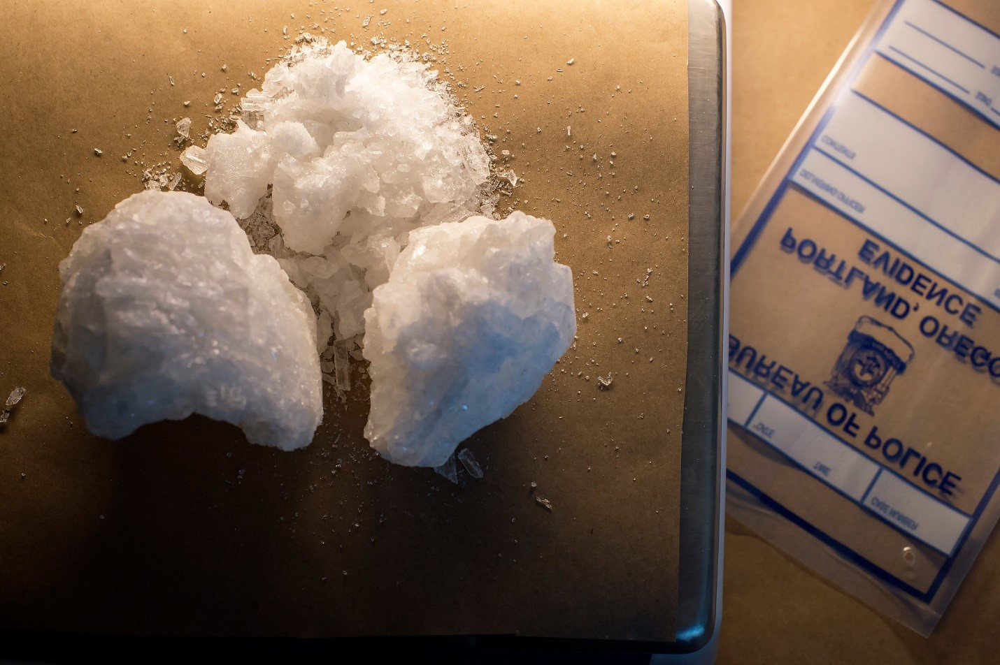
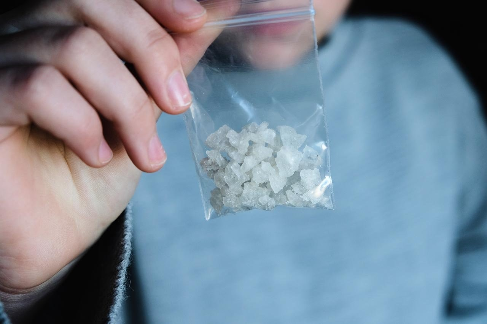

# 💀 Methamphetamine

A drug that was also known for a while as redneck cocaine.

Dr. Perry Halkitis: "Believed to be only used by hicks in rural areas. They use it, but so do gay men in urban centers.”

Over 11 million Americans have tried meth at least once. The same data says that 440,000 were last month's users. But this is all data from 2012. Its use is likely still on the rise, according to DEA meth seizure data. Crystal Meth is extremely addictive.

Methamphetamine meth for short is a very addictive stimulant drug it is a powder that can be made into a pill or a shiny rock called a crystal. The powder can be eaten or snorted at the nose it can also be mixed with liquid and injected into your body with a needle

Crystal meth is smoked in a small glass pipe meth at first causes a rush of good feelings but then users feel edgy overly excited angry or afraid which can quickly lead to addiction.

It causes medical problems including making your body temperature so high that you pass out severe itching meth mouth broken teeth dry mouth and thinking and emotional problems

How do we treat methamphetamine?

Addiction as opposed to other drugs of abuse well as I've said methamphetamine is a very powerful stimulant drug so maybe we should talk in terms of how it affects the body and how it affects the mind of the person's psychology and treatment it's separated into those two areas physically a stimulant drug is it's not the same in withdrawal.

In the way, it's acting on the body as a depressant drug like heroin or alcohol so the body of the methamphetamine addict, if you like, is going to be in no harm or danger as such when they're in withdrawal from the drug especially with young addicts the body is going to repair very very quickly given enough sleep and proper nutrition, etc.

So this is the period that we call stabilization so upon entering treatment somebody who's got a methamphetamine addiction is going to crash as we call it for several days and allowances are made in the treatment program for that person to rest and eat properly and sometimes they'll be sleeping for days at a time otherwise if we were to try to do therapy with such with the methamphetamine addict, they become very irate very difficult to deal with and their body needs to rest at that point, however, there is another side to methamphetamine addiction which is much more serious really which is the psychological withdrawn so the illness of addiction generally will create cravings and with the methamphetamine addict.

Addict very strong cravings so for a start is probably appropriate and important for a methamphetamine addict to be an inpatient treatment in a residential setting because that is what their craving is going to be so strong that having a secure environment where they can't easily go away and get methamphetamine is very important.

Secondly, they're going to have lots of psychological issues like depression feeling extremely agitated high anxiety, and so on and they may even have the appearance of symptoms of other cyclic.

Cyclic Ileana seas that have been hidden by the methamphetamine abuse like attention deficit disorder a DD depression anxiety and so on so a lot of methamphetamine abusers started using the drug to cope with the symptoms of those illnesses and then became addicted and so also now have the illness of addiction so in that case, we may be prescribing antidepressants and drugs that are appropriate to ameliorate the effects of psychological problems that are coming up and then, of course, is group therapy and one-to-one therapy physical exercise good nutrition and all of these things help the psychology of the recovering methamphetamine addict so common models of counseling that would be used would be the same as with other drugs of abuse twelve steps 12-step fellowship cognitive behavioral therapy motivational interviewing all of these models of counseling have very good evidence base in treating methamphetamine addiction as they do other addictions so in short residential treatment setting period of crashing sleeping resting which we call stabilization and then an extended period of psychological therapy to help with the illness of addiction itself and co-occurring illnesses which often present in conjunction with addiction like anxiety depression a DD and so on.

## About the Author

Mujahid Al-Majali, a 29-year-old former air force soldier and an economic
development and business specialist, also does translation and copywriting.
Loves long drives, chill music and old school movies. A nicotine addict and a
huge fan of Jack Daniel’s whiskey. Owned multiple businesses in Amman and
southern of Jordan PRE-COVID and now focusing on translation and copywriting
part of my experience through Upwork.
