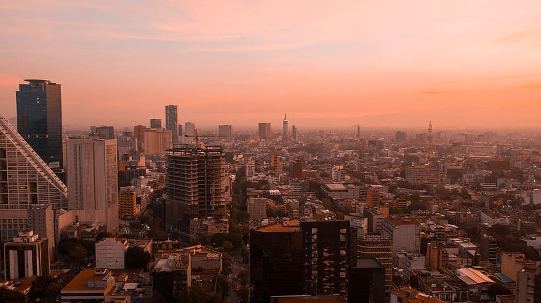
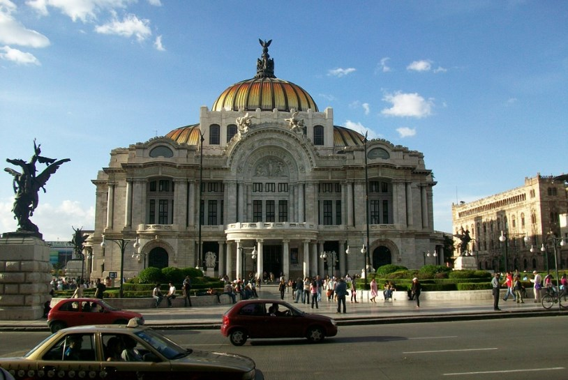
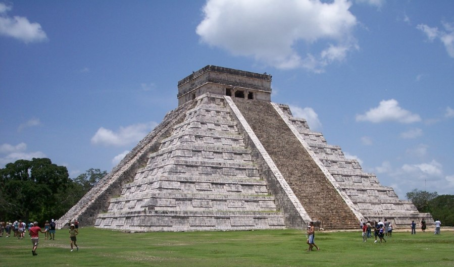

## 🇲🇽 Mexico City

It is the capital of Mexico and one of the largest cities in the world
with more than 20 million inhabitants, it is located above sea level at
more than 2000 meters. Mexico City has a beautiful historic center, with
the Zócalo square being the meeting point for tourists and locals. This
city is full of incredible museums, ruins of ancient civilizations,
charming neighborhoods, huge green areas and squares animated by
mariachis, which make it a vibrant place and a paradise for tourists who
visit it.

We will guide you through this article through the most important sites
that you cannot miss if you visit this great city.

## The Zocalo

The Zocalo or also called "Plaza de la Constitución" impresses with its
size as well as the frenetic activity and social life. It is one of the
largest squares in the world and has at least 5 centuries of history,
being the point of celebration of any number of cultural activities,
parties, concerts and other manifestations; It was declared a World
Heritage Site and there you can find the Metropolitan Cathedral and the
National Palace.

The Cathedral took almost 250 years to finish, inside you can find
emblematic jewels such as the Crypt of the Archbishops, the altarpiece
of the Kings, the Choir and the Royal Chapel.

Regarding the National Palace, you can marvel at the works of Diego
Rivera, one of the most important muralists in the history of art.

## Palace of Fine Arts

The Palace of Fine Arts is located in the Alameda Central Park, in this
lyrical theater important opera stars such as Luciano Pavarotti, María
Callas or Plácido Domingo have passed. The palace is a mix of Art Deco
and Art Nouveau styles, featuring a huge bronze dome, a Carrara marble
façade and precious sculptures that adorn its exterior. Inside you can
see 17 murals made by seven national artists and in its Main Hall, an
opalescent glass curtain.

For its part, the Alameda Central park also offers you a perfect place
to walk among sculptures, trees and fountains, it is considered the
oldest public garden in America and it is worth taking a walk to see it.

## Main temple

The Main Temple is the ruins of the center of religious and political
life of the ancient Mexican civilization, it is located near the Zocalo
in Tenochtitlan, which was the ancient Aztec capital, this temple was
buried when the Spanish colonization of 1521 built on it a new town.
However, different archaeologists throughout the 20th century gradually
discovered parts of the ancient temple and today you can visit the ruins
in which several buildings and the remains of a double pyramid stand
out. On the other hand, the best pieces found in the great temple are in
a museum located on the sides of the complex and one of the jewels that
stands out is the great stone relief offered to the lunar goddess
Coyolxauhqui, there are also other treasures such as the figures of
Tlaloc or Mictlantecuhtli, the sphinx of the god of fire or the
impressive monument of Tlaltecuhtli.

## Coyoacan neighborhood

This is the bohemian neighborhood, located to the south of the city and
is the benchmark of artistic and cultural life in Mexico City, for a
long time it has been the residence of several renowned artists,
established in large colonial houses. It has several markets, museums
and bookstores. In this neighborhood you can visit the famous Casa Azul
where Frida Kahlo lived with Diego Rivera until the day of her death,
today it is a museum with a large collection of paintings and various
personal objects of Frida Kahlo, they will help you to understand the
history of this controversial artist.

Other interesting places to see in Coyoacán are the Municipal House, the
San Juan Bautista parish, the León Trotsky House Museum, the Centennial
Garden, the Plaza de la Conchita, the House of Hernán Cortés and the
Mercado de Antojitos Mexicanos, are places that will show you one of the
most charming areas in the city.

## Francisco I. Madero Street

Francisco I. Madero Street is packed with restaurants, shops and street
artists that blend with its great architectural heritage. Among the
buildings that stand out is La Casa de los Azulejos, which is a colonial
palace whose facade is covered by tiles and a beautiful interior. This
street also concentrates other important buildings such as La Casa
Borda, the Iturbide Palace, the Guardiola Building, the \"La Mexicana\"
Building, the Templo de la Profesa and the Torre Latinoamericana, where
you can enjoy one of the best views of Ciudad de Mexico when climbing to
its 204 m height.

## The forest of Chapultepec

This forest is the green lung of the city and in addition to offering
pleasant walks either along its trails or on a boat in its artificial
lake, you will also find a great cultural offer such as the National
Museum of Anthropology. This museum is one of the most important in the
entire continent and has the largest collection of pre-Hispanic art on
the planet and among its most important objects is the tomb of Pakal, La
Piedra del Sol, the Teotihuacan Sculptures, the Tlaloc Monolith, among
many others.

## Visit the pyramids of Teotihuacán

Teotihuacán is located less than 50 km from Mexico City and in ancient
times it was one of the largest pre-Hispanic cities in America. You will
be able to see one of the largest pyramids in the world, which is the
Pyramid of the Sun, and then go through La Calzada de los Muertos and
finally, visit the Pyramid of the Moon, where you will have spectacular
panoramic views of the entire archaeological complex.

## San Angel neighborhood

In this old colonial town the buildings are still preserved thanks to
the money of many wealthy families who chose this space to rebuild their
large mansions. Currently it is a place to stroll through beautiful
squares and buy the best handcrafted souvenirs of Mexico City. The
recommendation is to go on a Saturday when the markets are set up in
Plaza del Carmen and Plaza San Jacinto where you can find paintings,
antiques, ceramics and regional dolls, among many other things.

In this neighborhood there are also other interesting places such as the
Plaza de los Arcángeles, the Plaza de los Licenciados or the Casa
Estudio de Diego Rivera, you can also try the local cuisine such as
fresh waters and delicious quesadillas in the restaurants of the area or
the street stalls.

## Basilica of Saint Mary of Guadalupe

This basilica is the most visited religious site dedicated to the Virgin
in the world and this large complex made up of several buildings is of
great historical value, the Capilla del Cerrito stands out, where you
will see several frescoes that recall the appearance of the Virgin. You
can also see the Tepeyac Cemetery, which is the oldest in Mexico, the
old Convent of Las Capuchinas, both the old and the new Basilica de la
Guadalupe and the Capilla del Pocito, to complete the wonders of this
site.

## Xochimilco

Xochimilco means \"land of flowers\" and was declared a World Heritage
Site, it is one of the most picturesque sites in the city. You can
stroll through the different canals with a traditional boat adorned with
flowers and painted in colors, where you can see parties with mariachis
walking on the boats with an excellent atmosphere.

Mexico City offers you a wide range of history, culture, warm people and
endless interesting places to visit.
