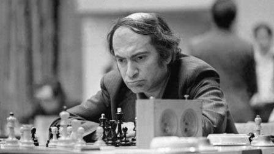
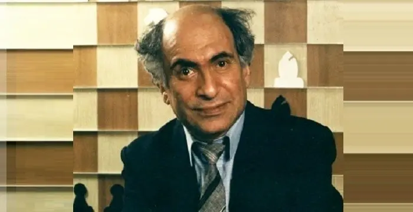

# 🏆 The Greatest Attacking Player in Chess History

He was known by many names; the magician from Riga, the pirate of Latvia, Fortunes favorite, the hypnotist and so on.

Mikhail Tal was born on 9th of November 1936. He was a Soviet Latvian chess grandmaster and the eighth world champions from 1960 - 1961. Widely regarded as a creative genius and the best attacking player of all time Tal played in a daring combinatorial style. His play was well known above all for improvisation and unpredictability. Every game, he once said, was as inimitable and invaluable as a poem.

The Mikhail Tal memorial has been held in Moscow annually since 2006 to honor Tal's memory.

He was born in Riga, Latvia into a Jewish family. According to his friend Gennadi Sosonko, his true father was a family friend identified only as uncle Robert. From the very beginning of his life he suffered from illness. Tal learned to read at the age of three and was allowed to start university studies while only 15.

At the age of 8 Tal learned to play chess while watching his father, a doctor and a medical researcher.

shortly thereafter he joined the Riga palace for Young Pioneers chess club. His play was not exceptional at first but you worked hard to improve. Alexander Koblenz began tutoring Tal in 1949 after which Tal's game rapidly improved and by 1951 he had qualified for the Latvian championship. In the 1952 Latvian championship Tal finished ahead of his trainer. Tal won his first Latvian title in 1953 and was awarded the title of candidate master.

He became a Soviet master in 1954 by defeating Vladimir Saigin in a qualifying match. That same year he also scored his first win over a grandmaster when Yuri Averbakh lost on time in a drawn position.

Tal won a very strong tournament at Zurich in 1959. Following the internal zonal the top players carried out to the candidate’s tournament, Yugoslavia, 1959.

Tal showed superior form by winning with 20 out of 28 points ahead of Paul Kares with 18,5 followed by Tigran Petrosian, Vasily Smislov, the sixteen-year-old Bobby Fischer, Svetozar Gligorić, Friedrich Olafson and Paul Benco.

Tal's victory was attributed to his dominance over the lower half of the field while scoring only one win and three losses vs Keres. He won all four individual games against Fisher and took three and a half points out of four from each Gligorić, Olafson and Benko.

Tal was absolutely unique. His playing style was of course unrepeatable. He was a man in whose presence others sensed their mediocrity.

Tal was playing against grandmaster Vasiukov. They reached a very complicated position and Tal was considering a knight sacrifice (I know what you're thinking... What else would Tal be considering :) But, to his horror, he couldn't find any good continuations.

Suddenly, he started to think about a Hippopotamus drowning in a swamp. He tried to figure out how to save the poor hypo. After 40 minutes of thinking about this problem, Tal realized that he couldn't save the poor hypo and that some things simply can't be calculated.

He realized that the knight sacrifice was purely intuitive and it promised an interesting game. The following day, the newspapers wrote how Tal, after thinking for 40 minutes about the position, managed to calculate all the variations and win the game with a great knight sacrifice. Little did they know that a poor hypo had to drown for Tal to win the game.

Mikhail Tal married three times. In 1959, he married 19-year-old Russian actress Salli Landau. This marriage lasted for 11 years and ended in divorce in 1970. His second marriage too did not last long. He later on married Angelina Petukhov who worked in the Riga Shakhmaty magazine.

He had been a sickly child though he had fairly good health during his youth. He suffered from kidney problems that intensified over time. He underwent several surgeries over the years and even lost a kidney to his illness. An eccentric man with a bohemian lifestyle, he became addicted to smoking and drinking which further affected his health.

Mikhail Tal died on 28 June 1992 of a haemorrhage in the esophagus. He was just 55.

## About the Author

Mujahid Al-Majali, a 29-year-old former air force soldier and an economic
development and business specialist, also does translation and copywriting.
Loves long drives, chill music and old school movies. A nicotine addict and a
huge fan of Jack Daniel’s whiskey. Owned multiple businesses in Amman and
southern of Jordan PRE-COVID and now focusing on translation and copywriting
part of my experience through Upwork.
