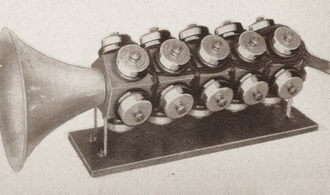

# 🎺 The Pianorad

Hugo Gernsback (born Hugo Gernsbacher, August 16, 1884 – August 19, 1967) was a Luxembourgish–American inventor, writer, editor, and magazine publisher, best known for publications including the first science fiction magazine. His contributions to the genre as publisher—although not as a writer—were so significant that, along with the novelists H. G. Wells and Jules Verne, he is sometimes called "The Father of Science Fiction". In his honour, annual awards presented at the World Science Fiction Convention are named the "Hugos".

[Gernsback’s ‘Pianorad’ at the WRNY radio studio]

The Pianorad, designed by Hugo Gernsback and built by Clyde Finch at the Radio News Laboratories in New York was a development of Gernsback’s Staccatone of 1923. the Pianorad had 25 single vacuum tube oscillators, one for every key for its two octave keyboard making
the instrument the first valve based electronic instrument to achieve full polyphony. The sound from the tubes was passed through a rudimentary mechanical filter that removed harmonic distortion producing virtually pure sine tones. The instrument played sound through a top mounted speaker
or could be connected directly for radio broadcast.

## Theory of the Instrument

The Pianorad has a keyboard like an ordinary piano, and there is a radio vacuum tube for each one of the piano keys. Every time a key is depressed, there is energized a radio-oscillator circuit which gives rise to a pure, flutelike note through the loud-speaker connected to the device.

It is possible to connect any number of loud-speakers to the Pianorad if it is desired to flood an auditorium with its tones. Also, by arranging
suitable outlets for loud-speakers on different floors or different rooms, the sounds of the Pianorad can be heard all over any large building.

The musical notes produced by the vacuum tubes in this manner have practically no overtones. For this reason the music produced on the Pianorad is of an exquisite pureness of tone not realised in any other musical instrument. The quality is better than that of a flute and much purer. the sound however does not resemble that of any known musical instrument. The notes are quite sharp and distinct, and the Pianorad can be readily distinguished by its music from any other musical instrument in existence.

[An article by Clyde J. Fitch describing the construction of the Pianorad will appear in the December issue of Radio News. ]

[Pianorad’s 25 units designed to eliminate harmonics.]

Each one of the twenty five oscillators had its own independent speaker, mounted in a large loudspeaker horn on top of the keyboard and the whole ensemble was housed in a housing resembling a harmonium. A larger 88 non keyboard version was planned but not put into production. The Pianorad was first demonstrated on june 12, 1926 at Gernsback’s own radio station WRNY in New York City performed by Ralph Christman.
The Pianorad continued to be used at the radio station for some time, accompanying piano and violin concerts.

Next topic: Keyboard Electric Harmonium 

## Sources

- Wikipedia / 120years.net

## About the author

"Guido F. Matis (a.k.a. widosub), a seasoned producer-composer authority with an unquenchable compassion towards the musical expression, and many years of experience in the fields of event organizing, movie post-production, and recording with professional musicians. His devotion to movie sounds shows in his art - widosub's music is filled with landscapes of emotions, dramatic twists and melancholic moods. He's one of the hosts of Tilos Rádió's MustBeat show, in which he's is focusing on drum'n'bass and chillout music. He's also one half of the duo Empty Universe."
