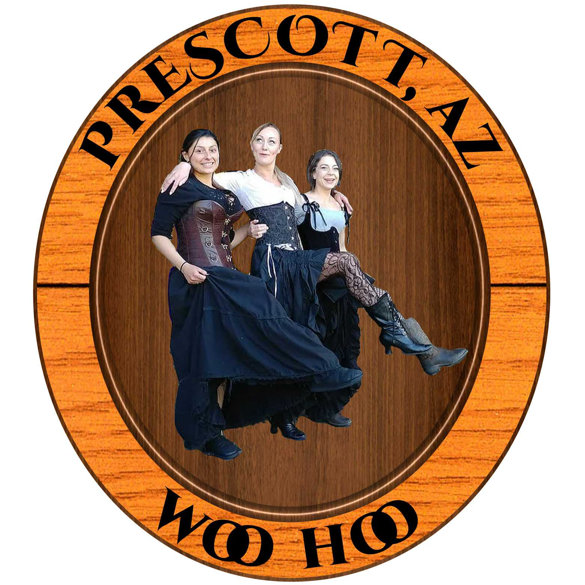

# 🗽 Prescott (pronounced “Preskit” or “Preskut”by the locals)

Prescott became the first territorial capital of Arizona Territory in 1864,
succeeding the temporary capital at Ft. Whipple just north of Chino Valley. Over
the next few years, the capital moved from Prescott to Tucson, to Prescott and
then finally to Phoenix in 1899. The moves were according to the vagaries of
Arizona politics. Prescott was, and is, a genuine “old west” town full of all
the usual stories, characters (cowboys, miners, prostitutes, gamblers,
drunkards), and ambiance of the historic American west. It is the county seat of
Yavapai County, AZ.

Prescott Frontier Days, the world’s oldest rodeo, was first held on July 4th,
1888 and has been a major event every year since. The list of notable people
from Prescott is lengthy (see the link at the end of this article) for a small
city, and residents included Virgil Earp (Wyatt’s brother) and Doc Holiday who
both spent time in Prescott. Prescott also includes part of the Yavapai Prescott
Indian Tribe reservation. One block of Montezuma Street, downtown, known as
Whiskey Row, contains the oldest bar and restaurant in Arizona, The Palace,
which opened in 1877 and is the oldest continuously operating business in the
state. Whiskey Row was near the red light district. It is on one side of the
central courthouse plaza, a beautiful park-like centerpiece to the city, known
for it’s extraordinary Christmas lighting display. The Arizona Pioneer’s Home, a
continuing care retirement home, is located in Prescott and is funded by the
state of Arizona. There are a number of old mining towns within a short distance
as well.

As of 2021, the population of Prescott is a little over 46,000 and it is
surrounded by other small towns, bringing the estimated population of the
metropolitan area to about 221,000. Located near the center of Arizona, there
are mountain ranges running north/south on the east and west of the city. This
results in a climate that is quite variable and somewhat unpredictable. Prescott
has a Monsoon Season that is generally recognized to be from mid July to mid
September, during which some very heavy rain storms can be expected. However,
isolated very heavy rains are sometimes seen at other times of the year, but
average yearly precipitation is only about 17-18 inches. The variable nature of
the weather was exemplified in 2020 when the monsoon season yielded so little
rain that I called it the “nonsoon season”.

In addition to the distinctly western culture, Prescott boasts quite an array of
music and other festivals, such as Bluegrass, Earth Day, Cinco de Mayo (a
Mexican holiday), a Navajo Rug Auction, and a number of sporting events. Yes,
there is even an opera house. Arizona’s first Elks Lodge (BPOE) is in Prescott.
There are three colleges in town: Prescott College, Yavapai College and
Embry-Riddle Aeronautical University, Prescott. Transportation is easily
available via multiple highways, an airport and a shuttle service. There are
many outdoor recreation opportunities, including fascinating geographical
features (huge rock formations), lakes and hiking trails galore. As I mentioned
in one of my other articles, there are also many off-road trails to challenge
the best 4x4 monsters. There are hundreds of buildings that are on The National
Register of Historic Places (many Victorian structures). Prescott IS HISTORY!

I guess one can tell that I find Prescott to be a fairly interesting place
(understatement, duh). Here are some links to further resources touting Prescott
and its varied attractions and statistics:

- <https://en.wikipedia.org/wiki/Prescott,_Arizona>
- <https://www.prescott.com/>
- <https://www.prescott-az.gov/>
- <https://en.wikipedia.org/wiki/List_of_people_from_Prescott,_Arizona>
- <https://www.bestplaces.net/people/metro/arizona/prescott>
- <https://www.whiskeyrowpalace.com/>
- <https://www.visit-prescott.com/>
- <https://www.tripadvisor.com/Tourism-g31323-Prescott_Arizona-Vacations.html>

## Logo

## About The Author

Harley Armentrout is a happy husband and father, former silversmith, aerospace
electronics prototype assembler, test, calibration & repair technician, also
writing test procedures at [BallAerospace](https://www.ball.com/aerospace). Then
21 years in the gaming industry, in a range of positions, culminated as a Gaming
Inspector, observing and reporting on rules violations, safety issues and
criminal activities for the
[Yavapai Prescott Indian Tribe](https://buckyscasino.com/). After “retiring”
Harley taught himself a few graphic design skills, and he works as a freelance
designer.
