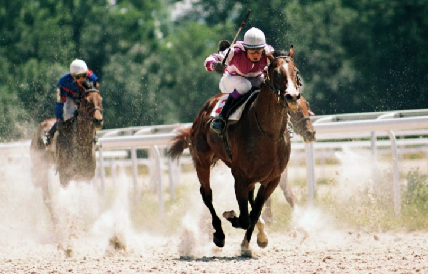
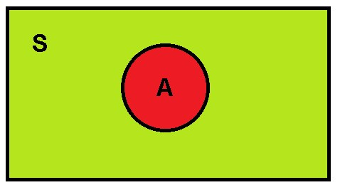
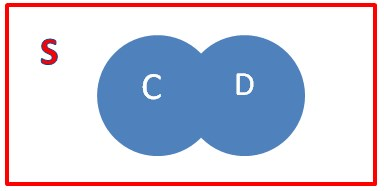
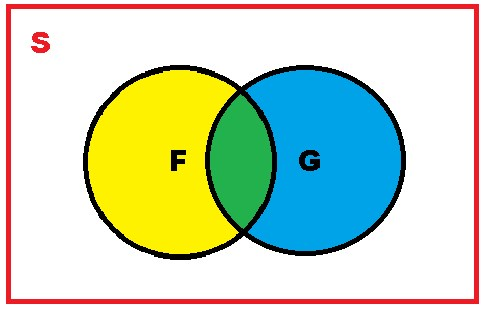
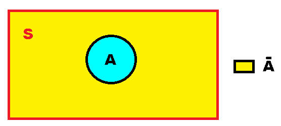
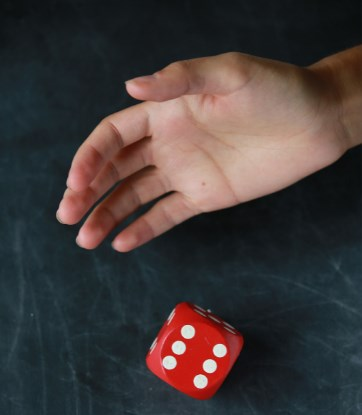
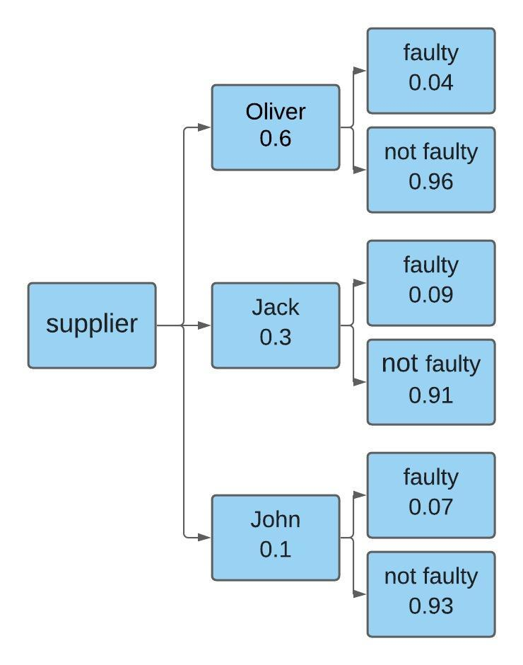

# ♾️ Probabilities

The man usually faces certain situations where he does not have a total control
of his certainty and on many occasions we ask ourselves the probability that an
event has if it is capable of happening or not, since we do not have absolute
certainty that it can happen in some circumstance.

That is why knowing probabilities that can help us measure certainty is so
important. Although it is true that statistics is a powerful tool for the
knowledge of data, from the way of collecting, presenting and interpreting them
in order to generate statistical inferences that help us in making decisions.
Probability, on the other hand, is no less important and both are very valuable
instruments within the different fields of research, risk markets, productive,
administrative and in the health area.

We use the term probability on a daily basis and without the need to become
mathematicians. For example, to try to forecast the weather, probability is
used, since it deals with both uncertainty and chance. As you will realize later
there are three different approaches to probability, but in addition, there are
dependent events that tell us to calculate what we call conditional
probabilities and what is commonly known as Bayes' Theorem. But we will also
study the development of combinations and permutations.

Many consider that probability is the basis of statistics and even mention that
when working with a known population, one can have a better certainty or
probability of obtaining a particular sample from that population. That is, the
probability is based on a series of rules or patterns where you can have a
better idea of what may happen. However, probability has three defined
approaches: subjective probability, relative frequency probability and classical
probability.

The classical probability is also known as the a priori probability and consists
of a sample space where there are results that are mutually exclusive,
therefore, it can be said that two or more events cannot occur at the same time,
that is, that all situations have the same probability of occurring
(equiprobable). When we say that an event A can occur in m ways, we can then say
that the probability of A is going to be equal to the number of favorable cases
divided by the total number of cases (n).

For example: we are going to suppose that in a box there are 15 white and 8
black marbles. What would be the probability at the time of extracting a marble
and that it is black?

Therefore the total number of marbles is n = 23 and that they are black m = 8

```{math}
P (B) = 8/23
P (B) = 0.3478
```

The probability that we have to extract a black marble will be 34.78%.


On the other hand, when we talk about relative frequency probability, it is also
commonly called a posteriori and as you know it means "after". This implies that
if in a study an event that we call A occurs m number of times, having repeated
the event n times, the relative frequency of A would be fr = m / n

When n tends to infinity, since the experiment is repeated several times, the
relative frequency will be equal to the probability, in this case A

```{math}
(lim)┬(n→∞)⁡fr (A)=P(A)
```

Let's go with another example: Let's suppose that in a racetrack we have
observed that horse number 12 has won 9 races out of 10, given the case that you
want to bet on this horse of course you want to know the probability that it
wins, for this concern:

m = 9 n = 10

Developing:

```{math}
(lim)┬(n→9)⁡fr (A)=P(A)
P (A) = 9/10
P (A) = 0.9
```



Answer:

As you will see, the probability that you have of winning when betting on horse
number 12 is going to be 90% and what we call subjective probability is
determined by the probability that any person assigns to a situation, but based
on in your experience.

When any of us forecast the possibility that it rains or does not rain,
according to how the sky sees and of course, we are aware that it is not
necessarily an absolute pattern, because many times what we predict does not
happen, it is a clear example of probability subjective.

From another point of view, it is worth mentioning that many probabilities are
calculated axiomatically, understanding that the axioms in probability are those
minimum conditions that must be verified, so that a certain function that is
defined on a set of events, establishes the consistently your odds.

Now, this relationship that exists between the relative frequency with respect
to an event and its probability, through the number of times it is repeated in a
large experiment, is attributed to Kolmogorov, who developed the axiomatic
theory and relied on 5 theorems and 3 axioms.

Theorems: 1) P (Ø) = 0 2) P (Ā) = 1 - P (A) 3) Being A and B events where A⊂B,
then P (A) ≤ P (B) 4) Since A and B are events we can ensure that
P(Ā∩B)=P(B)-P(A∩B) 5) Being A and B any two events, P(A∪B) = P(A) + P(B) -
P(A∩B)

Axioms:

1. P(S) = 1
2. Being A any event, P (A) ≥ 0
3. Being A AND B events that are mutually exclusive, then A∩B=∅ the probability
   that either A or B will occur will be P(A∪B) = P(A )+ P(B). Generalizing we
   can say that if we have several events A1, A2, A3, ... An and these events
   are mutually exclusive, then the intersection of all these events will result
   in an empty set, while the union will be equal to ∑\_(i=1)^n▒P (Ai)

## Events

When we make calculations to reach conclusions in some applied science, we
generally resort to mathematical models that in turn make up sets of unitary,
binary and trinary relations, to satisfy the propositions that are derived from
the axioms that are explained with advance.

There are two types of models, the deterministic one in which uncertainty plays
no role and the non-deterministic one, which is of the random probabilistic
type.

Mathematical calculations are usually applied to solve some type of observable
phenomenon of our reality, but also quantifiable and reproducible.
Experimentation is the process used to reproduce events and to be able to expect
tangible results, with repeatable reproduction being the most important property
for this process.

When we talk about deterministic experiments, we can say that they are those in
which the conditions of the experiment, manage to allow the results obtained to
always be the same. For example, when we put water to heat, we will realize that
it always manages to boil or boil at 100 ° C.

While when we talk about non-deterministic experiments, they are those in which
the conditions under which the experiment is carried out, are those that
determine the probability that the expected results will occur or not, that is,
they are those experiments where probability intervenes. For example, when we
toss a coin, we cannot predict the expected result with certainty and that is
why we must study all the possible results that we will obtain from tossing the
coin several times and this is what is called the sample space. The sample space
is usually represented by the letter "S" and between braces {} that indicate a
set.

Let's take an example, if we determine the sample space when we flip a coin, as
we all know, the coin has two probable sides when it comes to landing. Now, one
side of the coin is the head and the other is a tails, for this specific example
we will use the nomenclature “C” for heads and “T” for tails, then:

S = {C, T}

But what happens if we flip the coin twice? Our probabilities will be as
follows:

S = {CC, CT, TC, TT}


Being "S" the sample space made up of all the possible results of our experiment
and can be decomposed into events or events. Both the event and the event are
subsets of the sample space and are represented by any letter of the alphabet
that is capitalized and with the exception of "S" (to avoid confusion with the
symbol of the sample space).

For example, if S = {KKK, KKL, KLK, KLL, LKK, LLL, LKL, LLK} and we intend an
“S” event that we will call A in which three K occur, the answer would be A =
{KKK} , but if we try an event that we will call B where it is taken into
account that it has at least one K, then: B = {KKK, KKL, KLK, KLL, LKK, LKL,
LLK}.

In many cases the simplest thing is to try to represent the sample space through
Venn diagrams, since in this way those events that can generate other events can
be better appreciated.

Venn diagrams are the schematic representation of set theory and are used in
logic, mathematics, and diagrammatic reasoning. In Venn diagrams, sets of
elements are shown by closed lines.

These diagrams were devised by John Venn around 1880 and they try to represent
what the sample space "S" is and how we can observe, this space is the one that
is part of the rectangle but is not part of the circle, that is, the Venn
diagram represents all the points that make up the sample space, but are not
included in A.



Now, when we join two events such as C and D, we can define the union of the two
events, as the set that includes all the points that are in both events and is
represented mathematically with the symbol U, therefore it would be C∪D and
looks like this:



Now, the intersection that exists between two events F and G is represented by
those points in the sample that are common to both events and are represented in
the following figure by the green area and are mathematically represented as
follows F∩G, by both the area that is shaded in green will be:



The complement of A, are those points that belong to S but are not in A and is
represented by the symbol Ā.



Let's go with an illustrative example, the sample space for the toss of a die is
S= {1, 2, 3, 4, 5, 6}, If we determine three events such that A = {1, 3, 5], in
addition B = {4, 5} and C = {1}, we can conclude that:

1. The complement of A will be: Ā = {2, 4, 6}.
2. If we require A U B, we need to join all the points of both A and B: A U B =
   {1, 3, 4, 5}
3. If what we need is to find, we must find the common points of both events and
   therefore: A∩C = {1}

## Conditional probability

Before understanding what conditional probability is, we must know that there
are independent events and dependent events. When a certain event does not exert
any type of effect with respect to the probability that another event occurs, it
is what we define as an independent event. For example, when it comes to rolling
a die, the result that we obtain when we make the first roll, we know that it
does not affect in any way the probability that is obtained from a second roll.

Being the events A and B independent, we can express them as follows:

```{math}
P (A ∩ B) = P (A) P (B)
P (B | A) = P (B)
P (A | B) = P (A)
```

On the other hand, dependent events indicate that one event happens or does not
happen with respect to another and it is precisely in this type of event that we
use conditional probability, which is the one where situations that are similar
and in which it is required to find the probability of event A, but yes, when we
already know what happened in another event B.

Now, since A and B are two specific events within a sample space and the
condition that P(B) > 0 is obtained, this implies that the probability of A with
respect to B is:

```{math}
P (A Ι B) = P (A ∩ B) / P (B)
```

An example can clarify the above much more, if we want to calculate the
probability when tossing a coin 2 times and also that the result of the second
toss when falling to the ground turns out to be heads, when the result of the
first toss is a tails. . We must first specify the nomenclature to use and we
will use the same that we established in the example mentioned before: C = Heads
T = Tails

In this case the sample space is: S = {CC, CT, TC, TT}

To know the conditional probability, we must express the following: P (C Ι T) =
P (C ∩ T) / P (T)

It is important to take into account only the sample space in those results
where the first toss is a stamp or a cross (T) T = {TC, TT}

When we express the event C ∩ T we will need to limit the sample space, but this
time when the second toss has yielded as a result. C = {CC, TC}

When it comes to intersecting C with T, we have one element in common: C ∩ T =
{TC}

As we can see, in the original formula there is a division that is carried out
precisely with the results that we have just obtained and also we only have 1/4
in the numerator, since we have one element of the 4 that are part of the sample
space (in this case TC) of the intersection that exists between T and C. On the
other hand, we obtain two elements such as TC and TT from the limited sample
space of T, therefore that account gives us 2/4, since they are two elements of
the 4 that make up the sample space, therefore:

```{math}
P (C | T) = ((1/4))/((2/4) )=1/2
```

Answer: according to the calculations when we toss a coin twice, the probability
that we will get heads on the second toss is 50%, yes, when we get tails or
tails on the first toss.

What probabilities do we have when two events intersect?

When we have an event A and another B, given the case that the intersection
between the two generates a new event, where all the points of the sample are
common to both A and B. It is important to take into account that when we talk
about the intersection of both events, we refer to the event composed of those
common elements of two or more events when they intersect and therefore, the
probability will only be equal to the probability that the common elements have.
According to the property that the intersection of sets has, we can say that: A
∩ S = A A ∩ ∅ = ∅ A ∩ Ā = ∅ With B ⊂ A we can then say A ∩ B = B

Let's now go with an example, suppose that a dice is thrown into the air and we
want to analyze two events, the first event is that an odd number is returned
and the second is that the number is less than 4 Let's first define the
nomenclature: I = odd number A = less than 4 We then have that: I = {1, 3, 5} A
= {1, 2, 3}

Answer: As we already know, this problem takes us directly to an intersection of
probabilities, we must then find the elements in common of I and A, if we
observe we can realize that they are the numbers 1 and 3, this implies that we
obtain 2 of the 6 points that make up our sample space, therefore: P (I ∩ A) =
2/6 P (I ∩ A) = 0.3333

Answer: The probability that we have when we throw a dice into the air and that
a number that is odd will fall and is also less than 4 is 33.33%.



## Bayes theorem

As we saw in a previous article, Bayes' theorem allows us to calculate the
probability of an event A, but from what happens in an event B. This theorem is
generally used in areas such as quality control In this way, we can know how
likely we are to find a defective item or, on the contrary, that it is perfectly
manufactured.

According to Bayes' formula, we can assume that we have a sample space "S" which
in turn is made up of "n" events, but in addition, each of the events are
mutually exclusive. Of course, the union of all the events will make up our
sample space "S".

On the other hand, we can suppose that H is any event that is in "S", where
P(H) > 0, so that the conditional probability that H generates on other events
such as: G1, G2, G3, …, Gn can be expressed through the Bayes formula:

```{math}
P(G1 Ι H)=P(G1)P(H Ι G1)/(P(G1)P(H Ι G1)+P(G2)P(H Ι G2)+...+P(Fn)P(H Ι Gn) )
```

In order to better visualize the Bayes formula. It is advisable to rely on what
we call a probability tree, which is nothing more than a graphical
representation where we can visualize the groupings of the elements that
influence the formula.

For example: A small company dedicated to the manufacture of clothing, depends
in turn on other companies that send the prefabricated pieces, in this sense,
the small company has three suppliers that are: Mr. Oliver who provides 60% of
the clothing, while Mr. Jack supplies 30% and the rest is produced by Mr. John.

According to his experience, the president of the company assumes that the
probability of obtaining a defective pants from Mr. Oliver is 4%, in the same
way, he believes that the probability corresponding to Mr. Jack is 9% and the
John's is 7%. All suppliers deliver their ready-made garments the same day and
at that moment they find defective pants from which supplier is the defective
pants most likely to come from?

First, a probability tree is made so that the probability paths can be
illustrated:



Once the probability tree has been visualized, the path of each provider is
followed, in this case the name of each of the providers and then multiplied by
the data of interest, for this specific case it will be the defective path of
that supplier and finally, that result is divided between all the branches of
the defective cases, that is, the sum of all the suppliers.

Let's suppose that we want to know the probability that the defective pants were
manufactured by Mr. Oliver:

```{math}
P (G1 Ι H) = (0.60)(0.04)/(((0.60) (0.04) + (0.30) (0.09) + (0.10) (0.07)))
P (G1 Ι H) = 0.024/0.058
P (G1 Ι H) = 0.4137
```

According to the formulas we can conclude that Mr. Oliver has a 41.37%
probability at the time of having manufactured the defective pants.

Now, if we want to know the probability that the defective pants come from Mr.
Jack, we must carry out the same procedure:

```{math}
P (G2 Ι H) = (0.30)(0.09)/(((0.60)(0.04)+ (0.30)(0.09)+ (0.10)(0.07)))
P (G2 Ι H) = 0.027/0.058
P (G2 Ι H) = 0.4655
```

As we can see, Mr. Jack has a 46.55% probability of having made the defective
pants. Finally, we need to know the probability that Mr. John has of having
manufactured the defective part.

```{math}
P (G3 Ι H) = (0.10)(0.07)/(((0.60)(0.04)+ (0.30)(0.09)+ (0.10)(0.07)) )
P (G3 Ι H) = 0.027/0.058
P (G3 Ι H) = 0.1206
```

This calculation indicates that Mr. John has a 12.06% probability of having made
the defective pants.

Answer: As we can see, it is most likely that the defective pants come from the
manufacturer named Jack, since this supplier has a probability of 46.55% and
therefore, this number is higher than that of the other two manufacturers.

## Counting techniques

When we calculate a probability, it can become tedious or complicated to count
the elements that make up the set, that is why it is advisable to apply
techniques that favor us when carrying out a count and also that allow us to
solve and know some problems in as far as probabilities are concerned.

We are then going to delve into the combinatorial analysis, which will allow us
to know each of the subsets or selections that can be formed with the elements
that make up the set.

Combinations: Unlike permutation, in a combination it does not matter the order
that the "r" objects may have without repetition, which as we already know have
been selected from the "n" objects taken from r to r. The commonly used
nomenclature is nCr. The number of possible combinations that can be obtained
from the “n” objects is given by:

```{math}
nCr = n!/r!(n-r)!
```

As always, we are going to clarify your doubts with an example: A company is
made up of 20 workers and among them they must cover a guard every Saturday of
the weekend, so that a group of 4 workers will be formed to carry out the work.
How many different groups made up of 4 members can be constituted?

Answer: It should be taken into account that for this specific example, the
order of the workers who will make up the guard group is not important at all,
since it is not necessary to establish how they intend to choose the members of
each group, any possible combination does not alter the final result.

```{math}
20C4 =20!/4!(20-4)!
20C4 =  20.19.18.17.16!/4.3.2.1.16!
20C4 =116280/24
20C4 = 4845
```

Although the answer is self-explanatory, 4,845 different groups of 4 workers out
of the 20 who work in the company can be formed to carry out the Saturday
shifts.


Permutations: In the case that we are interested in the order of our "r"
non-repeated objects, which in turn have been selected within the "n" objects
that we have in totality, we must use what we call a permutation and its
nomenclature it is denoted as nPr.

Now, we can determine the number of possible permutations that exist of our “n”
objects, but taken from r to r and for this it will be necessary to apply the
following formula:

```{math}
nPr = n (n-1) (n-2)… (n - r + 1)
```

But when we have a large number of elements, it is best to express the same
formula but in factorial terms, so we will state it as follows:

```{math}
nPr=n!/(n-r)!
```

For example: Let's suppose that you want to carry out a market study to find out
the preferences of consumers with respect to the brand of a certain soft drink.
For this, the respondent must choose 4 reasons from the six possible items, why
they may be interested in consuming the soft drink in question. But in this
market study the preferences must be ordered from highest to lowest, that is,
with number 1 being the preference of greatest interest and in the same order of
ideas, 4 will be the ratio of least interest among its four choices. The
question is, in how many possible ways will the respondent be able to answer the
questionnaire?


Answer:

```{math}
6P4 = 6!/(6-4)!
6P4 = 6.5.4.3.2.1!/2.1!
6P4 = 6.5.4.3
6P4 = 360
```

As we can see, the calculations indicate that the respondent has 360 different
ways of answering the questionnaire.
