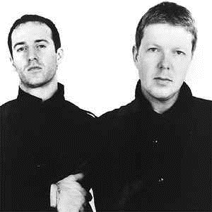

# 🎶 Progressive

The progressive marker was used to distinguish the works of performers experimenting with a fusion of jazz and rock in the late
1960s, and the first techno producers in Detroit and Chicago in the 1980s.
In the electronic music scene, the word progressive refers both to the gradual construction that can be observed in the recordings and
to the willingness to incorporate the characteristic stylistic elements of other trends. Again, the label was first used by Mixmag
experts.
Its roots go back to the early 1990s, with critics considering the early maxi of Guerrilla Records and Leftfield (especially the 1992
Song Of Live) as the very first progressive house recordings. The cradle of the trend is Mansfield, England, where the Renaissance
Club opened its doors in 1992, with residents of later key players, Sasha and John Digweed. The popularity of progressive really
grew until the mid-1990s, when the increasingly kitschy, distorted, commercial eurotrance no longer met the expectations of more
demanding music listeners.

Progressive trance was created by mixing several trends; it also drew
from elements of trance, (mostly deep) house, techno, dub and ambient.
The recordings have typically four four rhythm, with 125-135 bpm
deliberately more restrained than the then-fashionable "resident trance"
130-160 tempo.
Its structures are more complex, more abstract, and the deeper,
more definite bass line feeds on the aesthetics of the dub.
The introductory, slowly recovering phase of progressive trance
can take up to 3-4 minutes, and then rhythm and the main motif
return after (often with a long break - with or without a snare drum).
Progressive trance music is typically longer than trance pieces, at least 5-6, but often 10-12 minutes.
Lots of music scenes have a "progressive" version that extends the framework of their aesthetics, from Progressive Breaks to
Progressive Trance and Progressive House, and even non-electronic music like Progressive Rock and Progressive Metal. These
"progressive" genres have nothing in common with each other other than a drive to explore and expand the quality of their genre's
native essence. At least, that's what they think they're doing.
And then there's this -- an actual scene and genre called Progressive. Not Progressive anything, just Progressive, or Prog. A noun
rather than an adjective.
It probably got its name as a fusion genre between Progressive House and Progressive Trance, producing something that
simultaneously sounds like both and neither (but don't call it Trouse because that's just stupid. What kind of Dutch idiot would call it
that?). Two Progressives = One Prog, if my math is correct.

You can find more details about its formation and development on Ishkur's Guide to Electronic Music, and you can listen to
progressive music right away.
<https://music.ishkur.com/?query=Progressive>

The Every Noise at Once platform provides an opportunity for people to get to know better the names of the creators who have ever
been in the genre and thus the peculiarities of it.
<https://everynoise.com/everynoise1d.cgi?root=progressive%20house&scope=all>

## Sources

- MENNYEK KAPUI - Az elektroniks zene évtizede (The decade of electronic music)
- Wikipedia
- Ishkur's Guide to Electronic Music
- Every Noise at Once

## About the Author

"Guido F. Matis (a.k.a. widosub), a seasoned producer-composer authority with an unquenchable compassion towards the musical
expression, and many years of experience in the fields of event organizing, movie post-production, and recording with professional
musicians. His devotion to movie sounds shows in his art - widosub's music is filled with landscapes of emotions, dramatic twists and
melancholic moods. He's one of the hosts of Tilos Rádió's MustBeat show, in which he's is focusing on drum'n'bass and chillout
music. He's also one half of the duo Empty Universe."
