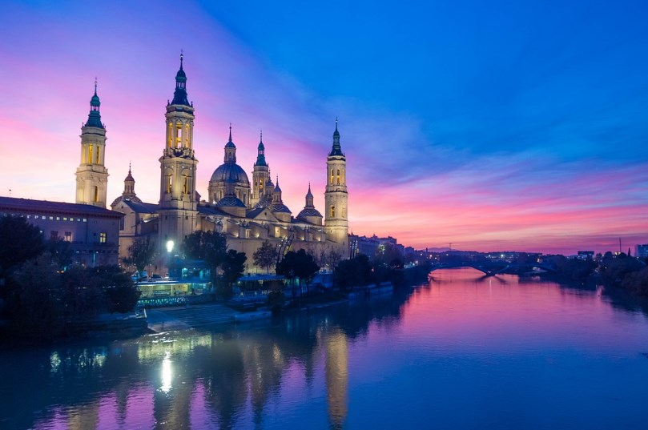
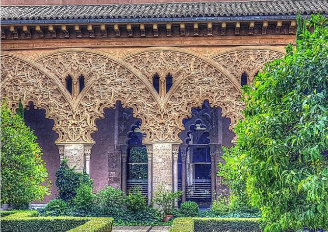
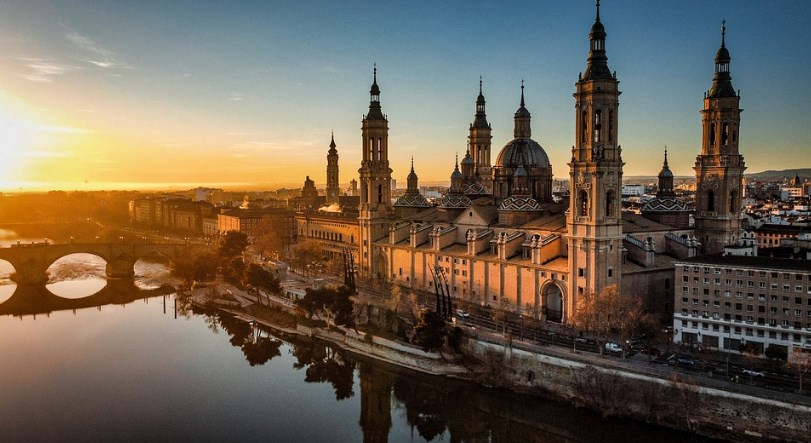

# 🇪🇸 Saragossa

This city in Spain has more than 2000 years of history and is bathed by
the Ebro River. Zaragoza has an excellent nightlife and delicious
gastronomic dishes such as Zaragoza-style loin, migas, Aragón ternasco
and borage with potatoes. The city has a more cosmopolitan part and a
more traditional part, such as its famous Basilica del Pilar.

If you plan to get to know Zaragoza, in this article we are going to
indicate the essential places to see, so that you do not miss the most
important things.

## Basilica of Our Lady of the Pillar

The Basilica of Our Lady of the Pillar is the first Marian temple that
exists in Christianity, this Baroque jewel is an important pilgrimage
site since, according to tradition, the Virgin appeared on a jasper
column in this place in the year 40 AD. C. and many come to see the
image of the Virgin. However, non-believers can also observe its
impressive exterior, which has 11 domes with glazed tiles of different
colors, the Altarpiece of the High Altar, the Humilladero, the Choir,
two paintings by Francisco de Goya and the Holy Chapel, which contains
inside the wooden carving of the Virgin. Finally, you can enjoy unusual
views of the city from the top of the Tower of the Pillar, you can also
see the Ebro river, the domes of the basilica and you can go up by
elevator.

## Pillar Square

Opposite the basilica is Pillar Square, which is a meeting point for
locals and tourists, where you can see some of its historic buildings
such as La Lonja and the Town Hall (both in Renaissance style) and the
Church of San Juan de los pancakes The square also has beautiful
monuments such as the one dedicated to Francisco de Goya, La Bola del
Mundo, which is a figure made to commemorate the discovery of America,
and lastly, La Fuente de la Hispanidad, which contains the map of the
Americas, only can be seen in its entirety from the top of the Tower of
the Pillar.

## Aljaferia Palace

The Aljafería Palace is known as the little Alhambra and was declared a
World Heritage Site. It is a beautiful work of Islamic architecture
built in the eleventh century, inside you can find typical
horseshoe-shaped arches in the Arab style and charming rooms such as El
Salón Dorado, the Torre del Trovador, the mosque, the patio of Santa
Isabel, the Church of San Martín, The Throne Room and the Mudéjar
Palace.

## Cathedral of the Savior

The Salvador Cathedral located near the Basilica del Pilar was built on
the aljama mosque and the old Roman forum in the 12th century. You will
be impressed with this temple due to the excellent examples of
Renaissance, Gothic, Mudejar, Baroque and Neoclassical art.

Outside you can see the impressive Mudejar dome of the Chapel of San
Miguel Arcángel, the baroque tower from the 18th century and the
neoclassical façade. While inside you can see the Gothic main
altarpiece, the Main Sacristy, the Parroquieta, the Choir and the organ.

## The Tube of Zaragoza

Going for drinks towards sunset in the Tubo area, which is located in
the historic center of the city, is one of the best activities to do in
Zaragoza. In its network of streets you will find many restaurants and
places where you can taste the most traditional appetizers to accompany
a drink, while enjoying an excellent atmosphere. You can try the
delicious croquettes at Doña Casta, order the cod skewer with the
patatas bravas at the "7 Golpes", the potato omelette at the Bar Circo,
or taste the gastronomy at the Meli, among many others.

## Saragossa Old Town

In the old town you can find old medieval buildings, Roman remains,
samples of the Aragonese Mudejar, see El Torreón de la Zuda, the old
Roman wall and the old Muslim tower of the alcázar.

Later you can go down Calle Alfonso I until you reach Plaza San Felipe
where you can see the Church of San Felipe and several Renaissance
palaces around you. The Plaza de España will be the next stop, where you
can see the headquarters of the Bank of Spain, the Palacio de la
Diputación and the Monument to the Martyrs that is dedicated to the
people who died in the War of Independence.

From this point you can go through a part of Calle de Corso and then go
walking through places like Plaza de San Pedro Nolasco, where is the
Church of La Magdalena with its Mudejar tower, the Theater of
Caesaraugusta, the Goya Museum and the impressive Palacio de la Real
Maestranza de Caballería with its Renaissance style.

Finally, a few meters from the palace is El Arco and the Casa del Deán
from the 13th century, which is definitely one of the best preserved
works from medieval times, and the Plaza de Santa Marta.

## Sunset from the Stone Bridge

The Stone Bridge was built in the 15th century and connects the Arrabal
neighborhood with the historic center, from the middle of the bridge you
will have some fantastic views of the Ebro River and that of the Pilar
Basilica, the best time of day to visit this site It is towards sunset,
in which you can have a panoramic view both day and night. Then you can
go to the Balcón de San Lázaro and thus have a better perspective of the
basilica and the bridge, both illuminated.

## The Roman Saragossa

The Roman remains that are preserved from the year 14 a. C. are from a
colony founded by Emperor Caesar Augustus. The recommendation is to
start with the Caesaraugusta Forum Museum where an audiovisual is
projected explaining the history of the Romans in Zaragoza, and then
visit the River Port Museum, continuing with the Public Baths Museum and
finish the route with the Museum del Teatro, where you can see the
stands of an old theater built in the 1st century AD. C. with a capacity
of 6000 spectators and see the Roman sculptures.

## Central Market

The Central Market was designed by the architect Félix Navarro Pérez in
1895 inspired by Les Halles (a Parisian shopping center). Crossing its
imposing neoclassical-style façade, you will find yourself inside the
impressive iron and glass building, and then see a wide range of fresh
products in the 74 stalls that the market houses.

## Large Park Jose Antonio Labordeta

Once you enter this park you will find Avenida San Sebastian, full of
fountains and gardens that can remind you of the Palace of Versailles
and will make you fall in love at first sight.

Other magical corners of this park are the Glorieta de la Princesa, the
Bandstand, the marble statue of King Alfonso I, and the Botanical Garden
with its species from different corners of the world.

In Zaragoza you can see a mixture of styles from different eras and
cultures, which make it a very interesting city to visit.

## About the Author

Idais, Graduated in Mechanical Engineering, and a master’s degree in teaching component, she gave classes in several institutes of mathematics and physics, but she also dedicated several years of my life as a television producer, she did the scripts for mikes, the camera direction, editing of video and even the location. Later she was dedicated to SEO writing for a couple of years. She likes poetry, chess and dominoes.
