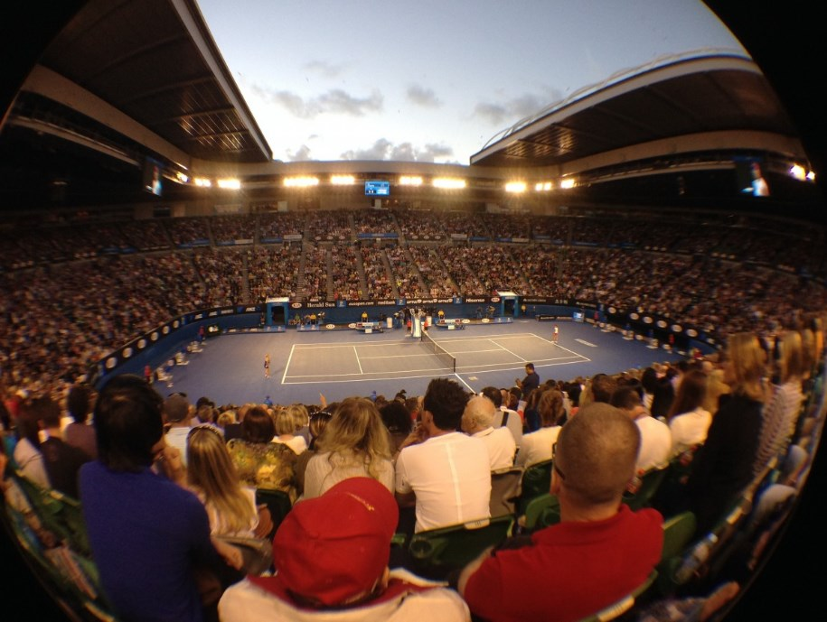
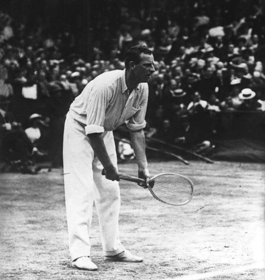
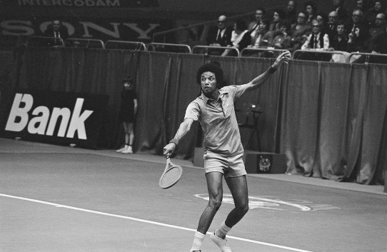
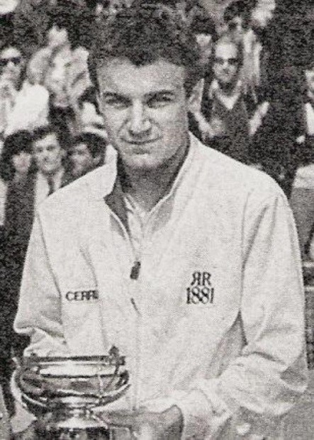
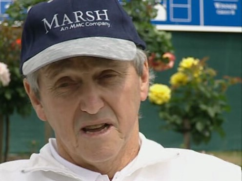
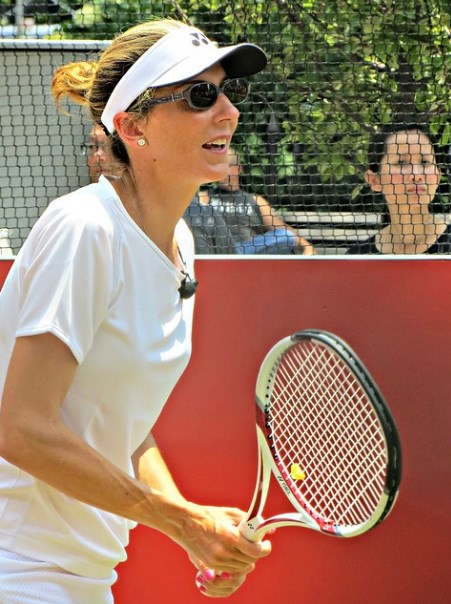
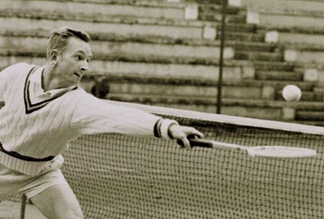
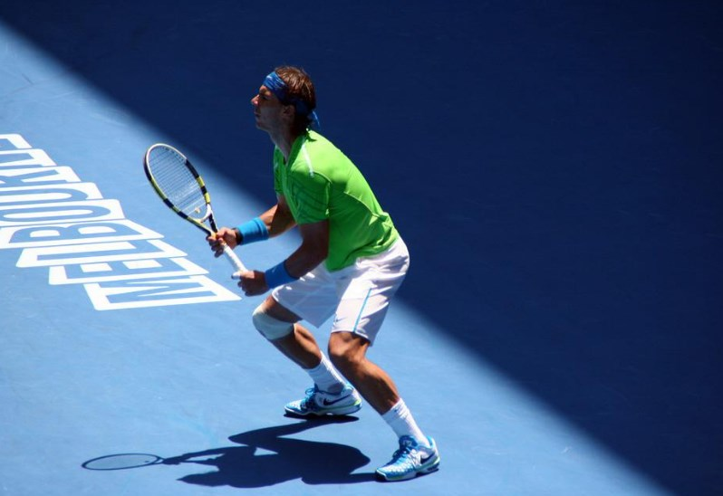
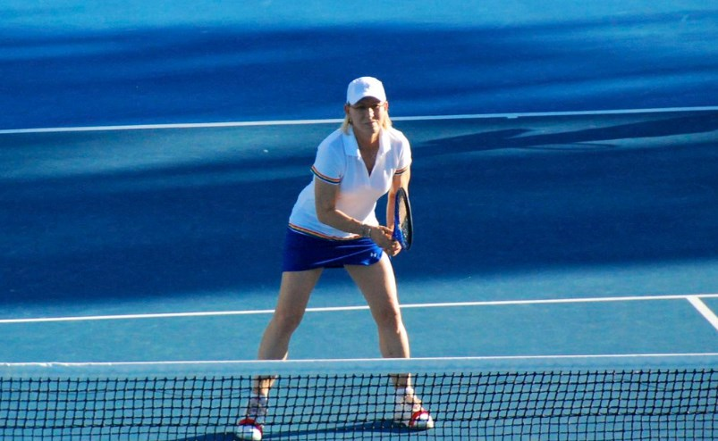
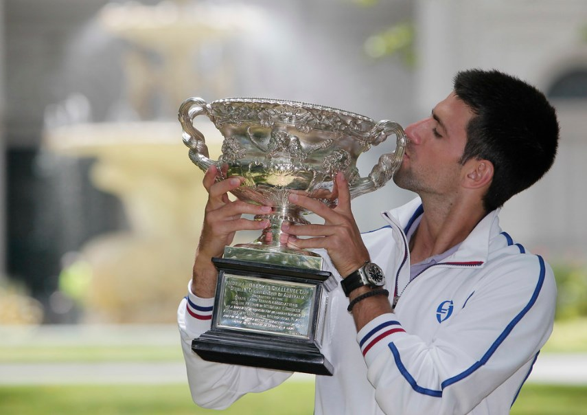

# 🎾 The Australian Open

The Australian Open is the first, referring chronologically, to be held
of the four tournaments that make up the Grand Slam. It takes place
every January within the sports complex located in Melbourne Park, which
is located in the city of Melbourne.

 

Photo of the Australian Open taken by Vamosrafapuntoes extracted from
flickr

 The tournament was created on November 17, 1905 and at that time it was
called the \"Australasian Championship\", but it was renamed the
\"Australian Championship\" in 1927. Later the Open Era was introduced
in 1968, where it was allowed participation in the tournament for
professional players, so that it changed its name in 1969 to the
\"Australian Open\".

 Its first editions were played on the Kooyong grass courts that were
located on the southeast side of the city of Melbourne, however the
expected notoriety was not achieved, so it was decided to move the
competition to its current location in Melbourne Park, which was then
known as Flinders Park. This new complex had concrete tennis courts and
was close to the Melbourne Cricket Ground in the southern part of the
financial district. Player Mats Wilander was the only one capable of
winning the tournament on both grass and hard courts.

 As with the rest of the Grand Slam tournaments, the competition is also
divided into categories as we know them, there are individual categories
for both men and women, in the same way there is the doubles category
for both sexes and the mixed doubles, which are couples made up of a man
and a woman, there are also competitions for veteran and junior players,
in recent years competitions for players who are in wheelchairs have
been included.

 The main courts of the complex are two and are named after Rod Laver and
John Cain, both courts have retractable roofs, so that in case of rain
or extreme heat the game can continue.

 

Rod Laver Arena

 The tournament is held in the middle of the southern summer when the
days of extreme heat definitely stand out. That is why on many
occasions, the game stops and does not resume until the temperature and
humidity values ​​are not adequate.

 This tournament has a high rate of attendance among fans, not in vain
they have the daily attendance record for a Grand Slam tournament, it
was achieved in 2008 with a total of 62,885 attendees.

 A new surface was released in 2008 after 20 years using tracks from
Rebound Ace. The material that covers the playing court was changed for
a new one called Plexicushion, this material absorbs less heat causing
less wear on the players and also allows the ball to move at a lower
speed. After this change all tournaments in preparation for the
Australian Open had to change their court surfaces. The material change
generated some controversy in view of the similarity to the surface
material used at the US Open. Since 2020 the material used on the slopes
of Melbourne Park is Greenset. However, they retained the iconic blue
padded acrylic court.

## History of the Australian Open

The Australian Open began in Melbourne in 1905 specifically at the
Warehouseman\'s Cricket Ground, currently known as the Albert Reserve
Tennis Center where the court was grass and was administered by the Lawn
Tennis Association of Australia (LTAA). Since the tournament was created
it has been held in five Australian cities, of course, the city in which
it has been held the most times is Melbourne with 54 editions, then
Sydney where it was held 17 times, Adelaide (14 times), 7 times in
Brisbane and finally 3 times in Perth, but it was also held twice in New
Zealand, in Christchurch in 1906 and in Hastings in 1912.

 Before 1905, both the Australian states and New Zealand had their own
championships, the first being called the Victoria Colony Championship
and held in Melbourne in 1880. However, players as important as Norman
Brookes and New Zealander Anthony Wilding, participated very little in
these tournaments, because although it is true that they existed, the
tournaments were divided and unimportant. However, these previous
tournaments determined some of the best Australasian players, but for
example, when the Australasian Championship was held in Hastings, New
Zealand in 1912, Wilding, who had been champion three times at
Wimbledon, did not return to play your country of origin. Participation
in tournaments was a recurring problem for many players at the time.
Norman Brookes only went to Europe three times, reaching the Wimbledon
Challenge Round once and then twice winning the Wimbledon Championships.

 

Anthony Wilding

 Many players had never played in the Australian (Asian) Open or Amateur
Championships. Among whom we can name the Doherty brothers, Maurice
McLoughlin, William Larned, Beals Wright, Bill Tilden, Bill Johnston,
Henri Cochet, René Lacoste, Bobby Riggs, Pancho Gonzales, Budge Patty,
Ted Schroeder, among others. But in addition Brookes, Jaroslav Drobný or
Ellsworth Vines attended only once. Even when traveling was not as
difficult as in the 1960s and 1970s, such prominent players as Manuel
Orantes, Jan Kodeš, Ilie Năstase or Björn Borg, if they attended at that
time it was once or never.

 The Lawn Tennis Association of Australia (LTAA), which is the
organization in charge of managing the Australian Open, decided in 1972
that the tournament be held in a single city and they chose the city of
Melbourne, given that it was the one with a greater influx as far as
spectators are concerned. Thanks to the demand generated by the
tournament, Melbourne Park was built in 1988 and was a resounding
success, as the number of attendees increased from 140,000 to 266,436 in
just one year. Although it is true that it was created in 1905, it was
not until 1924 that the tournament was designated by the International
Tennis Federation as a major championship.

 Like the other major tennis tournaments, no tournament was organized in
Australia between 1916 and 1918 as a result of the First World War. In
the same way, the tournament was not held due to World War II between
1941 and 1945.

 Given the geographical location of Australia, many of the foreign
players did not participate in the Australian championship in view of
its distance, a large part of the players had to travel for 45 days by
boat from Europe to Australia, in fact, players who lived in the same
Australia could not easily move between cities, since they had to make
long trips by train. For example, no one from New South Wales or
Victoria traveled the 3,000 km by train to the tournament in Perth, and
when the competition was held in Christchurch in 1906, only 10 players
participated, of whom two were Australians and it was won by a New
Zealander. The first tennis players to visit Australia were Davis Cup
players from the United States in November 1946.

 The best players at that time were the Australian Norman Brookes who won
the 1911 championship and Anthony Wilding (New Zealander) who won the
1906 and 1909 championships. It should be noted that at this time the
tournament was not open to all players, since The Open Era had begun.
The Australian Open was played at Milton Courts in 1969 and was open to
all players, including those professionals who did not belong to any of
the traditional circuits.

 George MacCall\'s National Tennis League, which was the one that
employed Rod Laver, Andrés Gimeno, Ken Rosewall, Fred Stolle, Roy
Emerson and Pancho Gonzales, but prevented its players from entering the
tournament in 1970, because it considered that the guarantees they were
insufficient. The tournament was won that year by Arthur Ashe.

 

Arthur Ashe

 It was not even until 1982 when the best players began to participate in
the tournament, precisely because of its distance, it was also held at
Christmas and the monetary gain of the prize was very low.

 However, by 1983 players of the stature of John McEnroe, Ivan Lendl and
Mats Wilander participated in the big tournament, who was the player who
won the singles title. It was after this year\'s tournament that the
International Tennis Federation approached the Lawn Tennis Association
of Australia to change the location of the tournament, given that
Kooyong Stadium was not capable of hosting a tournament that had grown
in importance, it was then when it was moved to Flinders Park (now
Melbourne Park), the surface of the pitch being hard and not grass. At
that time Mats Wilander not only won the tournament on this surface, but
he was the only player who could win on both grass and hard courts.

 

Mats Wilander

 Before the tournament was consolidated in the Melbourne Park stadiums,
the dates of the tournaments fluctuated and especially in the first
years. For example, the tournament scheduled for 1919 was held in
January 1920, while the tournament for the year 1920 was played in
March. The tournament in Brisbane in 1923 ended up taking place in
August, in order to avoid the inclement weather of that year.
Subsequently, the tournament corresponding to 1977 was held in December
1976 and therefore, in December of that same year a second tournament
was played, this resulted in the best players not attending.

 Foreign authorities and New South Wales proposed to be the new hosts of
the tournament in 2008, but this measure never materialized. However,
around the time improvements to the facilities for both players and
spectators began at Melbourne Park. One of the most important was that a
retractable roof was placed over the Margaret Court Arena and this made
the Australian Open the first of the Grand Slams to have three courts
with retractable roofs. Player facilities and administrative
infrastructure were also improved, including access points for the
attending public. The complex extended out of Melbourne Park to nearby
Birrarung Marr.

 

Photo of Margaret Court Arena taken by Mark Heath extracted from flickr

 Since 2017, the audience can also watch the game on Show Courts 2 and 3
and each field has a capacity for 3,000 fans, while fields 4 to 15, 19
and 20 can hold up to 2,500. people with the help of temporary
bleachers.

 At the end of 2021, a fourth main show court was completed, with a
capacity for 5,000 people and the Centerpiece ballroom was included,
along with the rest of the remodeling that took place over a decade,
where a building was also built for media, improved facilities for
players, the public and administrators in general. In view of the
renovations, it was concluded that the tournament would continue to be
held inside Melbourne Park, at least until the year 2036.

 Tournament organizers announced in December 2008 that the Australian
Open would follow certain previous rules established by both Wimbledon
and the US Open. So in the final games for the men\'s and women\'s
singles competitions, tiebreakers would be introduced. However, unlike
Wimbledon and the US Open, where conventional tiebreaks start at 12-12
games for Wimbledon and 6-6 games for the US Open, at the Australian
Open it was decided to use a first tiebreaker of 10 points in a total of
6 games.

 In 2021 the organizers found it necessary to reduce the number of staff
due to the COVID-19 pandemic. To do this, they used an electronic
evaluation line, which is a system capable of controlling the game with
12 cameras for each of the lanes, which is why many think that this
system dehumanizes the game. When a ball goes out of the demarcated
area, a robotic voice is heard saying "Out" and if there is skepticism
in the decision, seconds later the image can be seen on the giant screen
where the error is confirmed. Normally, the \"Hawkeye\" would have been
called just before accepting the linesman\'s decision, but at the
Australian Open this possibility no longer exists.

 The electronic arbitration system has completely replaced the line
judges, being able to control the matches in an absolute way. The voices
over the loudspeakers signaling the error were recorded by eight
Melbourne firefighters, police officers, paramedics and volunteers. They
lent their voice to this device hosted by Tennis Australia, in order to
limit interactions with players during the coronavirus pandemic. This
made the Australian Open the first Grand Slam to use electronic line
judging exclusively, while the US Open used it for matches taking place
outside the stadium\'s two main courts.

 When a player wins the women\'s singles tournament, her name is written
on the trophy to perpetuate her name and the cup is awarded at the
Daphne Akhurst Memorial Cup. In the same way the player who wins the
men\'s singles, their name is written on the trophy and it is given in
the Norman Brookes Challenge Cup. On the other hand, a certain amount of
money is also given as part of the prize for the winner and also for all
the participants who compete in the event. For example, in 2011 the
prizes were \$20,000 for the first round, \$32,000 for the second round,
\$54,500 for the third round, for the fourth round a prize of \$93,000
was awarded, in the quarterfinals the Prize money was \$210,000, while
for the semifinals it was \$420,000, for the runner-up \$1,100,000 and
for the champion \$2,200,000.

 

Photo of trophies taken by AO Tennis Blitz extracted from flickr

 During the history of this competition, the tennis players who hold the
records for the greatest number of titles are: Roy Emerson, Andre Agassi
and Roger Federer in men\'s singles; Adrian Quist, Bob Bryan and Mike
Bryan in men\'s doubles; Margaret Court and Serena Williams in women\'s
singles, Thelma Cpyne Long and Martina Navrátilová in women\'s doubles;
Harry Hopman, Colin Long, Jim Pugh, Daphne Akhurst Cozen, Nell Hall
Hopman, Nancye Wynne Bolton, Thelma Coyne Long, Jana Novotná and Larisa
Savchenko Neiland in mixed doubles.

## Below we will show a table with the record of titles won in the men\'s modality

| Record                            | Player                          | Era          | Titles | Years                                   |
| --------------------------------- | ------------------------------- | ------------ | ------ | --------------------------------------- |
| Most singles titles               | Serbia&nbsp;/ Novak Djokovic    | Open Era     | 9      | 2008, 2011–2013, 2015–2016, 2019–2021   |
| &nbsp;                            | Australia&nbsp;/ Roy Emerson    | Pre-Open Era | 6      | 1961, 1963–1967                         |
| Most consecutive singles titles   | Serbia&nbsp;/ Novak Djokovic    | Open Era     | 3      | 2011–2013, 2019–2021                    |
| &nbsp;                            | Australia&nbsp;/ Roy Emerson    | Pre-Open Era | 5      | 1963–1967                               |
| Most doubles titles               | United States&nbsp;/ Bob Bryan  | Open Era     | 6      | 2006–2007, 2009–2011, 2013              |
| &nbsp;                            | United States&nbsp;/ Mike Bryan | &nbsp;       | &nbsp; | &nbsp;                                  |
| &nbsp;                            | Australia&nbsp;Adrian / Quist   | Pre-Open Era | 10     | 1936–1940, 1946–1950                    |
| Most consecutive doubles titles   | United States&nbsp;/ Bob Bryan  | Open Era     | 3      | 2009–2011                               |
| &nbsp;                            | United States/ &nbsp;Mike Bryan | &nbsp;       | &nbsp; | &nbsp;                                  |
| &nbsp;                            | Australia&nbsp;/ Adrian Quist   | Pre-Open Era | 10     | 1936–1940, 1946–1950[45]                |
| Most mixed doubles titles         | United States /&nbsp;Jim Pugh   | Open Era     | 3      | 1988–1990                               |
| &nbsp;                            | India / Leander Paes            | &nbsp;       | &nbsp; | 2003, 2010, 2015                        |
| &nbsp;                            | Canada /&nbsp;Daniel Nestor     | &nbsp;       | &nbsp; | 2007, 2011, 2014                        |
| &nbsp;                            | Australia /&nbsp;Harry Hopman   | Pre-Open Era | 4      | 1930, 1936–1937, 1939                   |
| &nbsp;                            | Australia /&nbsp;Colin Long     | &nbsp;       | &nbsp; | 1940, 1946–1948                         |
| Most Championships                | Serbia&nbsp;/ Novak Djokovic    | Open Era     | 9      | 2008–2021 (9 men's singles)             |
| (singles, doubles, mixed doubles) | Australia&nbsp;/ Adrian Quist   | Pre-Open Era | 13     | 1936–1950 (3 singles, 10 men's doubles) |

 

Current photo of Roy Emerson taken by Tennis Buzz from flickr

## In the female modality, the players who have the records are the following:

| Record                            | Player                                        | Era          | Titles | Years                                                      |
| --------------------------------- | --------------------------------------------- | ------------ | ------ | ---------------------------------------------------------- |
| Most singles titles               | Australia / Margaret Court                    | All-time     | 11     | 1960–1966, 1969–1971, 1973                                 |
|                                   | United States / Serena Williams               | Open Era     | 7      | 2003, 2005, 2007, 2009, 2010, 2015, 2017                   |
|                                   | Australia / Margaret Court                    | Pre-Open Era | 7      | 1960–1966                                                  |
| Most consecutive singles titles   | Australia / Margaret Court                    | Open Era     | 3      | 1969–1971                                                  |
|                                   | Australia / Evonne Goolagong Cawley           |              |        | 1974–1976                                                  |
|                                   | Germany / Steffi Graf                         |              |        | 1988–1990                                                  |
|                                   | Federal Republic of Yugoslavia / Monica Seles |              |        | 1991–1993                                                  |
|                                   | Switzerland / Martina Hingis                  |              |        | 1997–1999                                                  |
|                                   | Australia / Margaret Court                    | Pre-Open Era | 7      | 1960–1966                                                  |
| Most doubles titles               | Australia / Thelma Coyne Long                 | Pre-Open Era | 12     | 1936–1940, 1947–1949, 1951–1952, 1956, 1958                |
|                                   | United States / Martina Navratilova           | Open Era     | 8      | 1980, 1982–1985, 1987–1989                                 |
| Most consecutive doubles titles   | United States / Martina Navratilova           | Open Era     | 7      | 1982–1985, 1987–1989                                       |
|                                   | United States / Pam Shriver                   |              |        |                                                            |
|                                   | Australia / Thelma Coyne Long                 | Pre-Open Era | 5      | 1936–1940                                                  |
|                                   | Australia / Nancye Wynne Bolton               |              |        |                                                            |
| Most mixed doubles titles         | Czech Republic / Barbora Krejčíková           | Open Era     | 3      | 2019–2021                                                  |
|                                   | Australia / Daphne Akhurst Cozens             | Pre-Open Era | 4      | 1924–1925, 1928–1929                                       |
|                                   | Australia / Nell Hall Hopman                  |              |        | 1930, 1936–1937, 1939                                      |
|                                   | Australia / Nancye Wynne Bolton               |              |        | 1940, 1946–1948                                            |
|                                   | Australia / Thelma Coyne Long                 |              |        | 1951–1952, 1954–1955                                       |
| Most Championships                | United States / Martina Navratilova           | Open Era     | 12     | 1980–2003 (3 singles, 8 women's doubles, 1 mixed doubles)  |
| (singles, doubles, mixed doubles) | Australia / Nancye Wynne Bolton               | Pre-Open Era | 20     | 1936–1952 (6 singles, 10 women's doubles, 4 mixed doubles) |

 

Photo Serena Williams taken by AshMarshall extracted from flickr

## Other important records

| Record                    | Player                          | Category | Years                        |
| ------------------------- | ------------------------------- | -------- | ---------------------------- |
| Unseeded champions        | Australia / Mark Edmondson      | Men      | 1976                         |
|                           | Australia / Chris O'Neil        | Women    | 1978                         |
|                           | United States / Serena Williams | Women    | 2007                         |
| Youngest singles champion | Australia / Ken Rosewall        | Men      | 18 years and 2 months (1953) |
|                           | Switzerland / Martina Hingis    | Women    | 16 years and 4 months (1997) |
| Oldest singles champion   | Australia / Ken Rosewall        | Men      | 37 years and 2 months (1972) |
|                           | Australia / Thelma Coyne Long   | Women    | 35 years and 8 months (1954) |

## The Players who achieved both the junior and senior titles:

Men\'s Singles: Rod Laver, Vivian McGrath, Jack Crawford, Adrian Quist,
Dinny Pails, John Bromwich, Frank Sedgman, Ken Rosewall, Ken McGregor,
Lew Hoad, Stefan Edberg, and John Newcombe.

  Women\'s Singles: Joan Hartigan, Thelma Long, Emily Westacott, Beryl
Penrose, Kerry Reid, Mary Carter-Reitano, Evonne Cawley, and Chris
O\'Neil.

## Left-handed players with the most titles:

Men\'s category: Horace Rice, Norman Brookes, John Hawkes, Mervyn Rose,
Rod Laver (1960 - 1962 - 1969), Jimmy Connors, Guillermo Vilas (1978 -
1979), Roscoe Tanner and Petr Korda.

 Female category: Monica Seles (1991 - 1992 - 1993 - 1996) and Martina
Navratilova (1981 - 1983 - 1985)

 

Photo Monica Seles taken by John Wisniewski extracted from flickr

## The greatest time distances between the first and the last title won

 Men\'s category: Ken Rosewall won his first title in 1953 and his last
in 1972, after 20 years.

 Women\'s category: Nancye Wynne Bolton took her first title in 1937 and
then won her last in 1951, after 15 years.

## Players with the results with the greatest difference in the score (6-0, 6-0 and 6-0)

For the men\'s category: James Anderson for the first round in the year
1925, Fred Perry achieved this difference in the quarterfinals of the
year 1935, then in the first round of 1949 it was achieved by John
Bromwich, later Neale Fraser in the first round of the year 1953, also
in the first round but from 1960 Martin Mulligan and Richard Russell
obtained this result, in the first round of 1966.

 In the women\'s category: Margaret Court and Mary Pierce achieved this
feat four times, while Wendy Turnbull achieved it three times.

## Highest number of games played in a final:

Men\'s individual category: In Melbourne 1927 Gerald Patterson defeated
John Hawkes by a score of 3-6, 6-4, 3-6, 18-16 and 6-3.

 Women\'s individual category (38 games): In Melbourne 1930 Daphne
Akhurst beat Sylvia Harper with a score of 10-8, 2-6 and 7-5.

## Fewest games played in a final:

Men\'s Singles Category (23 games): Pat O\'Hara Wood beat CB St John 6-1
6-1 6-3 at Brisbane 1932; then John Hawkes beat Jim Willard 6-1, 6-3,
6-1 in 1926.

 Women\'s singles category with (14 games): Margaret Smith won the final
against Jan Lehane with a score of 6-0 and 6-2 in Sydney 1962; later
Steffi Graf won over Arantxa Sanchez Vicario by a score of 6-0 and 6-2
in Melbourne 1994.

## The best matches of the Australian Open

## Rod Laver vs. Tony Roche in the 1969 semi-finals

The Australian Open was played on grass courts until 1987 and at that
time the players used wooden rackets, and tiebreakers had not yet been
agreed upon. The first set was won by Laver 7-5 and the second set was
memorable and endless with a score of 22-20, where Laver managed to
break serve in game 41 and won it. For the third set again Laver took a
3-2 lead, but Roche managed to recover by winning the third set by a
score of 11-9, to then dominate the fourth set where he won the first 5
games and that\'s when Laver recovered and passed to be dominated in
that fourth set, to win the deciding set 6-3.

 

Rod Laver

## Chanda Rubín against Arantxa Sánchez in the Quarterfinals of the year 1996

This 1996 final was exciting because it lasted three hours and 33
minutes, making it the longest (women\'s) match at the Australian Open.
Rubín was leading the third set 4-1, but she wasted two chances on
Sánchez\'s serve at 5-4. Later in game 28, Rubín obtained two more match
points and Sánchez managed to save those two points, then Rubín let go
of a shot by Arantxa Sánchez because she thought the ball was out. At
that point Rubín got frustrated but tried to keep his cool and finally
prevailed over Sánchez in game 30 of the set.

## Serena Williams versus Kim Clijsters in the 2003 Semifinals

Williams was seeking her fourth consecutive Grand Slam title, however,
she did not play her best against Clijsters as she committed 65 errors
in that match, while Clijsters committed 33 errors. At that time
Williams was treated for blisters on her feet during the third set and
perhaps that is why she was on the brink of defeat.

 In the deciding set Williams trailing 5-1, she held her serve and
managed to take the game to 5-4. Clijsters could still win the match on
that score, but on the first two points she double-faulted. Although it
is true that she recovered the score 30-30, she could not dominate
Serena Williams who managed to conquer the match after winning 6
consecutive games, leaving with a score of 4-6, 6-3, 7-5.

 All in all, it was an incredible and unforgettable battle!

## Rafael Nadal vs. Roger Federer in the 2009 final

This was one of the most memorable matches of this tournament as Federer
did not hold back and started crying uncontrollably during the trophy
presentation.

 Both players were considered the top two in the world at the time and an
epic duel in the Wimbledon final in the 2008 fifth set set the stage for
the highly anticipated match in Australia. While it is true that this
game could not match the level of what happened at Wimbledon, it was not
so much the game itself as much as the rivalry between the two players.
In the match, Nadal won just one point more than Federer leaving the
score at 7-5, 3-6, 7-6(3), 3-6, 6-2. But this devastated Federer, who
according to the New York Times expressed in his speech \"God is killing
me\" as he shed tears and received the runner-up trophy.

 

Rafael Nadal

## Jennifer Capriati versus Martina Hingis in the 2002 final

Jennifer Capriati\'s victory over Martina Hingis in 2002 has been called
by many one of the greatest displays of resilience in tennis history.
The first half of the match was openly dominated by Hingis with a 6-4,
4-0 lead, to the point that Capriati lost her composure in the second
set yelling at the chair umpire and then at the jeering crowd. However,
she regained control by winning the second set in a tie-break, while
Hingis earned a fourth point in the tie-break at 7-6, but she failed to
take advantage of it and Capriati finally won the tie-break with a score
of 9- 7. According to the BBC Capriati said "I really don\'t know how I
managed to win today".

## Martina Navratilova vs. Chris Evert in the 1981 final

This was the most exciting of the 80 matches between Martina Navratilova
and Chris Evert. When the two players met in 1981 at the Australian
Open, the rackets were still made of wood and the game was played on
grass.

 In an intense first set they were tied 4-4, then Evert managed to win 3
points in a row winning the first set, then she leads 4-3 in the second
set until Navratilova changed the momentum winning the next 3 games to
conquer the second set and managed to take a 5-1 lead in the third set.
At that point Evert tied the match 5-5 and was serving in game eleven
when they were up 30-30 and attempted a rare foray into the net to
surprise Navratilova and the point ended with both players at the net
where Navratilova spiked for the break, then held serve until completing
the victory.

 

Photo of Martina Navratilova taken by Paolo Rosa taken from flickr

## Pete Sampras vs. Andre Agassi in the 2000 Semifinals

The contrasting styles and rivalry between the two players made any
match between them truly intriguing, they met 34 times but only two of
those times went to five sets and this match was one of them.

 Sampras came out on top with 37 aces and seemed in control later to take
the third set tie break. However Agassi recovered and forced the fourth
set to a tie break, in which Sampras managed to hit two aces and take a
5-4 tie break lead. Agassi managed to land two great serves and a great
forehand with which he won the tie break.

 In the fifth set Agassi provided a break of serve that took him to a 2-0
lead and in the last 4 games, Sampras was excessively exhausted compared
to Agassi, who took the victory by a score of 6-4, 3-6, 6-7 (0), 7-6
(5), 6-1.

 According to the Washington Post, Sampras said: \"We have faced each
other about 30 times and this was definitely one of the best.\"

## Boris Becker and Omar Camporese in the 1991 Third Round

Omar Camporese was ranked 45th at the time and in the third round he
pulled off one of the most impressive comebacks in tennis history.
Camporese recovered from two sets to love and managed to win the third
set. In the fourth set Becker seemed to be in control but his opponent
always found a way to hold serve, in game 22 Camporese fought against
Becker for a triple match point serving 40-0 to prolong the match, this
game he lost but managed to win the set with a score of 6-4 and forcing
to reach the fifth set.

 In this set both held serve for the first 20 games, when Becker broke
serve in game 21 and found himself serving 40-0 in game 22 with a chance
to win the match, also having one of the most powerful serves in the
game tennis. Camporese saved three match points and then won five
straight points, the last of these points with a backhand as he leveled
the fifth set at 11-11. Becker broke serve and rallied to 12-11 and
again Camporese managed to break, but this time to love. In game 25
Camporese had his serve and a 40-0 sellout, but Becker managed to
recover by breaking serve and then hit two aces for the final two
points, thus completing the victory that took him more than five hours
and with a score of 7-6 (4), 7-6 (5), 0-6, 6-4, 14-12. Camporese lost,
but with this game he will go down in history for posterity!

 

Photo of Boris Becker at the Australian Open (2015) taken by tlaenPix
taken from flickr

## Andy Roddick versus Younes El Aynaoui in the 2003 quarterfinals

Both players had faced marathon matches in the fourth round to make it
to the quarterfinals. Roddick was 11 years younger than his opponent and
the two faced a game that lasted just one minute shy of five hours, with
the final set alone lasting two hours and 23 minutes.

 In the fifth set Roddick managed to break El Aynaoui\'s serve in game 21
when the score was 11-10, later El Aynaoui broke his opponent\'s serve
in game 22 and when they reached 19-19 they took a short break.

 In the next game Roddick broke serve and placed the score in his favor
20-19, so he did not miss the opportunity, thus certifying the victory
that would take him to the semifinal that year.

Photo of Andy Roddick taken by Court Two taken from flickr

## Novak Djokovic vs. Stan Wawrinka in the 2013 Fourth Round

Although Stan Wawrinka lost in the fourth round of the tournament, this
match set him on the path to the elite level. Many think that Wawrinka
despite losing the match, played the match of his life and to an
extremely high standard, even leading the match with a score of 6-1, 5-2
before his opponent came back in a so forceful. Djokovic won both the
second and third sets, however Wawrinka bounced back by winning the
fourth set in a tie break that led to the marathon final.

 This last set both players put on an epic battle, while the crowd
exclaimed euphorically during the game. Djokovic capped off the shocking
20-shot rally with a perfect crosscourt backhand, it was all in all a
fascinating final point.

## Novak Djokovic vs. Rafael Nadal in the 2012 final

This final was packed with remarkable shots, long rallies, unlikely
comebacks, tense moments, entertaining competition and displays of
emotion.

 This match was definitely one of the best and many insiders rank it in
the top 10 of all time, both players showed boundless determination and
energy, it lasted 5 hours and 53 minutes of unforgettable moments.

 Nadal had lost the last six matches against Djokovic and he knew he had
to do his best, he started with a 4-2 lead but Djokovic won the next
three games with a 5-4 lead, that\'s when Nadal jumped in front placing
the score at 6-5. Djokovic battled against the two points and took the
match to a draw, however Nadal managed to win the first set.

 In the second set Djokovic took a 5-3 lead and in the 10th game after a
40-30 deficit to break serve, he finally managed to win the set. For the
third set Djokovic led 4-3, but Nadal recovered by holding serve and
tied at 5-5, then rain interrupted the match.

 Once they closed the roof Djokovic managed to take a 5-3 lead into the
fourth set tie break, when Nadal collected four straight points to win
the set. With momentum from his side Rafael Nadal built a 4-2 lead in
the final set and was serving in the seventh game when Djokovic broke
serve and tied the match at 4-4. At that point Nadal won an
extraordinary 32-shot rally opening the ninth game and holding serve
until he took a 5-4 lead. Djokovic broke serve and took a 6-5 lead as
Nadal won three points in a row, then Djokovic conquered the next three
points and when he finished off his first opportunity for the
match-winning point, an emotional Djokovic tore off his shirt with a
triumph that would mark him forever, being also the longest match in the
history of the Australian Open.

 

Photo from the Meridiano sports newspaper extracted from flickr

## Most recent finals

| 2022 Event      | Champion                            | Runner-up                        | Score                        |
| --------------- | ----------------------------------- | -------------------------------- | ---------------------------- |
| Men's singles   | Spain / Rafael Nadal                | Russia / Daniil Medvedev         | 2–6, 6–7(5–7), 6–4, 6–4, 7–5 |
| Women's singles | Australia / Ashleigh Barty          | United States / Danielle Collins | 6–3, 7–6(7–2)                |
| Men's doubles   | Australia / Thanasi Kokkinakis      | Australia / Matthew Ebden        | 7–5, 6–4                     |
|                 | Australia / Nick Kyrgios            | Australia / Max Purcell          |                              |
| Women's doubles | Czech Republic / Barbora Krejčíková | Kazakhstan / Anna Danilina       | 6–7(3–7), 6–4, 6–4           |
|                 | Czech Republic / Kateřina Siniaková | Brazil / Beatriz Haddad Maia     |                              |
| Mixed doubles   | France / Kristina Mladenovic        | Australia / Jaimee Fourlis       | 6–3, 6–4                     |
|                 | Croatia / Ivan Dodig                | Australia / Jason Kubler         |                              |

## About the Author

Idais, Graduated in Mechanical Engineering, and a master’s degree in teaching component, she gave classes in several institutes of mathematics and physics, but she also dedicated several years of my life as a television producer, she did the scripts for mikes, the camera direction, editing of video and even the location. Later she was dedicated to SEO writing for a couple of years. She likes poetry, chess and dominoes.
