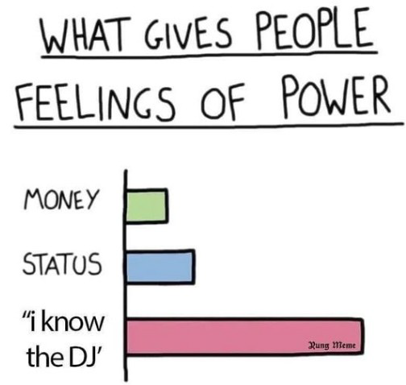

# 🎼 The DJ

"In a year before the turn of the millennium, a survey in Germany found that 70%
of young people surveyed would like to be a disc jockey." \*

\*\*

The question may arise as to what might be the reason for this. What does a DJ
(disc jockey) actually do? What is his/her role and what makes someone a good
DJ? What is the future of DJing?

As incredible as it may be, DJing itself dates back to the wartime, when some
wanted to entertain their comrades in this way. Since then, a lot of time has
passed, and the name itself has got a completely different meaning, but the role
has also changed a lot with the development of technology and needs.

What are the basic tasks of a DJ? Selection (compiling a musical program for a
given set), technical skills (mixing), presence (keeping in touch with the
audience). \*

The basic requirement for a DJ is to perform his set as smoothly as possible,
for which it is essential to have a good knowledge of the songs played and the
playing device (mixer), as this allows him to mix two music tracks in a
completely unique way, thus achieving the effect of continuity and appropriate
enhancement of mood.

"A disc jockey can be neither a slave nor a dictator." \*

A DJ can really measure the success of his set from the reaction of the
audience, as the goal is to entertain. Therefore, it is important to pay
attention to the needs and feedback of the audience (even in the form of body
language), but this should not be the sole goal, as the process may lose its
meaning because a set can be really successful if both the audience, and the DJ
feel good during the process.

## The present and the future

It is interesting to note that in many cases today we cannot talk about spinning
disks at all, as modern technology allows us to take our music with us when
stored on an external storage device (pendrive, external HDD), thus protecting
the music from amortization.

On the other hand, this is exactly what makes a DJ, who plays music from vinyl,
special, but no matter how we look at it, analog sound is a kind of ancient,
instinctive world that makes it a curiosity forever.

Of course, in the meantime, transcoding systems have emerged (e.g. Serato),
which is a kind of hybrid of the two worlds, because one can play music from a
vinyl(-like) plate using a digital signal.

Today, systems have been introduced that make it no longer necessary to have an
external storage device, because thanks to the latest developments, music can
also be played directly from the cloud.

Sources:

- - MENNYEK KAPUI - Az elektroniks zene  vtizede (The decade of electronic
    music) \*\* - Facebook
