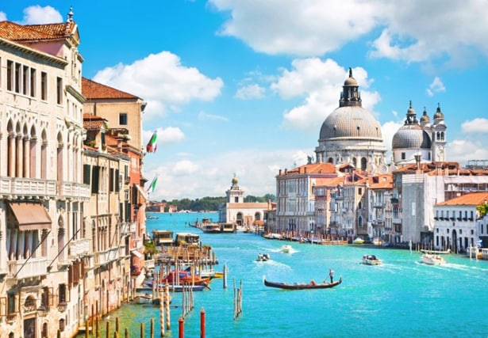
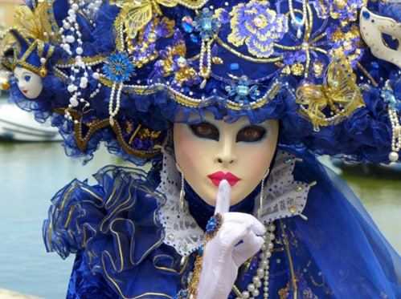

# Venice

Venice is a city located in northeastern Italy and its historic center was declared a World Heritage Site by UNESCO. This city is located on a set of islands to the north of the Adriatic Sea, due to its geographical peculiarity, its rich artistic heritage and its ancient history, have made this city one of the most popular tourist destinations in the world.
The city was built on an archipelago consisting of 118 small islands linked by 455 bridges, but also includes six districts that are on the mainland and where most of the population lives. Inside the city there is no car traffic and its inhabitants move both on foot and through the canals by boats known as vaporettos. Starting from the Grand Canal, a large network of canals emerges where you can see a multitude of small and large boats, but the best known are the so-called gondolas.

This city was founded in the 5th century, thanks to its particular geography it provided protection against possible attacks by the Germanic peoples.
If you go to Venice it is important that you visit Saint Mark's Square, as it is one of the most beautiful places in Venice, although it is very difficult to enjoy this square without it being packed with tourists. This is because it is surrounded by illustrious buildings and is one of the nerve centers of the city. There you can find the spectacular Basilica of Saint Mark, which in turn has a 100-meter-high bell tower, but also countless outdoor cafes and small shops where you can find curious items.

You cannot miss the Doge's Palace, which is one of the most important monuments in Venice, built with Gothic architecture and inside it houses the paintings of such renowned artists as Tintoretto and Veronese. One of the curiosities of the palace are the cells that are in its basement, the story goes that Casanova escaped from there and fled across the rooftops of Venice. Another of the surrounding stories is that the Bridge that connects to the Palace is called the Bridge of Sighs because women used to walk around when the Ducal Palace was a prison and sighed for the men who were imprisoned there, which has given rise to the name of the famous bridge and that by itself, is another attraction worth seeing.

Another of the essential monuments of Venice is found on the small island of San Giorgio Maggiore, since the monastery of San Giorgio was established there in 982, it also has a beautiful basilica. Although the art center that belongs to the Giorgio Cini Foundation currently resides there, it really is a place that will really surprise you.

In the landscape of the city, the Santa María de la Salute church stands out for its enormous and beautiful dome that is capable of dominating the Venetian horizon, it is worth visiting and from there you can enjoy one of the most beautiful sunsets in the city.

From the most important bridge of the Grand Canal in Venice you can enjoy one of the best landscapes, in addition to the movement of water taxis, vaporettos and gondolas. The Grand Canal is the most important road and on its sides there are numerous churches and palaces that you should not miss. Strolling through the canals of Venice is quite a spectacle since it is one of the most romantic and beautiful cities in the world, although it is true that the gondola ride is significantly more expensive than the vaporetto, this small boat can move between alleys and canals through where other means of transport simply do not fit and in this way discover some untouristy areas of the city. Touring Venice while the gondolier sings is an experience that you have to live if you are already in the city.

Taking an excursion to Burano would be an unforgettable experience, because it is also not one of the typical tourist destinations, so it has even more charm. Urano is an island that is 7 km from Venice and can be reached by a vaporetto whose trip takes approximately 20 minutes, there you will find narrow canals full of color from the small houses that surround it, since their facades are painted each of a different color. But you can also visit the beautiful islands of Torcello and Murano, thus extending the fabulous experience.

If your visit coincides with the carnival dates, you should know that it is one of the most important events in the city, since thousands of people put on masks and dress up each year. You must join the hubbub that ignites throughout Venice, whether in the style of a harlequin, Pulcinella or any other costume that allows you to enjoy the surrounding party. The Venetians dedicate themselves on these dates to planning down to the last detail, since for them this tradition is truly important. Even one of the most interesting experiences is to walk through the mask shops to choose the one you plan to use, for this you will find hundreds of shops where you can buy all kinds of costumes and part of the ritual is to choose what you want to become for one night, in addition You can take home the mask as a nice memory of that day.

If what you really want is to savor the best dishes in Venice, you should know that the most traditional and delicious food will not be found in the typical tourist places such as Saint Mark's Square. While it is true that there are many places to eat in the city, you must find those places that are really worth it. You must search the alleys of the city where you can discover excellent trattorias with small wooden tables and their typical checkered tablecloths, where the Italian clientele abounds is where you must try the best pizza and the best spaghetti in Venice.

Do not forget to look for the secret corners of the city, between canals, alleys with colorful roofs and dreamy passages.

## About the Author

Idais, Graduated in Mechanical Engineering, and a master’s degree in teaching component, she gave classes in several institutes of mathematics and physics, but she also dedicated several years of my life as a television producer, she did the scripts for mikes, the camera direction, editing of video and even the location. Later she was dedicated to SEO writing for a couple of years. she like poetry, chess and dominoes.
